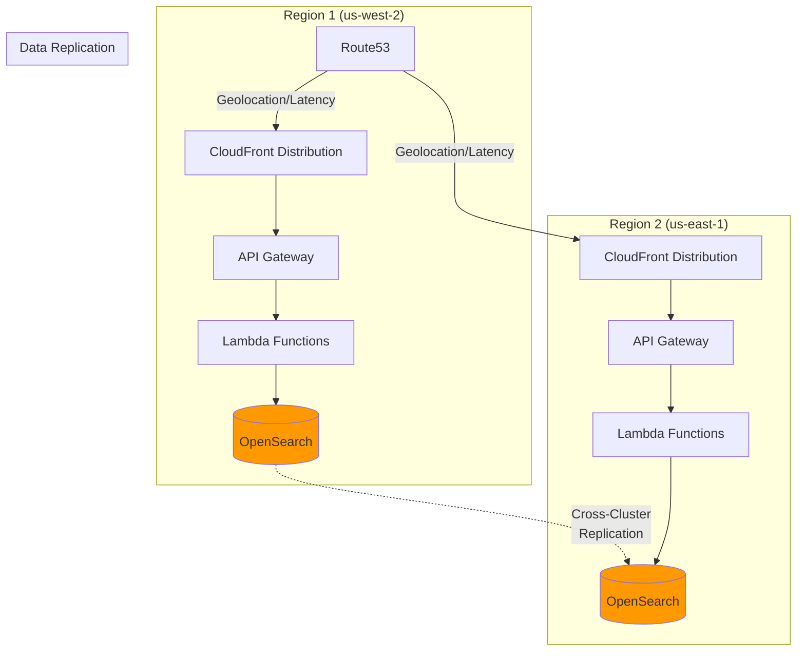

# Architecture

This document provides a comprehensive overview of stac-server's architecture, component interactions, and data flows.

## Table of Contents

- [Overview](#overview)
- [System Components](#system-components)
- [Request Flow](#request-flow)
- [Ingest Pipeline](#ingest-pipeline)
- [OpenSearch Index Structure](#opensearch-index-structure)
- [Authentication & Authorization](#authentication--authorization)
- [Asset Proxy Flow](#asset-proxy-flow)
- [Pre/Post Hook System](#prepost-hook-system)
- [Deployment Architecture](#deployment-architecture)

## Overview

Stac-server is a serverless implementation of the STAC API specification built entirely on AWS managed services. The architecture is designed for:

- **Scalability**: Auto-scaling Lambda functions handle any load
- **Cost Efficiency**: Pay-per-use pricing with minimal idle infrastructure (OpenSearch cluster runs continuously)
- **Reliability**: Managed services with built-in redundancy
- **Event-Driven**: Asynchronous ingest pipeline with guaranteed delivery

**Core Principle**: Separation of read (API) and write (Ingest) paths for optimal performance and reliability.

## System Components


### Component Descriptions

| Component | Type | Purpose | Scaling |
|-----------|------|---------|---------|
| **API Gateway** | Managed Service | HTTP endpoint, request routing, throttling | Auto-scales to millions of requests |
| **API Lambda** | Serverless Function | STAC API implementation, query processing | Concurrent execution up to account limits |
| **Ingest Lambda** | Serverless Function | Process and index Collections/Items | Batch processing with SQS triggers |
| **Pre-Hook Lambda** | Optional Function | Request authentication/modification | Synchronous, adds latency |
| **Post-Hook Lambda** | Optional Function | Response transformation/logging | Synchronous, adds latency |
| **OpenSearch** | Managed Database | Document store and search engine | Configurable instance types and counts |
| **Ingest SNS Topic** | Managed Queue | Entry point for data ingestion | Unlimited throughput |
| **Ingest SQS Queue** | Managed Queue | Buffering and batching | Unlimited retention |
| **Post-Ingest SNS Topic** | Managed Queue | Notification of ingest status | Unlimited throughput |
| **Dead Letter Queue** | Managed Queue | Failed ingest messages | Unlimited retention |
| **Secrets Manager** | Managed Service | OpenSearch credentials storage | N/A |
| **S3 Buckets** | Object Storage | Asset storage (external or managed) | Unlimited |

## Request Flow

### Standard API Request


**Key Points:**
- Pre-hook can modify request or reject with 401/403
- OpenSearch queries use JSON DSL for complex filtering
- Response includes STAC-compliant links for pagination
- Post-hook can add headers, modify body, or log

### Search Query Processing

The API Lambda translates STAC API parameters to OpenSearch queries:

1. **Collection Filter**: `term` query on `collection` field
2. **Bbox**: `geo_bounding_box` query on `geometry` field
3. **Datetime**: `range` query on `properties.datetime`
4. **CQL2 Filter**: Recursive translation to OpenSearch DSL
5. **Sort**: Maps to OpenSearch `sort` array
6. **Pagination**: Uses `search_after` for efficient deep pagination

## Ingest Pipeline

### Message Flow


### Ingest Message Formats

**Inline Item/Collection:**
```json
{
  "type": "Feature",
  "stac_version": "1.0.0",
  "id": "item-id",
  "collection": "my-collection",
  "geometry": {...},
  "properties": {...}
}
```

**Reference (for large items):**
```json
{
  "href": "s3://my-bucket/path/to/item.json"
}
```

**Action (delete all items from collection):**
```json
{
  "type": "action",
  "command": "truncate",
  "collection": "my-collection"
}
```

> **Note**: The `truncate` command deletes all items from the specified collection's index using OpenSearch's `deleteByQuery` API. This is a destructive operation that requires `ENABLE_INGEST_ACTION_TRUNCATE=true`. It cannot be used on the collections index or wildcard indices.

### Ingest Processing Steps

1. **Receive**: Lambda triggered by SQS with batch of 1-10 messages
2. **Parse**: Extract STAC document from SNS wrapper and SQS record
3. **Fetch**: If href reference, retrieve from S3 or HTTP
4. **Validate**: Check STAC version, required fields, schema
5. **Route**:
   - Collections → `collections` index
   - Items → `<collection-id>` index
   - Actions → Execute command
6. **Transform**: Apply asset proxy transformations if enabled
7. **Index**: Write to OpenSearch with upsert semantics
8. **Notify**: Publish success/failure to Post-Ingest SNS
9. **Cleanup**: Delete message from SQS or send to DLQ on failure

### Error Handling

- **Transient Errors** (network, OpenSearch timeout): Automatic retry via SQS visibility timeout
- **Permanent Errors** (invalid JSON, missing collection): Send to Dead Letter Queue after max retries
- **Partial Batch Failures**: Successfully processed messages are deleted, failures return to queue

## OpenSearch Index Structure

### Collections Index

**Index Name**: `collections` (configurable via `COLLECTIONS_INDEX`)

**Mapping Highlights**:
```json
{
  "mappings": {
    "properties": {
      "id": {"type": "keyword"},
      "type": {"type": "keyword"},
      "stac_version": {"type": "keyword"},
      "title": {"type": "text"},
      "description": {"type": "text"},
      "license": {"type": "keyword"},
      "extent": {
        "properties": {
          "spatial": {
            "properties": {
              "bbox": {"type": "double"}
            }
          },
          "temporal": {
            "properties": {
              "interval": {"type": "date"}
            }
          }
        }
      },
      "queryables": {"enabled": false},
      "aggregations": {"enabled": false}
    }
  }
}
```

**Notes**:
- `queryables` and `aggregations` fields are stored but not indexed (served from API)
- One document per collection
- Updated via upsert (partial updates not supported)

### Items Indices

**Index Name**: `<collection-id>` (one index per collection)

**Mapping Highlights**:
```json
{
  "mappings": {
    "properties": {
      "id": {"type": "keyword"},
      "type": {"type": "keyword"},
      "stac_version": {"type": "keyword"},
      "collection": {"type": "keyword"},
      "geometry": {"type": "geo_shape"},
      "bbox": {"type": "double"},
      "properties": {
        "properties": {
          "datetime": {"type": "date"},
          "created": {"type": "date"},
          "updated": {"type": "date"}
        }
      },
      "links": {"enabled": false},
      "assets": {"enabled": false}
    },
    "dynamic_templates": [
      {
        "strings_as_keywords": {
          "match_mapping_type": "string",
          "mapping": {"type": "keyword"}
        }
      }
    ]
  }
}
```

**Notes**:
- Dynamic mapping for item properties (strings become keywords by default)
- `geometry` uses `geo_shape` for complex polygon queries
- `links` and `assets` stored but not indexed (metadata only)
- Index auto-created on first item ingest (can be disabled)

### Index Strategy

**Option 1: Collection Per Index (default)**
- Pros: Independent scaling, deletion = drop index, custom mappings per collection
- Cons: More indices to manage, can't search across collections efficiently

**Option 2: Shared Index (via `COLLECTION_TO_INDEX_MAPPINGS`)**
- Pros: Fewer indices, efficient cross-collection search
- Cons: Shared mappings, delete requires query

## Authentication & Authorization

### OpenSearch Authentication


**Fine-Grained Access Control (Default)**:
- Lambda uses service account (e.g., `stac_server`) with read/write permissions
- Credentials stored in Secrets Manager
- Granular role-based permissions within OpenSearch
- Admin uses master account for dashboard/CLI access

**IAM Authentication**:
- Lambda uses its execution role for OpenSearch access
- IAM policies control index-level permissions
- No credentials to manage
- Requires SigV4 signing for all requests

### API Authorization (Optional)


**Authorization Layers**:

1. **API Gateway Authorizer** (external):
   - JWT validation, API key checking
   - Adds context to Lambda event
   - Not included in stac-server

2. **Pre-Hook Lambda** (included example):
   - Reads API key from header
   - Validates against Secrets Manager
   - Injects `_collections` or `_filter` parameters

3. **Lambda Authorization Parameters**:
   - `ENABLE_COLLECTIONS_AUTHX`: Restrict by collection list
   - `ENABLE_FILTER_AUTHX`: Apply CQL2 filter to all queries

## Asset Proxy Flow


**Asset Transformation**:

Before (original):
```json
{
  "assets": {
    "data": {
      "href": "s3://my-bucket/path/to/file.tif",
      "type": "image/tiff"
    }
  }
}
```

After (proxied):
```json
{
  "assets": {
    "data": {
      "href": "https://api.example.com/collections/col/items/item/assets/data",
      "type": "image/tiff",
      "alternate": {
        "s3": {
          "href": "s3://my-bucket/path/to/file.tif"
        }
      }
    }
  },
  "stac_extensions": [
    "https://stac-extensions.github.io/alternate-assets/v1.2.0/schema.json"
  ]
}
```

**Proxy Modes** (via `ASSET_PROXY_BUCKET_OPTION`):
- `NONE`: Disabled (default)
- `LIST`: Specific buckets from `ASSET_PROXY_BUCKET_LIST`
- `ALL`: All S3 assets
- `ALL_BUCKETS_IN_ACCOUNT`: All accessible buckets in AWS account

## Pre/Post Hook System

The Pre/Post Hook system enables custom logic injection at two key points in the request lifecycle: before request processing (Pre-Hook) and after response generation (Post-Hook). Both hooks are optional Lambda functions invoked synchronously by the API Lambda.


### Pre-Hook

The Pre-Hook Lambda is invoked **before** the API Lambda processes the request, allowing request validation, authorization, and modification.

**Capabilities**:
- Read all request headers, query parameters, and body
- Reject request (return error response directly with 401/403)
- Modify request event (add/change query parameters, modify body)
- Add response headers (CORS headers, custom headers)
- Inject authorization parameters (`_collections`, `_filter` for user-specific filtering)

**Example Use Cases**:
- API key validation and quota enforcement
- JWT token verification and claims extraction
- User-specific collection filtering based on permissions
- Request logging and metrics collection
- Custom authentication schemes (OAuth, SAML)
- Geo-fencing or IP-based access control

### Post-Hook

The Post-Hook Lambda is invoked **after** the API Lambda generates the response, allowing response transformation and analytics without affecting core logic.

**Capabilities**:
- Read full response (status code, headers, body)
- Modify response body (transform structure, add computed fields, redact data)
- Add or modify response headers (caching, custom headers)
- Cannot change HTTP status code
- Perform async logging and analytics

**Example Use Cases**:
- Response transformation (inject computed fields, normalize structure)
- Redaction of sensitive data for specific users
- Analytics and metrics collection (usage tracking, performance monitoring)
- Custom STAC extension injection
- Response caching headers based on content type
- A/B testing headers

### Configuration

Both hooks are configured via environment variables pointing to Lambda ARNs. The API Lambda's IAM role must have permission to invoke these functions.

```yaml
# serverless.yml
environment:
  PRE_HOOK: arn:aws:lambda:region:account:function:my-pre-hook
  POST_HOOK: arn:aws:lambda:region:account:function:my-post-hook

iam:
  role:
    statements:
      - Effect: Allow
        Action: lambda:InvokeFunction
        Resource: 
          - arn:aws:lambda:region:account:function:my-pre-hook
          - arn:aws:lambda:region:account:function:my-post-hook
```

**Hook Requirements**:
- Synchronous invocation (`RequestResponse` type)
- Return proper event/response structure
- Handle errors gracefully (timeouts, exceptions)
- Pre-Hook: Must return modified event or error response
- Post-Hook: Must return modified response object

## Deployment Architecture

### Multi-Region Setup



**Multi-Region Considerations**:
- Use OpenSearch Cross-Cluster Replication for data sync
- CloudFront for global edge caching
- Route53 for geographic routing
- Separate ingest per region or centralized

### High Availability Setup

**Components**:
- API Gateway: Multi-AZ by default
- Lambda: Multi-AZ by default
- OpenSearch: Multi-AZ with dedicated master nodes
- SQS: Multi-AZ by default

**Best Practices**:
- 3+ OpenSearch nodes across AZs
- Enable OpenSearch automatic snapshots
- Monitor Lambda concurrent execution limits
- Set up CloudWatch alarms for DLQ depth

### Performance Optimization

**API Response Times**:
- Cold start: 1-3 seconds (first request)
- Warm request: 50-200ms (depends on query complexity)
- OpenSearch query: 10-100ms (most queries)

**Optimization Strategies**:
1. **Provisioned Concurrency**: Keep Lambda warm (costs more)
2. **OpenSearch Tuning**: Right-size instances, add nodes
3. **CloudFront**: Cache GET requests for static data
4. **Connection Pooling**: Reuse OpenSearch connections
5. **Pagination**: Use `search_after` instead of `from`/`size`

**Ingest Throughput**:
- SQS: Unlimited buffering
- Lambda: Up to 1000 concurrent executions (soft limit)
- OpenSearch: Depends on instance size and cluster
- Typical: 100-1000 items/second with proper tuning

### Cost Optimization

**Cost Drivers** (typical production deployment):
1. **OpenSearch**: 70-80% (always running)
2. **Lambda Invocations**: 10-15%
3. **Data Transfer**: 5-10%
4. **Other Services**: 5%

**Optimization Tips**:
- Use Reserved Instances for OpenSearch
- Right-size OpenSearch cluster (don't over-provision)
- Enable response compression
- Use S3 for large assets (not OpenSearch)
- Monitor and alert on Lambda throttles

## Security Architecture

### Network Security


**Security Layers**:
1. **CloudFront**: DDoS protection, SSL termination, WAF
2. **WAF**: Rate limiting, IP filtering, SQL injection protection
3. **API Gateway**: Throttling, API keys, resource policies
4. **Lambda**: Execution role with minimal permissions
5. **OpenSearch**: VPC isolation, security groups, encryption at rest/in transit
6. **Secrets Manager**: Encrypted credential storage

### Data Security

**Encryption**:
- **At Rest**: OpenSearch encryption enabled, S3 bucket encryption
- **In Transit**: TLS 1.2+ for all connections
- **Secrets**: AWS Secrets Manager with KMS encryption

**Access Control**:
- **Least Privilege**: Lambda roles with specific permissions
- **Credential Rotation**: Automated via Secrets Manager
- **Audit Logging**: CloudWatch logs for all Lambda invocations
- **OpenSearch Audit**: Fine-grained audit logs (when enabled)

---

For deployment instructions, see [DEPLOYMENT.md](DEPLOYMENT.md).  
For configuration options, see [CONFIGURATION.md](CONFIGURATION.md).
