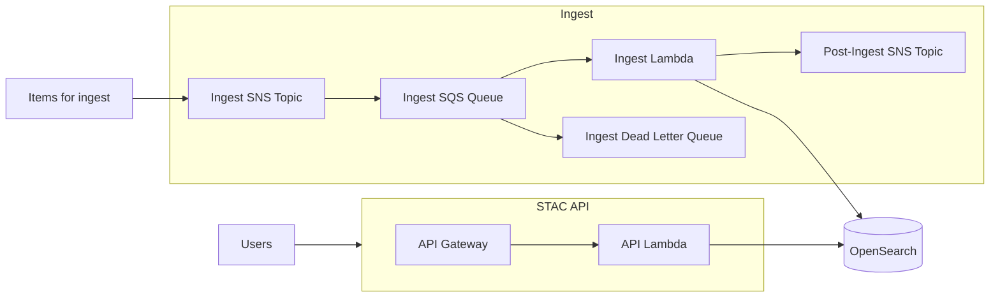
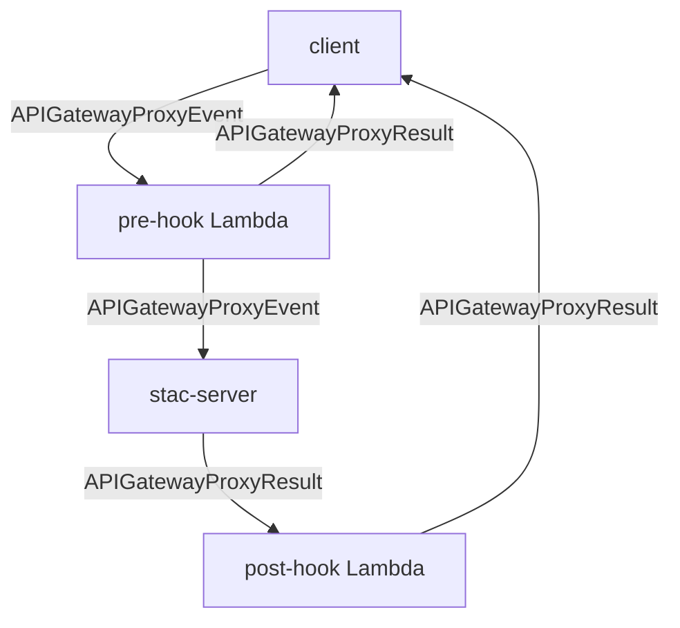

<!-- omit from toc -->

# stac-server


**Documentation:** [README](README.md) | [Deployment](DEPLOYMENT.md) | [Contributing](CONTRIBUTING.md) | [Security](SECURITY.md) | [Changelog](CHANGELOG.md)

- [Overview](#overview)
- [Architecture](#architecture)
- [Usage](#usage)
- [Queryables](#queryables)
  - [Filter Extension](#filter-extension)
  - [Query Extension](#query-extension)
- [Aggregation](#aggregation)
- [Asset Proxy](#asset-proxy)
  - [Configuration](#configuration)
  - [Endpoints](#endpoints)
  - [IAM Permissions](#iam-permissions)
  - [Asset Transformation](#asset-transformation)
- [Collections and filter parameters for authorization](#collections-and-filter-parameters-for-authorization)
  - [Collections](#collections)
  - [CQL2 Filter](#cql2-filter)
- [Ingesting Data](#ingesting-data)
  - [Ingest actions](#ingest-actions)
  - [Ingesting large items](#ingesting-large-items)
  - [Subscribing to SNS Topics](#subscribing-to-sns-topics)
  - [Ingest Errors](#ingest-errors)
- [Contributing](#contributing)
- [About](#about)
- [License](#license)

## Overview

Stac-server is an implementation of the [STAC API specification](https://github.com/radiantearth/stac-api-spec) for searching and serving metadata for geospatial data, including but not limited to satellite imagery). The STAC and STAC API versions supported by a given version of stac-server are shown in the table below. Additional information can be found in the [CHANGELOG](CHANGELOG.md)

| stac-server Version(s) | STAC Version | STAC API Foundation Version |
| ---------------------- | ------------ | --------------------------- |
| 0.1.x                  | 0.9.x        | 0.9.x                       |
| 0.2.x                  | <1.0.0-rc.1  | 0.9.x                       |
| 0.3.x                  | 1.0.0        | 1.0.0-beta.2                |
| 0.4.x                  | 1.0.0        | 1.0.0-beta.5                |
| 0.5.x-0.8.x            | 1.0.0        | 1.0.0-rc.2                  |
| >=1.0.0                | 1.0.0        | 1.0.0                       |
| >=3.10.0               | 1.1.0        | 1.0.0                       |

Currently, stac-server supports the following specifications:

- STAC API - Core
- STAC API - Features
- STAC API - Collections
- STAC API - Item Search
- Context Extension (deprecated, disabled by default)
- Sort Extension
- Fields Extension
- Query Extension
- Filter Extension (conformance classes "Basic CQL2", "CQL2 JSON", "Basic Spatial Functions", and
  "Basic Spatial Functions with additional Spatial Literals", and
  the "in" and "between" predicates from "Advanced Comparison Operators")
- Transaction Extension (disabled by default)
- Aggregation Extension (experimental)

The following APIs are deployed instances of stac-server:

| Name                                                                 | STAC Version | STAC API Version | Description                              |
| -------------------------------------------------------------------- | ------------ | ---------------- | ---------------------------------------- |
| [Earth Search v1](https://earth-search.aws.element84.com/v1)         | 1.0.0        | 1.0.0            | Catalog (v1) of some AWS Public Datasets |
| [USGS Astrogeology STAC API](https://stac.astrogeology.usgs.gov/api) | 1.0.0        | 1.0.0            | A STAC API for planetary data            |
| [Earth Search v0](https://earth-search.aws.element84.com/v0)         | 1.0.0-beta.2 | 0.9.0            | Catalog (v0) of some AWS Public Datasets |
| [Landsat Look](https://landsatlook.usgs.gov/stac-server)             | 1.0.0        | 0.9.0            |                                          |

## Architecture



## Usage

Stac-server is a web API that returns JSON, see the [documentation](http://stac-utils.github.io/stac-server), or the /api endpoint which is a self-documenting OpenAPI document. [STAC Index](https://stacindex.org) collects information on a number of [client tools](https://stacindex.org/ecosystem?category=Client).

stac-server supports both GET and POST Search requests.

An Item Search with GET:

```shell
curl "${HOST}/search?collections=sentinel-2-l2a,sentinel-2-l1c&bbox=10,10,15,15&query=%7B%22eo%3Acloud_cover%22%3A%7B%22gte%22%3A0%2C%22lte%22%3A5%7D%7D&filter=%7B%22op%22%3A%22%3C%22%2C%22args%22%3A%5B%7B%22property%22%3A%22view%3Asun_elevation%22%7D%2C50%5D%7D&sortby=-properties.datetime"
```

Notice that the `query` and `filter` parameters are URL-encoded JSON values.

An Item Search with POST:

```shell
curl -X "POST" "${HOST}/search" \
     -H 'Content-Type: application/json; charset=utf-8' \
     -d $'{
  "collections": [
    "sentinel-2-l2a",
    "sentinel-2-l1c"
  ],
  "bbox": [
    10,
    10,
    15,
    15
  ],
  "query": {
    "eo:cloud_cover": {
      "gte": 0,
      "lte": 5
    }
  },
  "filter": {
    "op": "<",
    "args": [
      "property": "view:sun_elevation"
    ],
    50
  }
  "sortby": {
    "field": "properties.datetime",
    "direction": "desc"
  }
}'
```

## Deployment

For detailed deployment instructions, see [DEPLOYMENT.md](DEPLOYMENT.md).:
## Queryables

The Filter Extension defines a
[Queryables](https://docs.ogc.org/is/19-079r2/19-079r2.html#queryables) resource for
discovering properties that may be used to construct filter expressions. Queryables for
each Collection are served from the `/collections/{collectionId}/queryables` endpoint.
Root-level (global to all Collections) queryables are served from the `/queryables`
endpoint.

Collection queryables are defined in stac-server by adding a `queryables` field to the
Collection JSON object with the value being the JSON Schema definition of the queryables
for that Collection. The content of this `queryables` field is extracted from the
Collection object and served from the Collection's queryables endpoint, but is removed
from the Collection object when the Collection itself is served from the
`/collections/{collectionId}` endpoint. Stac-server's root-level queryables resource is
not configurable and currently does not advertise any queryable properties. Likewise, if a
Collection does not define a `queryables` field, no queryable properties are advertised
for that Collection. For reference, here is a queryables JSON Schema definition that does
not advertise any queryables properties (note the empty `properties` field):

```json
{
  "$schema": "https://json-schema.org/draft/2020-12/schema",
  "$id": "https://stac-api.example.com/queryables",
  "type": "object",
  "title": "Queryables for Example STAC API",
  "description": "Queryable names for the example STAC API Item Search filter.",
  "properties": {},
  "additionalProperties": true
}
```

### Filter Extension

Stac-server currently implements the Filter Extension such that the `id`, `collection`,
`bbox`, and `geometry` Item fields and all fields in the `properties` object of an Item
are always available as filter terms for a Collection, regardless of whether a Collection
defines a `queryables` field or not. This behavior aligns with a value of `true` for the
`additionalProperties` field in the queryables definition. Stac-server currently
**requires** `additionalProperties` to be `true`; a value of `false`, which would restrict
filtering to only those `properties` defined in a Collection's queryables schema, is not
supported and will raise an error. Thus, adding a `queryables` field to a Collection is
informative only - it does not change the behavior of a filter.

Note that when creating a filter expression that uses fields from the `properties` object
in an Item, the fields **must not** be prefixed, e.g., use `eo:cloud_cover` instead of
`properties.eo:cloud_cover` in the filter expression. Care must be taken that terms used
in a filter expression exactly match the field names in the Item `properties` object;
there is no validation that filter expression terms are correct, so if you search for a
field that doesn't exist in an Item's `properties` object, that Item will never be
matched.

The`id`, `collection`, `bbox`, and `geometry` fields also **must not** be prefixed since
they are top-level Item fields. Note that until the [Basic Spatial Functions with
additional Spatial
Literals](https://docs.ogc.org/is/21-065r2/21-065r2.html#rc_basic-spatial-functions-plus)
and [Array
Functions](https://docs.ogc.org/is/21-065r2/21-065r2.html#_conformance_class_array_functions)
conformance classes are implemented, searching over the `bbox` and `geometry` fields is
not supported.

### Query Extension

Unlike the Filter Extension, the Query Extension does not (yet) define a mechanism to
advertise which terms may be used in expressions. However, an optional definition may be
added to it soon that defines queryables endpoints the same as used with Filter Extension.

## Aggregation

Stac-server supports the [Aggregation Extension](https://github.com/stac-api-extensions/aggregation). This allows the definition of per-collection aggregations that can be
calculated, dependent on the relevant fields being available in the STAC Items in that
Collection. A field named `aggregations` should be added to the Collection object for
the collection for which the aggregations are available, e.g.:

```text
  "aggregations": [
    {
      "name": "total_count",
      "data_type": "integer"
    },
    {
      "name": "datetime_max",
      "data_type": "datetime"
    },
    {
      "name": "datetime_min",
      "data_type": "datetime"
    },
    {
      "name": "datetime_frequency",
      "data_type": "frequency_distribution",
      "frequency_distribution_data_type": "datetime"
    },
    {
      "name": "grid_code_frequency",
      "data_type": "frequency_distribution",
      "frequency_distribution_data_type": "string"
    },
    {
      "name": "centroid_geohash_grid_frequency",
      "data_type": "frequency_distribution",
      "frequency_distribution_data_type": "string"
    },
    {
      "name": "centroid_geohex_grid_frequency",
      "data_type": "frequency_distribution",
      "frequency_distribution_data_type": "string"
    },
    {
      "name": "centroid_geotile_grid_frequency",
      "data_type": "frequency_distribution",
      "frequency_distribution_data_type": "string"
    },
      {
      "name": "geometry_geohash_grid_frequency",
      "data_type": "frequency_distribution",
      "frequency_distribution_data_type": "string"
    },
    {
      "name": "geometry_geotile_grid_frequency",
      "data_type": "frequency_distribution",
      "frequency_distribution_data_type": "string"
    }
  ]
```

Available aggregations are:

- total_count (count of total items)
- collection_frequency (Item `collection` field)
- platform_frequency (Item.Properties.platform)
- cloud_cover_frequency (Item.Properties.eo:cloud_cover)
- datetime_frequency (Item.Properties.datetime, monthly interval)
- datetime_min (earliest Item.Properties.datetime)
- datetime_max (latest Item.Properties.datetime)
- sun_elevation_frequency (Item.Properties.view:sun_elevation)
- sun_azimuth_frequency (Item.Properties.view:sun_azimuth)
- off_nadir_frequency (Item.Properties.view:off_nadir)
- grid_code_frequency (Item.Properties.grid:code)
- grid_geohash_frequency ([geohash grid](https://opensearch.org/docs/latest/aggregations/bucket/geohash-grid/) on Item.Properties.proj:centroid) (Deprecated)
- grid_geohex_frequency ([geohex grid](https://opensearch.org/docs/latest/aggregations/bucket/geohex-grid/) on Item.Properties.proj:centroid) (Deprecated)
- grid_geotile_frequency ([geotile grid](https://opensearch.org/docs/latest/aggregations/bucket/geotile-grid/) on Item.Properties.proj:centroid) (Deprecated)
- centroid_geohash_grid_frequency ([geohash grid](https://opensearch.org/docs/latest/aggregations/bucket/geohash-grid/) on Item.Properties.proj:centroid)
- centroid_geohex_grid_frequency ([geohex grid](https://opensearch.org/docs/latest/aggregations/bucket/geohex-grid/) on Item.Properties.proj:centroid)
- centroid_geotile_grid_frequency (geotile on Item.Properties.proj:centroid)
- geometry_geohash_grid_frequency ([geohash grid](https://opensearch.org/docs/latest/aggregations/bucket/geohash-grid/) on Item.geometry)
- geometry_geotile_grid_frequency ([geotile grid](https://opensearch.org/docs/latest/aggregations/bucket/geotile-grid/) on Item.geometry)

## Asset Proxy

The Asset Proxy feature enables stac-server to proxy access to S3 assets through the STAC
API by generating pre-signed URLs. Only assets with S3 URIs (`s3://` prefix) are proxied;
other URL schemes are ignored. When the Asset Proxy feature is enabled, asset `href`
values pointing to S3 are replaced with proxy endpoint URLs when an Item or Collection is
served, while the original S3 URLs are preserved in the `alternate.s3.href` field using
the [Alternate Assets Extension](https://github.com/stac-extensions/alternate-assets).
Subsequent GET requests to the proxy endpoint URLs are redirected to pre-signed S3 URLS
for download. Note that the AWS account that stac-server is running under must have
permission to access the S3 buckets containing the assets and that the stac-server AWS
account will be charged for the S3 egress, regardless of whether the bucket is a
"Requester Pays" bucket or not (the stac-server AWS account is the requester when
generating the pre-signed URL).

### Configuration

Asset proxying uses three environment variables:

- **`ASSET_PROXY_BUCKET_OPTION` -** Specifies one of four modes to control which S3 buckets are proxied.

  - **NONE** (default): Asset proxy is disabled. All asset hrefs are returned unchanged.
  - **ALL**: Proxy all S3 assets regardless of which bucket they are in.
  - **ALL_BUCKETS_IN_ACCOUNT**: Proxy assets from any S3 bucket accessible to the AWS account credentials. The list of buckets is fetched at Lambda startup.
  - **LIST**: Only proxy assets from specific buckets listed in `ASSET_PROXY_BUCKET_LIST`.

- **`ASSET_PROXY_BUCKET_LIST`** — Comma-separated list of bucket names (required only when the `ASSET_PROXY_BUCKET_OPTION` environment variable is set to `LIST`)

  ```yaml
  ASSET_PROXY_BUCKET_OPTION: "LIST"
  ASSET_PROXY_BUCKET_LIST: "my-bucket-1,my-bucket-2,my-bucket-3"
  ```

- **`ASSET_PROXY_URL_EXPIRY`** — Pre-signed URL expiry in seconds (default: `300`)

### Endpoints

When asset proxying is enabled, two endpoints are available for accessing proxied assets:

- `GET /collections/{collectionId}/items/{itemId}/assets/{assetKey}` - Redirects (HTTP 302) to a pre-signed S3 URL for an item asset
- `GET /collections/{collectionId}/assets/{assetKey}` - Redirects (HTTP 302) to a pre-signed S3 URL for a collection asset

### IAM Permissions

For the Asset Proxy feature to generate pre-signed URLs, the API and ingest Lambdas must
be assigned permissions for the S3 buckets containing the assets. Add the following to the
IAM role statements in your serverless.yml file, adjusting the resources as needed:

For the `LIST` mode, you can specify the buckets listed in `ASSET_PROXY_BUCKET_LIST`:

```yaml
- Effect: Allow
  Action:
    - s3:GetObject
  Resource:
    - "arn:aws:s3:::my-bucket-1/*"
    - "arn:aws:s3:::my-bucket-2/*"
- Effect: Allow
  Action:
    - s3:HeadBucket
    - s3:ListBucket
  Resource:
    - "arn:aws:s3:::my-bucket-1"
    - "arn:aws:s3:::my-bucket-2"
```

For the `ALL` mode, use wildcards:

```yaml
- Effect: Allow
  Action:
    - s3:GetObject
  Resource: "arn:aws:s3:::*/*"
- Effect: Allow
  Action:
    - s3:HeadBucket
    - s3:ListBucket
  Resource: "arn:aws:s3:::*"
```

When using `ALL_BUCKETS_IN_ACCOUNT` mode, the Lambda also needs permission to list the
account buckets:

```yaml
- Effect: Allow
  Action:
    - s3:GetObject
  Resource: "arn:aws:s3:::*/*"
- Effect: Allow
  Action:
    - s3:HeadBucket
    - s3:ListBucket
  Resource: "arn:aws:s3:::*"
- Effect: Allow
  Action:
    - s3:ListAllMyBuckets
  Resource: "*"
```

### Asset Transformation

When asset proxying is enabled and an asset's `href` points to an S3 URL, the asset is transformed as follows:

**Original asset:**
```json
{
  "thumbnail": {
    "href": "s3://my-bucket/path/to/thumbnail.png",
    "type": "image/png",
    "roles": ["thumbnail"]
  }
}
```

**Transformed asset:**
```json
{
  "thumbnail": {
    "href": "https://api.example.com/collections/my-collection/items/my-item/assets/thumbnail",
    "type": "image/png",
    "roles": ["thumbnail"],
    "alternate": {
      "s3": {
        "href": "s3://my-bucket/path/to/thumbnail.png"
      }
    }
  }
}
```

The item or collection will also have the Alternate Assets Extension added to its `stac_extensions` array:

```json
"stac_extensions": [
  "https://stac-extensions.github.io/alternate-assets/v1.2.0/schema.json"
]
```

## Collections and filter parameters for authorization

One key concern in stac-server is how to restrict user's access to items.  These
features allow this introducing support for injecting values at runtime (e.g., in a
proxy or pre-hook Lambda) to restrict items by collection or by CQL2 filter.

### Collections

This feature must be enabled with the `ENABLE_COLLECTIONS_AUTHX` configuration.

All endpoints that involve the use of Collections support the use of a additional
parameter that indicates which collections a user should have access to. This parameter
can be injected as:

1. GET request - a query parameter `_collections`
2. POST request - a body field `_collections`
3. All requests - an HTTP header `stac-collections-authx`

This parameter/field will be excluded
from pagination links, so it does not need to be removed on egress.

If this behavior is enabled and a parameter is not passed or is passed
with an empty string or empty list, the caller will not have access to any collections.
When `*` is included in the list of collections (presumably as the only value), the caller
will have access to all collections.

The endpoints this applies to are:

- /collections
- /collections/:collectionId
- /collections/:collectionId/queryables
- /collections/:collectionId/aggregations
- /collections/:collectionId/aggregate
- /collections/:collectionId/items
- /collections/:collectionId/items/:itemId
- /collections/:collectionId/items/:itemId/thumbnail
- /collections/:collectionId/items/:itemId/assets/:assetKey
- /collections/:collectionId/assets/:assetKey
- /search
- /aggregate

The five endpoints of the Transaction Extension do not use these parameters, as there are
other authorization considerations for these, that are left as future work.

### CQL2 Filter

This feature must be enabled with the `ENABLE_FILTER_AUTHX` configuration.

All endpoints that involve items support the use of a additional
parameter that indicates which items a user should have access to. This parameter
can be injected as:

1. GET request - a query parameter `_filter`
2. POST request - a body field `_filter`
3. All requests - an HTTP header `stac-filter-authx`

This parameter/field will be excluded
from pagination links, so it does not need to be removed on egress.

The endpoints this applies to are:

- /collections/:collectionId/aggregate
- /collections/:collectionId/items
- /collections/:collectionId/items/:itemId
- /collections/:collectionId/items/:itemId/thumbnail
- /collections/:collectionId/items/:itemId/assets/:assetKey
- /collections/:collectionId/assets/:assetKey
- /search
- /aggregate

One limitation of the header approach is that API Gateway has a hard limit of 10240 or
8000 bytes (depending on the type), so a large filter could exceed this.

## Ingesting Data

STAC Collections and Items are ingested by the `ingest` Lambda function, however this Lambda is not invoked directly by a user, it consumes records from the `stac-server-<stage>-queue` SQS. To add STAC Items or Collections to the queue, publish them to the SNS Topic `stac-server-<stage>-ingest`.

**STAC Collections must be ingested before Items that belong to that Collection.** Items should have the `collection` field populated with the ID of an existing Collection. If an Item is ingested before ingestion of the Collection it contains,
ingestion will either fail (in the case of a single Item ingest) or if auto-creation of indexes is enabled (default) and multiple Items are ingested in bulk, the auto-created index will have incorrect mappings.

If a collection or item is ingested, and an item with that id already exists in STAC, the new item will completely replace the old item, except the `created` property will be retained and the `updated` property updated
to match the time of the new update.

After a collection or item is ingested, the status of the ingest (success or failure) along with details of the collection or item are sent to a post-ingest SNS topic. To take action on items after they are ingested subscribe an endpoint to this topic.

Messages published to the post-ingest SNS topic include the following atributes that can be used for filtering:

| attribute    | type   | values                   |
| ------------ | ------ | ------------------------ |
| recordType   | String | `Collection` or `Item`   |
| ingestStatus | String | `successful` or `failed` |
| collection   | String |                          |

### Ingest actions

In addition to ingesting Item and Collection JSON, the ingestion pipeline can also execute
actions. This is useful when the Transaction Extension is turned off, but data modification
still needs to occur.

There is currently only one action implemented, `truncate`. This action will delete all
of the Items in the specified Collection, but keep the Collection.

This action is enabled by setting `ENABLE_INGEST_ACTION_TRUNCATE` to `true`. For example,
a deployment may want to enable this in dev and staging, but disable in prod so you don't
accidentally delete all the items from a production collection.

The form of this message is:

```json
{
  "type": "action",
  "command": "truncate",
  "collection": "my_collection_1"
}
```

### Ingesting large items

There is a 256 KB limit on the size of SQS messages. Larger items can by publishing a message to the `stac-server-<stage>-ingest` SNS topic in with the format:

```json
{
  "href": "s3://source-bucket/source-key"
}
```

The `s3://`, `http://`, and `https://` protocols are supported for remote ingest.

### Subscribing to SNS Topics

Stac-server can also be subscribed to SNS Topics that publish complete STAC Items as their message. This provides a way to keep stac-server up to date with new data. Use the AWS Lambda console for the function `stac-server-<stage>-subscibe-to-sns` to subscribe to an SNS Topic for which you have the full ARN and permission to subscribe to. This could be an SNS Topic you created yourself to publish STAC records to, or a publicly available one, such as for [Sentinel](https://github.com/sat-utils/sat-stac-sentinel).

_Note_, that adding the subscription via the topic page does not seem to work. Instead, add a trigger on Lambda edit page.

### Ingest Errors

Errors that occur while consuming items from the ingest queue will end up in the dead letter processing queue.

## Contributing

Stac-server supports two hooks into the request process: a pre-hook and a post-hook. These are each Lambda functions which, if configured, will be invoked by stac-server. It is assumed that the stac-server Lambda has been granted permission to invoke these Lambda functions, if configured.

### Pre-Hook

If the stac-server is deployed with the `PRE_HOOK` environment variable set to the name of a Lambda function, then that function will be called as the pre-hook.

The event passed into the pre-hook Lambda will be an instance of an [API Gateway Proxy Event](https://docs.aws.amazon.com/apigateway/latest/developerguide/set-up-lambda-proxy-integrations.html#api-gateway-simple-proxy-for-lambda-input-format).

If the return value from the pre-hook Lambda is an instance of an [API Gateway Proxy Result](https://docs.aws.amazon.com/apigateway/latest/developerguide/set-up-lambda-proxy-integrations.html#api-gateway-simple-proxy-for-lambda-output-format), then that response will immediately be returned to the client.

If the return value of the pre-hook Lambda is an instance of an [API Gateway Proxy Event](https://docs.aws.amazon.com/apigateway/latest/developerguide/set-up-lambda-proxy-integrations.html#api-gateway-simple-proxy-for-lambda-input-format), then that event will be passed along to stac-server.

If the pre-hook Lambda throws an exception, an internal server error will be returned to the client.

The pre-hook Lambda configuration may reference any Lambda, not only one deployed as part
of this stack. There is an example pre-hook Lambda that can be included with this stack,
which provides an example rudimentary authorization mechanism via a hard-coded token.

To enable this example pre-hook:

- Either (1) in package.json, pass the env var `BUILD_PRE_HOOK=true` in the `build`
  command, or (2) modify bin/build.sh to always build the "pre-hook" package.
- In the serverless.yml file, uncomment the `preHook` function, the `preHook` IAM
  permissions, and the environment variables `PRE_HOOK` and `API_KEYS_SECRET_ID`
- Create a Secrets Manager secret with the name used in `API_KEYS_SECRET_ID` with
  the keys as the strings allowed for API Keys and the values as an array `["write"]`.
- Build and deploy.

### Post-Hook

If the stac-server is deployed with the `POST_HOOK` environment variable set to the name of a Lambda function, then that function will be called as the post-hook.

The event passed into the post-hook labmda will be the response from the stac-server, and will be an instance of an [API Gateway Proxy Result](https://docs.aws.amazon.com/apigateway/latest/developerguide/set-up-lambda-proxy-integrations.html#api-gateway-simple-proxy-for-lambda-output-format).

The return value of the post-hook Lambda must be an instance of an [API Gateway Proxy Result](https://docs.aws.amazon.com/apigateway/latest/developerguide/set-up-lambda-proxy-integrations.html#api-gateway-simple-proxy-for-lambda-output-format).

If the post-hook Lambda throws an exception, an internal server error will be returned to the client.

The post-hook Lambda configuration may reference any Lambda, not only one deployed as part
of this stack. There is an example post-hook Lambda that can be included with this stack,
which does nothing, but shows how the API Lambda response can be modified.

The post-hook Lambda configuration may reference any Lambda, not only one deployed as part
of this stack. There is an example post-hook Lambda that can be included with this stack,
which provides an example of how to interact with the response, but does not modify it.

If compression is enabled with `ENABLE_RESPONSE_COMPRESSION`, you should ensure that the
post-hook deployed handles compressed responses, or for the example post-hook lambda,
disable compression.

To enable this example post-hook:

- Modify bin/build.sh to not exclude the "post-hook" package from being built.
- In the serverless.yml file, uncomment the `postHook` function and the `postHook`
  IAM permissions.
- Build and deploy.

### Request Flow



### Notes

Lambda payloads and responses [must be less than 6 MB](https://docs.aws.amazon.com/lambda/latest/dg/gettingstarted-limits.html#function-configuration-deployment-and-execution). A larger payload will result in an internal server error being returned to the client.

The outputs of the pre- and post-hooks are validated and, if they don't comply with the defined schemas, an internal server error will be returned to the client. Information about the invalid event, as well as details about the parsing errors, will be logged to CloudWatch.

## Contributing

For development setup, testing, and contribution guidelines, see [CONTRIBUTING.md](CONTRIBUTING.md).

## About

[stac-server](https://github.com/stac-utils/stac-server) was forked from [sat-api](https://github.com/sat-utils/sat-api). Stac-server is for STAC versions 0.9.0+, while sat-api exists for versions of STAC prior to 0.9.0.

## License

stac-server is licensed under [The MIT License](https://opensource.org/license/mit/).
Copyright for portions of stac-server is held by Development Seed (2016) as
part of project [sat-api](https://github.com/sat-utils/sat-api)
[original license](https://github.com/sat-utils/sat-api/blob/master/LICENSE). Copyright for all changes to stac-server since the fork date is held by Element 84, Inc (2020).
