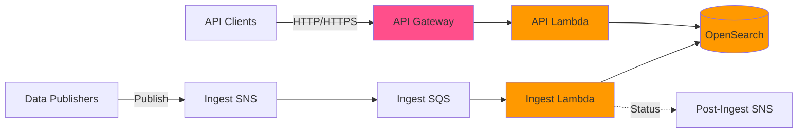

<!-- omit from toc -->

# stac-server

**A scalable, serverless implementation of the STAC API spec for searching geospatial metadata**

[](https://github.com/stac-utils/stac-server/actions)
[](https://opensource.org/licenses/MIT)
[](https://stacspec.org)

**Documentation:** [README](README.md) | [Usage Guide](USAGE.md) | [Architecture](ARCHITECTURE.md) | [Configuration](CONFIGURATION.md) | [Deployment](DEPLOYMENT.md) | [Contributing](CONTRIBUTING.md) | [Security](SECURITY.md) | [Changelog](CHANGELOG.md)

## Table of Contents

- [Overview](#overview)
- [Architecture](#-architecture)
- [Quick Start](#-quick-start)
- [Usage](#️-usage)
- [Configuration](#-configuration)
- [Production Deployments](#-production-deployments)
- [Contributing](#-contributing)
- [About](#about)
- [License](#license)

## Overview

Stac-server is a production-ready implementation of the [STAC API specification](https://github.com/radiantearth/stac-api-spec) for searching and serving metadata for geospatial data, including satellite imagery. Built on AWS serverless infrastructure (Lambda, API Gateway, OpenSearch), it provides a highly scalable and cost-effective solution for cataloging and discovering Earth observation data.

### 🌟 Key Features

- **📡 Full STAC API Support** - Core, Features, Collections, Item Search with extensions
- **🔍 Advanced Querying** - STACQL and CQL2 filtering, full-text search, spatial and temporal queries
- **📊 Aggregations** - Statistical summaries and frequency distributions  
- **🛸 Serverless Architecture** - Auto-scaling, pay-per-use AWS Lambda and API Gateway
- **🔐 Fine-Grained Access Control** - OpenSearch security with optional pre/post hooks
- **📨 Event-Driven Ingest** - SNS/SQS-based ingestion pipeline with dead-letter handling
- **🗂️ Asset Proxying** - Generate pre-signed S3 URLs for secure asset access

### Supported Versions

| stac-server Version(s) | STAC Version | STAC API Foundation Version |
| ---------------------- | ------------ | --------------------------- |
| 0.1.x                  | 0.9.x        | 0.9.x                       |
| 0.2.x                  | <1.0.0-rc.1  | 0.9.x                       |
| 0.3.x                  | 1.0.0        | 1.0.0-beta.2                |
| 0.4.x                  | 1.0.0        | 1.0.0-beta.5                |
| 0.5.x-0.8.x            | 1.0.0        | 1.0.0-rc.2                  |
| >=1.0.0                | 1.0.0        | 1.0.0                       |
| >=3.10.0               | 1.1.0        | 1.0.0                       |

### Tech Stack

- **Runtime:** Node.js 22 (AWS Lambda)
- **API Framework:** AWS API Gateway with Lambda proxy integration
- **Database:** AWS OpenSearch Service
- **Queue/Events:** AWS SNS and SQS for ingest pipeline
- **Infrastructure:** Serverless Framework for deployment
- **Language:** TypeScript

### Supported STAC Extensions

- STAC API - Core
- STAC API - Features
- STAC API - Collections
- STAC API - Item Search
- Context Extension (deprecated, disabled by default)
- Sort Extension
- Fields Extension
- Query Extension
- Filter Extension (conformance classes "Basic CQL2", "CQL2 JSON", "Basic Spatial Functions", and
  "Basic Spatial Functions with additional Spatial Literals", and
  the "in" and "between" predicates from "Advanced Comparison Operators")
- Transaction Extension (disabled by default)
- Aggregation Extension (experimental)

## 🪐 Architecture

Stac-server is built on AWS serverless infrastructure with a clear separation between read (API) and write (Ingest) paths:



**Key Components:**
- **API Gateway + Lambda**: Handle all STAC API requests with auto-scaling
- **OpenSearch**: Document storage and search engine with geo-spatial queries
- **SNS + SQS**: Event-driven ingest pipeline with guaranteed delivery
- **Separate Indices**: One index per collection for optimal performance

For detailed architecture documentation including data flows, authentication, and deployment patterns, see [ARCHITECTURE.md](ARCHITECTURE.md).

## 🚀 Quick Start

For detailed deployment instructions to AWS, see [DEPLOYMENT.md](DEPLOYMENT.md).

### Prerequisites

- Node.js 22 or later
- AWS account with appropriate permissions
- Serverless Framework

For local development and testing, see [CONTRIBUTING.md](CONTRIBUTING.md).

## 🕹️ Usage

Stac-server implements the STAC API specification for searching geospatial metadata. See **[USAGE.md](USAGE.md)** for comprehensive examples and guides.

### Quick Example

Search for items in a bounding box:

```shell
curl "${HOST}/search?collections=sentinel-2-l2a&bbox=10,10,15,15&limit=10"
```

### Key Capabilities

- **🔍 Search & Discovery** - Spatial, temporal, and property-based queries
- **🎯 Advanced Filtering** - CQL2 and STACQL for complex queries  
- **📊 Aggregations** - Statistical summaries and frequency distributions
- **📋 Sorting & Field Selection** - Optimize results and response size
- **🔐 Asset Proxy** - Secure S3 access via pre-signed URLs

### Documentation Resources

- **[Usage Guide](USAGE.md)** - Complete examples for searching, filtering, aggregating, and more
- **[API Reference](http://stac-utils.github.io/stac-server)** - Full OpenAPI specification
- **Instance `/api` endpoint** - Interactive API documentation on your deployment
- **[STAC Index](https://stacindex.org/ecosystem?category=Client)** - Client libraries and tools

## ⚙️ Configuration

Stac-server is configured through environment variables and collection-level parameters. See [CONFIGURATION.md](CONFIGURATION.md) for complete documentation of:

- **Environment Variables** - Database connection, API settings, CORS, extensions, asset proxy, authorization, logging
- **Collection Configuration** - Queryables and aggregations defined in Collection JSON
- **Best Practices** - Security, performance optimization, monitoring

Key configuration areas:
- **OpenSearch Connection**: `OPENSEARCH_HOST`, authentication options
- **API Customization**: `STAC_ID`, `STAC_TITLE`, `STAC_DESCRIPTION`
- **Extensions**: Enable/disable Context, Transactions, Thumbnails
- **Collection Queryables**: Define searchable properties in Collection JSON
- **Collection Aggregations**: Configure available statistical summaries

## 🌍 Production Deployments

The following production instances are powered by stac-server:

- **[Earth Search v1](https://earth-search.aws.element84.com/v1)** - Catalog of AWS Public Datasets (STAC 1.0.0)
- **[USGS Astrogeology STAC API](https://stac.astrogeology.usgs.gov/api)** - Planetary data catalog (STAC 1.0.0)
- **[Landsat Look](https://landsatlook.usgs.gov/stac-server)** - USGS Landsat imagery catalog

## 👽 Contributing

For development setup, testing, and contribution guidelines, see [CONTRIBUTING.md](CONTRIBUTING.md).

## About

[stac-server](https://github.com/stac-utils/stac-server) was forked from [sat-api](https://github.com/sat-utils/sat-api). Stac-server is for STAC versions 0.9.0+, while sat-api exists for versions of STAC prior to 0.9.0.

## License

stac-server is licensed under [The MIT License](https://opensource.org/license/mit/).
Copyright for portions of stac-server is held by Development Seed (2016) as
part of project [sat-api](https://github.com/sat-utils/sat-api)
[original license](https://github.com/sat-utils/sat-api/blob/master/LICENSE). Copyright for all changes to stac-server since the fork date is held by Element 84, Inc (2020).
