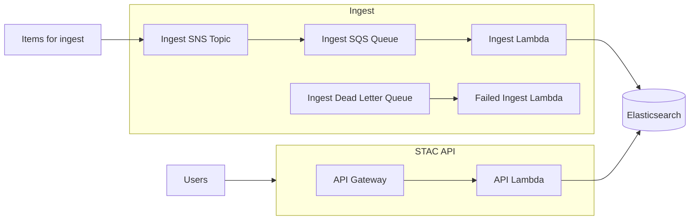
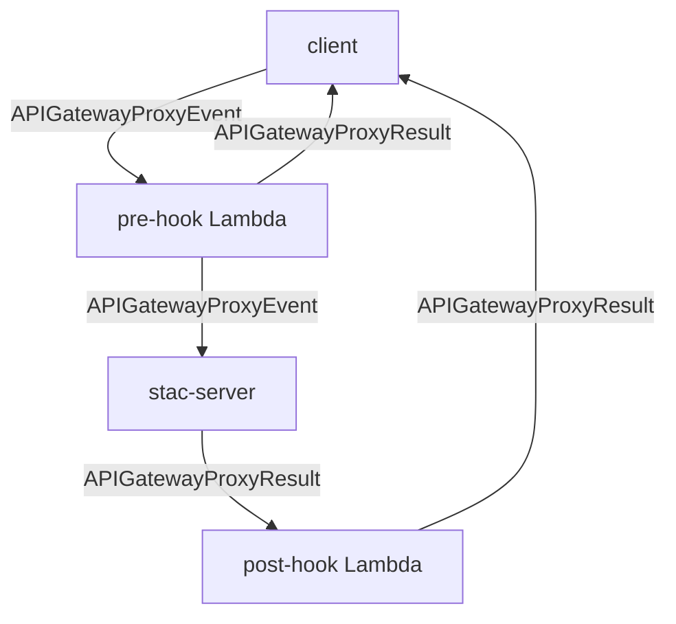

# stac-server


- [stac-server](#stac-server)
  - [Overview](#overview)
  - [Architecture](#architecture)
  - [Migration](#migration)
    - [0.4.x -\> 0.5.x](#04x---05x)
      - [serverless.yml migration](#serverlessyml-migration)
      - [Switch to Opensearch 2.3 from Elasticsearch 7.10](#switch-to-opensearch-23-from-elasticsearch-710)
    - [0.3.x -\> 0.4.x](#03x---04x)
      - [Elasticsearch upgrade from 7.9 to 7.10](#elasticsearch-upgrade-from-79-to-710)
      - [Disable automatic index creation](#disable-automatic-index-creation)
      - [Validate index mappings](#validate-index-mappings)
  - [Usage](#usage)
  - [Deployment](#deployment)
    - [Elasticsearch Configuration](#elasticsearch-configuration)
      - [Disable automatic index creation](#disable-automatic-index-creation-1)
      - [Create collection index](#create-collection-index)
    - [Proxying Stac-server through CloudFront](#proxying-stac-server-through-cloudfront)
    - [Locking down transaction endpoints](#locking-down-transaction-endpoints)
  - [Ingesting Data](#ingesting-data)
    - [Ingesting large items](#ingesting-large-items)
    - [Subscribing to SNS Topics](#subscribing-to-sns-topics)
    - [Ingest Errors](#ingest-errors)
  - [Pre- and Post-Hooks](#pre--and-post-hooks)
    - [Pre-Hook](#pre-hook)
    - [Post-Hook](#post-hook)
    - [Request Flow](#request-flow)
    - [Notes](#notes)
  - [Development](#development)
    - [Running Locally](#running-locally)
    - [Running Unit Tests](#running-unit-tests)
    - [Running System and Integration Tests](#running-system-and-integration-tests)
    - [Updating the OpenAPI specification](#updating-the-openapi-specification)
  - [About](#about)

## Overview

Stac-server is an implementation of the [STAC API specification](https://github.com/radiantearth/stac-api-spec) for searching and serving metadata for geospatial data, including but not limited to satellite imagery). The STAC and STAC API versions supported by a given version of stac-server are shown in the table below. Additional information can be found in the [CHANGELOG](CHANGELOG.md)

| stac-server Version | STAC Version | STAC API Version |
| ------------------- | ------------ | ---------------- |
| 0.1.x               | 0.9.x        | 0.9.x            |
| 0.2.x               | <1.0.0-rc.1  | 0.9.x            |
| 0.3.x               | 1.0.0        | 1.0.0-beta.2     |
| 0.4.x               | 1.0.0        | 1.0.0-beta.5     |

The following APIs are deployed instances of stac-server:

| Name                                                       | STAC Version | STAC API Version | Description                         |
| ---------------------------------------------------------- | ------------ | ---------------- | ----------------------------------- |
| [Earth Search](https://earth-search.aws.element84.com/v0/) | 1.0.0-beta.2 | 0.9.0            | Catalog of some AWS Public Datasets |
| [Landsat Look](https://landsatlook.usgs.gov/stac-server)   | 1.0.0        | 0.9.0            |                                     |

## Architecture



## Migration

### 0.4.x -> 0.5.x

Create a new deployment, copy the elasticsearch database, rename indexes.

#### serverless.yml migration

- `runtime`: preferred runtime is now nodejs18.x instead of nodejs16.x
- `STAC_API_VERSION` can be updated to `1.0.0-rc.2`
- `ElasticSearchInstance` should be renamed to `OpensearchInstance`
  - The `Type` of this resource should be changed from `AWS::Elasticsearch::Domain` to
    `AWS::OpenSearchService::Domain`
  - The `DomainName` can be changed to a suffix of `-os` from `-es`
  - `ElasticsearchClusterConfig` is now `ClusterConfig`
  - `InstanceType` values have changed, e.g., t3.small.elasticsearch is now t3.small.search
  - `ElasticsearchVersion` is replaced with `EngineVersion` and set to `OpenSearch_2.3`
  - `EsEndpoint` should be renamed to `OpensearchEndpoint` and the exported name suffixed
    with `-os-endpoint` instead of `-es-endpoint`

#### Switch to Opensearch 2.3 from Elasticsearch 7.10

AWS supports upgrading between Elasticsearch 7.10 and Opensearch 2.3. Work needs to be
done on if this can be supported through the serverless deployment.

### 0.3.x -> 0.4.x

Create a new deployment, copy the elasticsearch database, and rename indexes.

#### Elasticsearch upgrade from 7.9 to 7.10

The Serverless Framework supports provisioning AWS resources, but it does not support updating existing resources. In 0.4, the default Elasticsearch version has been updated from 7.9 to 7.10. Continuing to use 7.9 should not cause any problems, but it recommended that you manually upgrade to 7.10 by going to [AWS Console - Amazon OpenSearch Service](https://console.aws.amazon.com/esv3/home), choosing the Elasticsearch domain used by your stac-server deployment (e.g., stac-server-{stage}-es), choose Upgrade from the Actions menu, and then upgrade to Elasticsearch 7.10.

#### Disable automatic index creation

It is now recommended to [disable automatic index creation](#disable-automatic-index-creation-1).

#### Validate index mappings

Elasticsearch indices each have a mapping applied that determines how the data is indexed and searched over.
These mappings do not change the document data, but can change search behavior. One relevant mapping
behavior is that by default, string fields are analyzed for full-text search. In most cases with STAC Items,
values such as those in the `id` and `collection` fields should not be analyzed and should instead be searchable only
by exact matches. In Elasticsearch, this is known as a `keyword` field type. Importantly, sorting may only be done over `keyword` typed fields. As of 0.4.0, the default sort is now by `properties.datetime`, then `id`, then `collection`, and results will not be returnd if any indicies have the `id` or `collection` fields mapped as `text` instead of `keyword`.

For each index (other than `collections`), use GET to retrieve the endpoint `GET /{collectionId}/_mapping`, and
validate that `properties.datetime` type is `date`, and `id` and `collection` mappings are `keyword` (not `text` with a `keyword` subfield). For an AWS Opensearch Service instance, this can be done with a script similar to the one [here](#disable-automatic-index-creation-1).

The results should look simliar to this:

```
{
  "my_collection_name": {
    "mappings": {
      "dynamic_templates": [
        ...
        {
          "strings": {
            "match_mapping_type": "string",
            "mapping": {
              "type": "keyword"
            }
          }
        },
        ...
      ],
      "properties": {
        ....
        "id": {
          "type": "keyword"
        },
        "collection": {
          "type": "keyword"
        },
        ....
        "properties": {
          "properties": {
            ...
            "datetime": {
              "type": "date"
            },
            ...
          }
        },
        ...
      }
    }
  }
}
```

If this is not the case, the easiest solution to fix it is to:

1. Deploy a 0.4.0 instance.
2. Backup and restore the 0.3.0 instance's Elasticsearch indicies to the 0.4.0 instances's
   Elasticsearch database.
3. Create a collection via ingest with a new collection name similar to the existing one (e.g., if index foo exists, create foo_new).
4. Reindex from the the existing index (foo) to the the new one (foo_new).
5. Delete the exiting index and rename the new one to the name of the formerly-existing one (e.g. foo_new -> foo).

## Usage

Stac-server is a web API that returns JSON, see the [documentation](http://stac-utils.github.io/stac-server), or the /api endpoint which is a self-documenting OpenAPI document. Here are some additional tools that might prove useful:

- [pystac-client](https://github.com/stac-utils/pystac-client): A Python client library and CLI for searching a STAC compliant API

## Deployment

This repository contains Node libraries for running the API, along with a [serverless](https://serverless.com/) configuration file for deployment to AWS.

To create your own deployment of stac-server, first clone the repository:

```shell
git clone https://github.com/stac-utils/stac-server.git
cd stac-server
```

Copy the [example serverless config file](serverless.yml.example) to a file named `serverless.yml`:

```shell
cp serverless.yml.example serverless.yml
```

There are some settings that should be reviewed and updated as needeed in the serverless config file, under provider->environment:

| Name                          | Description                                                                                                                                                             | Default Value                                                                        |
| ----------------------------- | ----------------------------------------------------------------------------------------------------------------------------------------------------------------------- | ------------------------------------------------------------------------------------ |
| STAC_VERSION                  | STAC Version of this STAC API                                                                                                                                           | 1.0.0                                                                                |
| STAC_ID                       | ID of this catalog                                                                                                                                                      | stac-server                                                                          |
| STAC_TITLE                    | Title of this catalog                                                                                                                                                   | STAC API                                                                             |
| STAC_DESCRIPTION              | Description of this catalog                                                                                                                                             | A STAC API                                                                           |
| STAC_DOCS_URL                 | URL to documentation                                                                                                                                                    | [https://stac-utils.github.io/stac-server](https://stac-utils.github.io/stac-server) |
| ES_BATCH_SIZE                 | Number of records to ingest in single batch                                                                                                                             | 500                                                                                  |
| LOG_LEVEL                     | Level for logging (CRITICAL, ERROR, WARNING, INFO, DEBUG)                                                                                                               | INFO                                                                                 |
| STAC_API_URL                  | The root endpoint of this API                                                                                                                                           | Inferred from request                                                                |
| ENABLE_TRANSACTIONS_EXTENSION | Boolean specifying if the [Transaction Extension](https://github.com/radiantearth/stac-api-spec/tree/master/ogcapi-features/extensions/transaction) should be activated | false                                                                                |
| STAC_API_ROOTPATH | The path to append to URLs if this is not deployed at the server root. For example, if the server is deployed without a custom domain name, it will have the stage name (e.g., dev) in the path. | ""                                                                                |
| PRE_HOOK                  | The name of a Lambda function to be called as the pre-hook.                                                                                                                                           | none                                            |
| POST_HOOK                  | The name of a Lambda function to be called as the post-hook.                                                                                                                                           | none                                                                |

After reviewing the settings, build and deploy:

```shell
npm install
npm run build
npm run deploy
```

This will create a CloudFormation stack in the `us-west-2` region called `stac-server-dev`.
To change the region or the stage name (from `dev`) provide arguments to the deploy command
(note the additional `--` in the command, required by `npm` to provide arguments):

```shell
npm run deploy -- --stage mystage --region eu-central-1
```

Once deployed, there are a few steps to configure Elasticsearch.

### Elasticsearch Configuration

#### Disable automatic index creation

It is recommended to disable the automatic index creation. This prevents the situation where
a group of Items are bulk indexed before the Collection in which they are contained has
been created, and an Elasticsearch index is created without the appropriate mappings.

This requires installing the requests, requests_aws4auth, and boto3 python libraries, for example, with:

```shell
pip install requests requests_aws4auth boto3
```

Then putting this code into a python file an running it:

```python
from requests_aws4auth import AWS4Auth
import boto3
import requests

host = 'https://my-test-domain.us-east-1.es.amazonaws.com'
path = '/_cluster/settings'
region = 'us-west-2'

credentials = boto3.Session().get_credentials()
awsauth = AWS4Auth(credentials.access_key, credentials.secret_key, region, 'es', session_token=credentials.token)


r = requests.put(
  f'{host}{path}',
  auth=awsauth,
  json={
    "persistent": {
      "action.auto_create_index": "false"
    }
  })

print(r.status_code)
print(r.text)
```

#### Create collection index

The `collection` index must be created, which stores the metadata about each Collection.
Invoke the `stac-server-<stage>-ingest` Lambda function with a payload of:

```json
{
  "create_indices": true
}
```

This can be done with the [AWS CLI Version 2](https://docs.aws.amazon.com/cli/latest/userguide/getting-started-install.html). (The final `-` parameter pipes the output to stdout).

```shell
aws lambda invoke \
  --function-name stac-server-dev-ingest \
  --cli-binary-format raw-in-base64-out \
  --payload '{ "create_indices": true }' \
  -
```

Stac-server is now ready to ingest data!

### Proxying Stac-server through CloudFront

The API Gateway URL associated with the deployed stac-server instance may not be the URL that you ultimately wish to expose to your API users. AWS CloudFront can be used to proxy to a more human readable URL. In order to accomplish this:

1. Create a new CloudFront distribution (or use an existing distribution).
2. Set the origin to the Gateway API URL (obtain in the stage view of the deployed stac-server). The URL is in the form `<##abcde>.execute-api.region.amazonaws.com`.
3. Set the origin path to the deployed stage name prepended with a `/`, (e.g., /dev or /prod).
4. Under behaviors, add a new behavior for the desired URL endpoint or subdomain (e.g., /api or /v0.4.0).
5. Set the 'Origin and origin groups to the URL defined above ('`<##abcde>.execute-api.region.amazonaws.com`').
6. Set Viewer to HTTPS only and Allowed HTTP Methods to 'GET, HEAD, OPTIONS, PUT, POST, PATCH, DELETE'.
7. Set the Cache Policy to a custom policy that forwards query strings. If one simply disables caching, CloudFront strips the query strings.
8. Optionally, define a LambdaEdge to perform a URL rewrite. This is necessary if your API URL is appended to the root URL (e.g., mydomain.com/api). The Lambda must rewrite the URL to remove the /api. For example:

    ```python
    from re import sub

    def lambda_handler(event, context):
        request = event['Records'][0]['cf']['request']
        uri = request["uri"]

        if uri in ["/", "/index.html"]:
            response = {
                "status": 302,
                "statusDescription": "Found",
                "headers": {
                    "location": [{
                        "key": "Location",
                        "value": "/api/"
                    }]
                }
            }
            return response

        request["uri"] = sub("^/api", "/", uri)
        print(request)
        return request
    ```

### Locking down transaction endpoints

If you wanted to deploy STAC Server in a way which ensures certain endpoints have restricted access but others don't, you can deploy it into a VPC and add conditions that allow only certain IP addresses to access certain endpoints. Once you deploy STAC Server into a VPC, you can modify the Resource Policy of the API Gateway endpoint that gets deployed to restrict access to certain endpoints. Here is a hypothetical example. Assume that the account into which STAC Server is deployed is numbered 1234-5678-9123, the API ID is ab1c23def, and the region in which it is deployed is us-west-2. You might want to give the general public access to use any GET or POST endpoints with the API such as the "/search" endpoint, but lock down access to the transaction endpoints (see https://github.com/radiantearth/stac-api-spec/tree/master/ogcapi-features/extensions/transaction) to only allow certain IP addresses to access them. These IP addresses can be, for example: 94.61.192.106, 204.176.50.129, and 11.27.65.78. In order to do this, you can impose a condition on the API Gateway that only allows API transactions such as adding, updating, and deleting STAC items from the whitelisted endpoints. For example, here is a Resource Policy containing two statements that allow this to happen:
```
{
    "Version": "2012-10-17",
    "Statement": [
        {
            "Effect": "Allow",
            "Principal": "*",
            "Action": "execute-api:Invoke",
            "Resource": [
                "arn:aws:execute-api:us-west-2:123456789123:ab1c23def/v1/POST/search",
                "arn:aws:execute-api:us-west-2:123456789123:ab1c23def/v1/POST/search/*",
                "arn:aws:execute-api:us-west-2:123456789123:ab1c23def/v1/GET/search/*",
                "arn:aws:execute-api:us-west-2:123456789123:ab1c23defi/v1/GET/*"
            ]
        },
        {
            "Effect": "Allow",
            "Principal": "*",
            "Action": "execute-api:Invoke",
            "Resource": [
                "arn:aws:execute-api:us-west-2:123456789123:ab1c23def/v1/POST/collections/*/items",
                "arn:aws:execute-api:us-west-2:123456789123:ab1c23def/v1/PUT/collections/*/items/*",
                "arn:aws:execute-api:us-west-2:123456789123:ab1c23def/v1/PATCH/collections/*/items/*",
                "arn:aws:execute-api:us-west-2:123456789123:ab1c23def/v1/DELETE/collections/*/items/*"
            ],
            "Condition": {
                "IpAddress": {
                    "aws:sourceIp": [
                        "94.61.192.106",
                        "204.176.50.129",
                        "11.27.65.78"
                    ]
                }
            }
        }
    ]
}
```

The first statement in the Resource Policy above grants access to STAC API endpoints for use in general operations like searching, and the second statement restricts access to the Transaction endpoints to a set of source IP addresses. According to this policy, POST, PUT, PATCH, and DELETE operations on items within collections are only allowed if the request originates from the IP addresses 94.61.192.106, 204.176.50.129, or 11.27.65.78. The second statement can also be written in another manner, denying access to the Transaction endpoints for all addresses that don’t match a set of source IP addresses. This is shown below.

```
    {
        "Effect": "Deny",
        "Principal": "*",
        "Action": "execute-api:Invoke",
        "Resource": [
            "arn:aws:execute-api:us-west-2:123456789123:ab1c23def/v1/POST/collections/*/items",
            "arn:aws:execute-api:us-west-2:123456789123:ab1c23def/v1/PUT/collections/*/items/*",
            "arn:aws:execute-api:us-west-2:123456789123:ab1c23def/v1/PATCH/collections/*/items/*",
            "arn:aws:execute-api:us-west-2:123456789123:ab1c23def/v1/DELETE/collections/*/items/*"
        ],
        "Condition": {
            "NotIpAddress": {
                "aws:sourceIp": [
                    "94.61.192.106",
                    "204.176.50.129",
                    "11.27.65.78"
                ]
            }
        }
    }
```

## Ingesting Data

STAC Collections and Items are ingested by the `ingest` Lambda function, however this Lambda is not invoked directly by a user, it consumes records from the `stac-server-<stage>-queue` SQS. To add STAC Items or Collections to the queue, publish them to the SNS Topic `stac-server-<stage>-ingest`.

**STAC Collections must be ingested before Items that belong to that Collection.** Items should have the `collection` field populated with the ID of an existing Collection. If an Item is ingested before ingestion of the Collection it contains,
ingestion will either fail (in the case of a single Item ingest) or if auto-creation of indexes is enabled (default) and multiple Items are ingested in bulk, the auto-created index will have incorrect mappings.

If a collection or item is ingested, and an item with that id already exists in STAC, the new item will completely replace the old item.

### Ingesting large items

There is a 256 KB limit on the size of SQS messages. Larger items can by publishing a message to the `stac-server-<stage>-ingest` SNS topic in with the format:

```json
{
  "href": "s3://source-bucket/source-key"
}
```

The `s3://`, `http://`, and `https://` protocols are supported for remote ingest.

### Subscribing to SNS Topics

Stac-server can also be subscribed to SNS Topics that publish complete STAC Items as their message. This provides a way to keep stac-server up to date with new data. Use the AWS Lambda console for the function `stac-server-<stage>-subscibe-to-sns` to subscribe to an SNS Topic for which you have the full ARN and permission to subscribe to. This could be an SNS Topic you created yourself to publish STAC records to, or a publicly available one, such as for [Sentinel](https://github.com/sat-utils/sat-stac-sentinel).

*Note*, that adding the subscription via the topic page does not seem to work. Instead, add a trigger on Lambda edit page.

### Ingest Errors

Errors that occur during ingest will end up in the dead letter processing queue, where they are processed by the `stac-server-<stage>-failed-ingest` Lambda function. Currently all the failed-ingest Lambda does is log the error, see the CloudWatch log `/aws/lambda/stac-server-<stage>-failed-ingest` for errors.

## Pre- and Post-Hooks

Stac-server supports two hooks into the request process: a pre-hook and a post-hook. These are each Lambda functions which, if configured, will be invoked by stac-server. It is assumed that the stac-server Lambda has been granted permission to invoke these Lambda functions, if configured.

### Pre-Hook

If the stac-server is deployed with the `PRE_HOOK` environment variable set to the name of a Lambda function, then that function will be called as the pre-hook.

The event passed into the pre-hook Lambda will be an instance of an [API Gateway Proxy Event](https://docs.aws.amazon.com/apigateway/latest/developerguide/set-up-lambda-proxy-integrations.html#api-gateway-simple-proxy-for-lambda-input-format).

If the return value from the pre-hook Lambda is an instance of an [API Gateway Proxy Result](https://docs.aws.amazon.com/apigateway/latest/developerguide/set-up-lambda-proxy-integrations.html#api-gateway-simple-proxy-for-lambda-output-format), then that response will immediately be returned to the client.

If the return value of the pre-hook Lambda is an instance of an [API Gateway Proxy Event](https://docs.aws.amazon.com/apigateway/latest/developerguide/set-up-lambda-proxy-integrations.html#api-gateway-simple-proxy-for-lambda-input-format), then that event will be passed along to stac-server.

If the pre-hook Lambda throws an exception, an internal server error will be returned to the client.

The pre-hook Lambda configuration may reference any Lambda, not only one deployed as part
of this stack. There is an example pre-hook Lambda that can be included with this stack,
which provides an example rudimentary authorization mechanism via a hard-coded token.

To enable this example pre-hook:

- Modify bin/build.sh to not exclude the "pre-hook" package from being built.
- In the serverless.yml file, uncomment the `preHook` function, the `preHook` IAM
  permissions and the environment variables
  `PRE_HOOK`, `PRE_HOOK_AUTH_TOKEN`, and `PRE_HOOK_AUTH_TOKEN_TXN`.
- Build and deploy.

### Post-Hook

If the stac-server is deployed with the `POST_HOOK` environment variable set to the name of a Lambda function, then that function will be called as the post-hook.

The event passed into the post-hook labmda will be the response from the stac-server, and will be an instance of an [API Gateway Proxy Result](https://docs.aws.amazon.com/apigateway/latest/developerguide/set-up-lambda-proxy-integrations.html#api-gateway-simple-proxy-for-lambda-output-format).

The return value of the post-hook Lambda must be an instance of an [API Gateway Proxy Result](https://docs.aws.amazon.com/apigateway/latest/developerguide/set-up-lambda-proxy-integrations.html#api-gateway-simple-proxy-for-lambda-output-format).

If the post-hook Lambda throws an exception, an internal server error will be returned to the client.

The post-hook Lambda configuration may reference any Lambda, not only one deployed as part
of this stack. There is an example post-hook Lambda that can be included with this stack,
which does nothing, but shows how the API Lambda response can be modified.

The post-hook Lambda configuration may reference any Lambda, not only one deployed as part
of this stack. There is an example post-hook Lambda that can be included with this stack,
which provides an example of how to interact with the response, but does not modify it.

To enable this example post-hook:

- Modify bin/build.sh to not exclude the "post-hook" package from being built.
- In the serverless.yml file, uncomment the `postHook` function and the `postHook`
  IAM permissions.
- Build and deploy.

### Request Flow



### Notes

Lambda payloads and responses [must be less than 6 MB](https://docs.aws.amazon.com/lambda/latest/dg/gettingstarted-limits.html#function-configuration-deployment-and-execution). A larger payload will result in an internal server error being returned to the client.

The outputs of the pre- and post-hooks are validated and, if they don't comply with the defined schemas, an internal server error will be returned to the client. Information about the invalid event, as well as details about the parsing errors, will be logged to CloudWatch.

## Development

Install [NVM](https://github.com/nvm-sh/nvm) to manage your Node.js environment.

```
# uses version in .nvmrc
nvm install
nvm use
```

The package-lock.json was built with npm 8.5.0, so use at least this version.

There are several useful npm commands available to use locally:

```
# Install dependencies in package.json
npm install

# Run the build command in each of the packages (runs webpack)
npm run build

# Run ESLint
npm run lint

# To run tests for all packages
npm run test

# To build API docs from the api spec
npm run build-api-docs # TODO: this fails
```

### Running Locally

Before the API can be run, Elasticsearch and Localstack need to be running. There is a `docker-compose.yml` file to simplify running Elasticsearch locally:

```shell
docker-compose up -d
```

The API can then be run with:

```shell
npm run serve
```

Connect to the server on <http://localhost:3000/>

Other configurations can be passed as shell environment variables, e.g.,

```
export ENABLE_TRANSACTIONS_EXTENSION=true
export ES_HOST='https://search-stac-server-dev-os-7awl6h344qlpvly.us-west-2.es.amazonaws.com'
npm run serve
```

### Running Unit Tests

stac-server uses [ava](https://github.com/avajs/ava) to execute tests.

```shell
# alias to run unit tests
npm test

# run unit tests in tests directory
npm run test:unit

# run unit tests with coverage
npm run test:coverage

# run tests from a single test file whose titles match 'foobar*'
npx ava tests/test-es.js --match='foobar*'
```

### Running System and Integration Tests

The System and Integration tests use an Elasticsearch server running in Docker and a local instance of the API.

When the system tests run, they:

1. Wait for Elasticsearch to be available
1. Delete all indices from Elasticsearch
1. Start an instance of the API. That API will be available at <http://localhost:3000/dev/>
1. Wait for the API to be available
1. Run the system tests in `./tests/system/test-*.js`
1. Stop the API

Before running the system tests, make sure to start Elasticsearch using:

```shell
docker-compose up -d
```

Running these tests requires the timeout utility is installed. On Linux,
this is probably already installed, and on macOS it can be installed with `brew install coreutils`.

Once Elasticsearch has been started, run the system tests:

```shell
npm run test:system
```

A subset of system tests may be run by providing a glob matching the test files to run:

```shell
npm run test:system test-api-item-*
```

Run the integration tests (**Note**: currently none exist):

```shell
npm run test:integration
```

### Updating the OpenAPI specification

The OpenAPI specification is served by the endpoint `/api`.

This file is location in [src/lambdas/api/openapi.yaml](src/lambdas/api/openapi.yaml).

When the API is updated to a new STAC API release, this file must be updated. To update it,
first install [yq](https://github.com/mikefarah/yq), then run:

```shell
bin/build-openapi.sh
```

This script combines all of the STAC API OpenAPI definitions for each conformance class into one file.

Next, edit that file to make it specific to this server. For example:

- edit to change the title from `STAC API - Item Search` to just `STAC API`
- remove all of the Filter Extension references
- Fix each endpoint, especially the Landing Page defintion, which gets duplicated
- Add definitions for each tag

To validate the resulting OpenAPI file, run

```
npm run check-openapi
```

and fix any errors or warnings.

## About

[stac-server](https://github.com/stac-utils/stac-server) was forked from [sat-api](https://github.com/sat-utils/sat-api). Stac-server is for STAC versions 0.9.0+, while sat-api exists for versions of STAC prior to 0.9.0.
