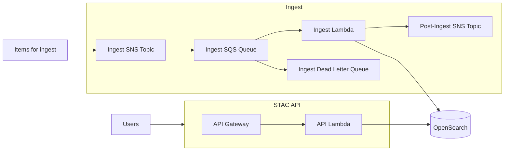
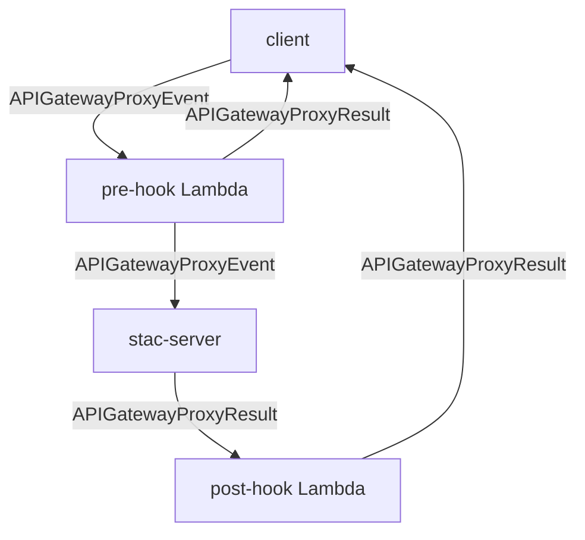

<!-- omit from toc -->

# stac-server


- [stac-server](#stac-server)
  - [Overview](#overview)
  - [Architecture](#architecture)
  - [Migration](#migration)
    - [Warnings](#warnings)
    - [3.12.0](#3120)
      - [Node 23 update](#node-23-update)
    - [3.10.0](#3100)
      - [Node 20 update](#node-20-update)
    - [3.1.0](#310)
      - [OpenSearch Version 2.11](#opensearch-version-211)
    - [3.0.0](#300)
      - [Node 18 update](#node-18-update)
    - [2.4.0](#240)
      - [OpenSearch Version 2.9](#opensearch-version-29)
    - [2.3.0](#230)
      - [OpenSearch Version 2.7](#opensearch-version-27)
    - [0.x or 1.x -\> 2.x](#0x-or-1x---2x)
      - [Fine-grained Access Control](#fine-grained-access-control)
      - [Enabling Post-ingest SNS publishing](#enabling-post-ingest-sns-publishing)
    - [0.4.x -\> 0.5.x](#04x---05x)
      - [Elasticsearch to OpenSearch Migration](#elasticsearch-to-opensearch-migration)
      - [Preferred Elasticsearch to OpenSearch Migration Process](#preferred-elasticsearch-to-opensearch-migration-process)
      - [Granting Access for Thumbnails](#granting-access-for-thumbnails)
    - [0.3.x -\> 0.4.x](#03x---04x)
      - [Elasticsearch upgrade from 7.9 to 7.10](#elasticsearch-upgrade-from-79-to-710)
      - [Disable automatic index creation](#disable-automatic-index-creation)
      - [Validate index mappings](#validate-index-mappings)
  - [Usage](#usage)
  - [Deployment](#deployment)
    - [OpenSearch Configuration](#opensearch-configuration)
      - [Disable automatic index creation](#disable-automatic-index-creation-1)
      - [OpenSearch fine-grained access control](#opensearch-fine-grained-access-control)
        - [Option 1 - API method](#option-1---api-method)
        - [Option 2 - Dashboard method](#option-2---dashboard-method)
        - [Populating and accessing credentials](#populating-and-accessing-credentials)
      - [Create collection index](#create-collection-index)
    - [Proxying stac-server through CloudFront](#proxying-stac-server-through-cloudfront)
    - [Locking down transaction endpoints](#locking-down-transaction-endpoints)
    - [AWS WAF Rule Conflicts](#aws-waf-rule-conflicts)
    - [API Gateway Logging](#api-gateway-logging)
  - [Queryables](#queryables)
    - [Filter Extension](#filter-extension)
    - [Query Extension](#query-extension)
  - [Aggregation](#aggregation)
  - [Ingesting Data](#ingesting-data)
    - [Ingesting large items](#ingesting-large-items)
    - [Subscribing to SNS Topics](#subscribing-to-sns-topics)
    - [Ingest Errors](#ingest-errors)
  - [Supporting Cross-cluster Search and Replication](#supporting-cross-cluster-search-and-replication)
    - [Cross-cluster Search](#cross-cluster-search)
    - [Cross-cluster Replication](#cross-cluster-replication)
  - [Pre- and Post-Hooks](#pre--and-post-hooks)
    - [Pre-Hook](#pre-hook)
    - [Post-Hook](#post-hook)
    - [Request Flow](#request-flow)
    - [Notes](#notes)
  - [Development](#development)
    - [Running Locally](#running-locally)
    - [Running Unit Tests](#running-unit-tests)
    - [Running System and Integration Tests](#running-system-and-integration-tests)
    - [Updating the OpenAPI specification](#updating-the-openapi-specification)
  - [About](#about)
  - [License](#license)

## Overview

Stac-server is an implementation of the [STAC API specification](https://github.com/radiantearth/stac-api-spec) for searching and serving metadata for geospatial data, including but not limited to satellite imagery). The STAC and STAC API versions supported by a given version of stac-server are shown in the table below. Additional information can be found in the [CHANGELOG](CHANGELOG.md)

| stac-server Version(s) | STAC Version | STAC API Foundation Version |
| ---------------------- | ------------ | --------------------------- |
| 0.1.x                  | 0.9.x        | 0.9.x                       |
| 0.2.x                  | <1.0.0-rc.1  | 0.9.x                       |
| 0.3.x                  | 1.0.0        | 1.0.0-beta.2                |
| 0.4.x                  | 1.0.0        | 1.0.0-beta.5                |
| 0.5.x-0.8.x            | 1.0.0        | 1.0.0-rc.2                  |
| >=1.0.0                | 1.0.0        | 1.0.0                       |

Currently, stac-server supports the following specifications:

- STAC API - Core
- STAC API - Features
- STAC API - Collections
- STAC API - Item Search
- Context Extension (deprecated)
- Sort Extension
- Fields Extension
- Query Extension
- Filter Extension (conformance classes "Basic CQL2", "CQL2 JSON", "Basic Spatial Functions", and
  "Basic Spatial Functions with additional Spatial Literals", and
  the "in" and "between" predicates from "Advanced Comparison Operators")
- Transaction Extension
- Aggregation Extension (experimental)

The following APIs are deployed instances of stac-server:

| Name                                                                 | STAC Version | STAC API Version | Description                              |
| -------------------------------------------------------------------- | ------------ | ---------------- | ---------------------------------------- |
| [Earth Search v1](https://earth-search.aws.element84.com/v1)         | 1.0.0        | 1.0.0            | Catalog (v1) of some AWS Public Datasets |
| [USGS Astrogeology STAC API](https://stac.astrogeology.usgs.gov/api) | 1.0.0        | 1.0.0            | A STAC API for planetary data            |
| [Earth Search v0](https://earth-search.aws.element84.com/v0)         | 1.0.0-beta.2 | 0.9.0            | Catalog (v0) of some AWS Public Datasets |
| [Landsat Look](https://landsatlook.usgs.gov/stac-server)             | 1.0.0        | 0.9.0            |                                          |

## Architecture



## Migration

### Warnings

- When upgrading to at least OpenSearch 2.7, there seems to be some low-level problem
  in the Lucene data storage that is a problem with indicies created in some but not all
  versions older
  than 2.7. Indicies created on the latest version in Fall of 2023 were not affected, but
  indices created is some previous version or versions are.
  After upgrading to 2.7, items may fail with the message reason "cannot
  change field \"geometry\" from doc values type=NONE to inconsistent doc values
  type=BINARY". There is no publicly-available information about this being a problem.
  The solution is to create a new index by creating a new collection with a different
  name, reindex the existing index into the newly-created index, delete and re-created
  the existing index by creating a collection, and reindex back into the index.

### 3.12.0

#### Node 23 update

The default Lambda deployment environment is now Node 22.

To update the deployment to use Node 22, modify the serverless config file value
`provider.runtime` to be `nodejs22.x` and the application re-deployed.

### 3.10.0

#### Node 20 update

The default Lambda deployment environment is now Node 20. The major difference between
the Node 18 and Node 20 Lambda environment is the update of the underlying Linux version
from Amazon Linux 2 to Amazon Linux 2023.

To update the deployment to use Node 20, modify the serverless config file value
`provider.runtime` to be `nodejs20.x` and the application re-deployed.

### 3.1.0

#### OpenSearch Version 2.11

- Update the `EngineVersion` setting in the serverless config file to `OpenSearch_2.11`
  and re-deploy

### 3.0.0

#### Node 18 update

The default Lambda deployment environment is now Node 18. The major difference between
the Node 16 and Node 18 Lambda environment is that the Node 16 env includes AWS SDK
for JS v2, and Node 18 includes v3. This code has been updated to use v3, so the
Node 18 environment must be used, or the build must be modified to install the v3 libraries.

To update the deployment to use Node 18, modify the serverless config file value
`provider.runtime` to be `nodejs18.x` and the application re-deployed.

### 2.4.0

#### OpenSearch Version 2.9

- Update the `EngineVersion` setting in the serverless config file to `OpenSearch_2.9`
  and re-deploy

### 2.3.0

#### OpenSearch Version 2.7

- Update the `EngineVersion` setting in the serverless config file to `OpenSearch_2.7`
  and re-deploy

### 0.x or 1.x -> 2.x

#### Fine-grained Access Control

As of 2.0.0, only OpenSearch is supported and only using fine-grained access control.
It is recommended to follow the migration path to upgrade to fine-grained access control
first and then upgrade to stac-server 2.x.

#### Enabling Post-ingest SNS publishing

stac-server now has the ability to publish all ingested entities (Items and Collections)
to an SNS topic. Follow these steps to add this to an existing deployment. These
configurations are also in the serverless.example.yml file, so reference that if it is
unclear exactly where to add this in your config.

The following changes should be added to the serverless.yml file.

Explicitly set the provider/environment setting for STAC_API_URL so the ingested entities
published to the topic will have their link hrefs set correctly. If this is not set,
the entities will still be published, with with incorrect link hrefs.

```text
STAC_API_URL: "https://some-stac-server.com"
```

Add the SNS topic resource:

```text
postIngestTopic:
  Type: AWS::SNS::Topic
  Properties:
    TopicName: ${self:service}-${self:provider.stage}-post-ingest
```

For the `ingest` Lambda resource definition, configure the ARN to publish to by adding:

```text
environment:
  POST_INGEST_TOPIC_ARN: !Ref postIngestTopic
```

Add IAM permissions with the statement:

```text
- Effect: Allow
  Action:
    - sns:Publish
  Resource:
    Fn::GetAtt: [postIngestTopic, TopicArn]
```

### 0.4.x -> 0.5.x

#### Elasticsearch to OpenSearch Migration

By default, a new deployment of 0.5.x will use OpenSearch instead of Elasticsearch. There
are three options if you have an existing deployment that uses Elasticsearch:

1. Use stac-server in compatibility mode
   1. Add to serverless.yml environment variables `ES_COMPAT_MODE: "true"` and retain the
      existing Elasticsearch 7.10 resource description.
2. Manage the Elasticsearch/OpenSearch domain outside the stac-server serverless deployment.
   1. With the 0.4.x stac-server code, add `DeletionPolicy: Retain` to the `AWS::Elasticsearch::Domain` resource
   2. Deploy the stack to update this property in the deployed CloudFormation Stack.
   3. Remove the `AWS::Elasticsearch::Domain` resource from serverless.yml, modify all of the variables that were previously dynamically populated by the Elasticsearch resource values to be hard-coded, and re-deploy.
   4. The Elasticsearch domain is now independent of the CF Stack.
   5. With the 0.5.x stac-server code, update the serverless.yml environment variable `ES_COMPAT_MODE: "true"`
   6. Deploy the 0.5.x stac-server code with the updated serverless.yml file
   7. Through the AWS Console, upgrade the OpenSearch Service domain from Elasticsearch 7.10
      to OpenSearch 1.3, retaining the compatibilty mode enabled configuration.
   8. Upgrade the OpenSearch 1.3 domain to OpenSearch 2.5.
   9. Re-deploy the stack without the ES_COMPAT_MODE environment variable set.
3. (Preferred) Disconnect the Elasticsearch domain from the stac-server CF Stack, deploy a new stac-server CF Stack,
   upgrade the Elasticsearch domain to OpenSearch, and connect the domain to the new CF Stack.
   This is described below.

Additionally, the `ES_HOST` variable used in the serverless.yml file has been
renamed `OPENSEARCH_HOST`.

#### Preferred Elasticsearch to OpenSearch Migration Process

**Note! The migration must be done carefully to avoid losing the database!**

The major part of this migration is the use of OpenSearch 2.5 instead of Elasticsearch
7.10. Confusingly, both of these are options in the AWS OpenSearch Service, but the Elasticsearch option
is no longer being updated by AWS in favor of OpenSearch.

The migration generally follows the outline in [here](https://docs.aws.amazon.com/AWSCloudFormation/latest/UserGuide/aws-resource-opensearchservice-domain.html#aws-resource-opensearchservice-domain--remarks). The underlying problem being solved
here is that the CloudFormation resource AWS::Elasticsearch::Domain is used for Elasticsearch,
but AWS::OpenSearchService::Domain is used for OpenSearch, and a CloudFormation update
can't "migrate" between these resource types. So, the approach is to upgrade the domain
to OpenSearch in compatibility mode, then clone the CloudFormation Stack, and import
the OpenSearch domain into it.

1. With the 0.4.x codebase, change the serverless.yml file to add `DeletionPolicy: Retain` and `UpdateReplacePolicy: Retain` to the `AWS::Elasticsearch::Domain` definition at the same level as the `Type` and deploy. See instructions for deploying [here](https://github.com/stac-utils/stac-server/blob/main/README.md#deployment).

```yaml
Type: AWS::Elasticsearch::Domain
DeletionPolicy: Retain
UpdateReplacePolicy: Retain
Properties: . . .
```

2. The existing Elasticsearch domain must be manually migrated to OpenSearch. Prior to
   re-deploying the stack, use the AWS Console to manually upgrade the
   Elasticsearch domain (`Actions->Upgrade`) to OpenSearch 1.3. Select "Enable
   compatibility mode" to support the existing stac-server 0.4.x code using the Elasticsearch
   JavaScript client library (@elastic/elasticsearch version 7.9.0). After this upgrade to
   OpenSearch 1.3, then upgrade the domain to OpenSearch 2.5.

3. Create a clone of the stac-server 0.5.x code. Copy and update the serverless.yml file used for the 0.4.0 deployment with these changes:

- `ElasticSearchInstance` should be renamed to `OpenSearchInstance`
  - The `Type` of this resource should be changed from `AWS::Elasticsearch::Domain` to
    `AWS::OpenSearchService::Domain`
  - `ElasticsearchClusterConfig` is now `ClusterConfig`
  - `InstanceType` values have changed, e.g., t3.small.elasticsearch is now t3.small.search
  - `ElasticsearchVersion` is replaced with `EngineVersion` and set to `OpenSearch_2.5`
- `EsEndpoint` should be renamed to `OpenSearchEndpoint` and the exported name suffixed
  with `-os-endpoint` instead of `-es-endpoint`
- Environment variable `STAC_API_VERSION` should be removed to instead defer to the current default version

- The `DomainName` value
  **must** remain the same as it is for the current deployment so
  the CloudFormation deployment will import the existing resource. Instead of a parameterized
  value of `${self:service}-${self:provider.stage}` as in the example serverless.yml file,
  it would have a hard-coded service name and `-es` suffix, e.g., `my-stac-server-${self:provider.stage}-es`.

- Note: these changes can be checked against the [serverless.example.yml](https://github.com/stac-utils/stac-server/blob/main/serverless.example.yml) file.

4. Run `npm run package` to generate the CloudFormation templates in the `.serverless` directory.
   Extract from the file `.serverless/cloudformation-template-update-stack.json` a template
   that only has the OpenSearchInstance resource in it. For example:

```json
{
  "AWSTemplateFormatVersion": "2010-09-09",
  "Description": "A STAC API running on stac-server",
  "Resources": {
    "OpenSearchInstance": {
      "Type": "AWS::OpenSearchService::Domain",
      "DeletionPolicy": "Retain",
      "UpdateReplacePolicy": "Retain",
      "UpdatePolicy": {
        "EnableVersionUpgrade": true
      },
      "Properties": {
        "DomainName": "my-stac-server-dev-es",
        "EBSOptions": {
          "EBSEnabled": true,
          "VolumeType": "gp2",
          "VolumeSize": 35
        },
        "ClusterConfig": {
          "InstanceType": "t3.small.search",
          "InstanceCount": 2,
          "DedicatedMasterEnabled": false,
          "ZoneAwarenessEnabled": true
        },
        "EngineVersion": "OpenSearch_2.3",
        "DomainEndpointOptions": {
          "EnforceHTTPS": true
        }
      }
    }
  }
}
```

5. Within CloudFormation, choose `Create stack` and `With existing resources (import resources)`.
   Upload the template that contains only the OpenSearch resource. Choose a new stack name for this similar to the old one, e.g., `my-stac-server-2-{deploy-stage}` and update `service` name in the serverless.yml file with this name without the deploy stage e.g., `my-stac-server-2`. When prompted for the name of the OpenSearch Domain, put in the name of the existing one, e.g., `my-stac-server-dev-es`.

6. Deploy the new stack with `npm run deploy -- --stage {deploy-stage}`. This should appear as an update to the CloudFormation stack that was just created manually, and should use the existing OpenSearch domain.

7. Switch the DNS entry for the domain name to the API Gateway endpoint for the new Stack. See instructions [here](https://github.com/stac-utils/stac-server/blob/main/README.md#proxying-stac-server-through-cloudfront).

8. Double-check that the `DeletionPolicy: Retain` is set on the old Stack for the Elasticsearch/OpenSearch resource, and then delete the old Stack.

#### Granting Access for Thumbnails

The new experimental endpoint `/collections/{c_id}/items/{item_id}/thumbnail` will
redirect to a URL providing a thumbnail as determined by the assets in an item. If the
href for this is an AWS S3 ARN, IAM permissions must be granted for the API Lambda to
generate a pre-signed HTTP URL instead. For example:

```yaml
- Effect: Allow
  Action: s3:GetObject
  Resource: 'arn:aws:s3:::usgs-landsat/*'
```

### 0.3.x -> 0.4.x

Create a new deployment, copy the elasticsearch database, and rename indexes.

#### Elasticsearch upgrade from 7.9 to 7.10

The Serverless Framework supports provisioning AWS resources, but it does not support updating existing resources. In 0.4, the default Elasticsearch version has been updated from 7.9 to 7.10. Continuing to use 7.9 should not cause any problems, but it recommended that you manually upgrade to 7.10 by going to [AWS Console - Amazon OpenSearch Service](https://console.aws.amazon.com/esv3/home), choosing the Elasticsearch domain used by your stac-server deployment (e.g., stac-server-{stage}-es), choose Upgrade from the Actions menu, and then upgrade to Elasticsearch 7.10.

#### Disable automatic index creation

It is now recommended to [disable automatic index creation](#disable-automatic-index-creation-1).

#### Validate index mappings

Elasticsearch indices each have a mapping applied that determines how the data is indexed and searched over.
These mappings do not change the document data, but can change search behavior. One relevant mapping
behavior is that by default, string fields are analyzed for full-text search. In most cases with STAC Items,
values such as those in the `id` and `collection` fields should not be analyzed and should instead be searchable only
by exact matches. In Elasticsearch, this is known as a `keyword` field type. Importantly, sorting may only be done over `keyword` typed fields. As of 0.4.0, the default sort is now by `properties.datetime`, then `id`, then `collection`, and results will not be returnd if any indicies have the `id` or `collection` fields mapped as `text` instead of `keyword`.

For each index (other than `collections`), use GET to retrieve the endpoint `GET /{collectionId}/_mapping`, and
validate that `properties.datetime` type is `date`, and `id` and `collection` mappings are `keyword` (not `text` with a `keyword` subfield). For an AWS Opensearch Service instance, this can be done with a script similar to the one [here](#disable-automatic-index-creation-1).

The results should look simliar to this:

```json
{
  "my_collection_name": {
    "mappings": {
      "dynamic_templates": [
        ...
        {
          "strings": {
            "match_mapping_type": "string",
            "mapping": {
              "type": "keyword"
            }
          }
        },
        ...
      ],
      "properties": {
        ....
        "id": {
          "type": "keyword"
        },
        "collection": {
          "type": "keyword"
        },
        ....
        "properties": {
          "properties": {
            ...
            "datetime": {
              "type": "date"
            },
            ...
          }
        },
        ...
      }
    }
  }
}
```

If this is not the case, the easiest solution to fix it is to:

1. Deploy a 0.4.0 instance.
2. Backup and restore the 0.3.0 instance's Elasticsearch indicies to the 0.4.0 instances's
   Elasticsearch database.
3. Create a collection via ingest with a new collection name similar to the existing one (e.g., if index foo exists, create foo_new).
4. Reindex from the the existing index (foo) to the the new one (foo_new).
5. Delete the exiting index and rename the new one to the name of the formerly-existing one (e.g. foo_new -> foo).

## Usage

Stac-server is a web API that returns JSON, see the [documentation](http://stac-utils.github.io/stac-server), or the /api endpoint which is a self-documenting OpenAPI document. [STAC Index](https://stacindex.org) collects information on a number of [client tools](https://stacindex.org/ecosystem?category=Client).

stac-server supports both GET and POST Search requests.

An Item Search with GET:

```shell
curl "${HOST}/search?collections=sentinel-2-l2a,sentinel-2-l1c&bbox=10,10,15,15&query=%7B%22eo%3Acloud_cover%22%3A%7B%22gte%22%3A0%2C%22lte%22%3A5%7D%7D&filter=%7B%22op%22%3A%22%3C%22%2C%22args%22%3A%5B%7B%22property%22%3A%22view%3Asun_elevation%22%7D%2C50%5D%7D&sortby=-properties.datetime"
```

Notice that the `query` and `filter` parameters are URL-encoded JSON values.

An Item Search with POST:

```shell
curl -X "POST" "${HOST}/search" \
     -H 'Content-Type: application/json; charset=utf-8' \
     -d $'{
  "collections": [
    "sentinel-2-l2a",
    "sentinel-2-l1c"
  ],
  "bbox": [
    10,
    10,
    15,
    15
  ],
  "query": {
    "eo:cloud_cover": {
      "gte": 0,
      "lte": 5
    }
  },
  "filter": {
    "op": "<",
    "args": [
      "property": "view:sun_elevation"
    ],
    50
  }
  "sortby": {
    "field": "properties.datetime",
    "direction": "desc"
  }
}'
```

## Deployment

This repository contains Node libraries for running the API, along with a [serverless](https://serverless.com/) configuration file for deployment to AWS.

To create your own deployment of stac-server, first clone the repository:

```shell
git clone https://github.com/stac-utils/stac-server.git
cd stac-server
```

Copy the [example serverless config file](serverless.example.yml) to a file named `serverless.yml`:

```shell
cp serverless.example.yml serverless.yml
```

There are some settings that should be reviewed and updated as needeed in the serverless config file, under provider->environment:

| Name                             | Description                                                                                                                                                                                                                                                                     | Default Value                                                                        |
| -------------------------------- | ------------------------------------------------------------------------------------------------------------------------------------------------------------------------------------------------------------------------------------------------------------------------------- | ------------------------------------------------------------------------------------ |
| OPENSEARCH_HOST                  | The URL of the OpenSearch cluster.                                                                                                                                                                                                                                              |                                                                                      |
| STAC_VERSION                     | The STAC version for the STAC objects returned by server. This should not be confused with the STAC API version.                                                                                                                                                                | 1.1.0                                                                                |
| STAC_ID                          | ID of this catalog                                                                                                                                                                                                                                                              | stac-server                                                                          |
| STAC_TITLE                       | Title of this catalog                                                                                                                                                                                                                                                           | STAC API                                                                             |
| STAC_DESCRIPTION                 | Description of this catalog                                                                                                                                                                                                                                                     | A STAC API                                                                           |
| STAC_DOCS_URL                    | URL to documentation                                                                                                                                                                                                                                                            | [https://stac-utils.github.io/stac-server](https://stac-utils.github.io/stac-server) |
| LOG_LEVEL                        | Level for logging (error, warn, info, http, verbose, debug, silly)                                                                                                                                                                                                              | warn                                                                                 |
| REQUEST_LOGGING_ENABLED          | Express request logging enabled. String 'false' disables.                                                                                                                                                                                                                       | enabled                                                                              |
| REQUEST_LOGGING_FORMAT           | Express request logging format to use. Any of the [Morgan predefined formats](https://github.com/expressjs/morgan#predefined-formats).                                                                                                                                          | tiny                                                                                 |
| STAC_API_URL                     | The root endpoint of this API                                                                                                                                                                                                                                                   | Inferred from request                                                                |
| ENABLE_TRANSACTIONS_EXTENSION    | Boolean specifying if the [Transaction Extension](https://github.com/radiantearth/stac-api-spec/tree/master/ogcapi-features/extensions/transaction) should be activated                                                                                                         | false                                                                                |
| STAC_API_ROOTPATH                | The path to append to URLs if this is not deployed at the server root. For example, if the server is deployed without a custom domain name, it will have the stage name (e.g., dev) in the path.                                                                                | ""                                                                                   |
| PRE_HOOK                         | The name of a Lambda function to be called as the pre-hook.                                                                                                                                                                                                                     | none                                                                                 |
| POST_HOOK                        | The name of a Lambda function to be called as the post-hook.                                                                                                                                                                                                                    | none                                                                                 |
| ES_COMPAT_MODE                   | Enable Elasticsearch 7.10 compatibility mdoe within the server.                                                                                                                                                                                                                 | false                                                                                |
| OPENSEARCH_CREDENTIALS_SECRET_ID | The AWS Secrets Manager secret use for the username and password to authenticate to OpenSearch.                                                                                                                                                                                 |                                                                                      |
| OPENSEARCH_USERNAME              | The username to authenticate to OpenSearch when AWS Secrets Manager is not used.                                                                                                                                                                                                |                                                                                      |
| OPENSEARCH_PASSWORD              | The password to authenticate to OpenSearch when AWS Secrets Manager is not used.                                                                                                                                                                                                |                                                                                      |
| COLLECTION_TO_INDEX_MAPPINGS     | A JSON object representing collection id to index name mappings if they do not have the same names.                                                                                                                                                                             |                                                                                      |
| ITEMS_INDICIES_NUM_OF_SHARDS     | Configure the number of shards for the indices that contain Items.                                                                                                                                                                                                              | none                                                                                 |
| ITEMS_INDICIES_NUM_OF_REPLICAS   | Configure the number of replicas for the indices that contain Items.                                                                                                                                                                                                            | none                                                                                 |
| CORS_ORIGIN                      | Configure the value to send for the `Access-Control-Allow-Origin` CORS header. Should be set to the domain name of the UI if Basic Authentication is enable (e.g., `https://ui.example.com`).                                                                                   | `*`                                                                                  |
| CORS_CREDENTIALS                 | Configure whether or not to send the `Access-Control-Allow-Credentials` CORS header. Header will be sent if set to `true`.                                                                                                                                                      | none                                                                                 |
| CORS_METHODS                     | Configure whether or not to send the `Access-Control-Allow-Methods` CORS header. Expects a comma-delimited string, e.g., `GET,PUT,POST`.                                                                                                                                        | `GET,HEAD,PUT,PATCH,POST,DELETE`                                                     |
| CORS_HEADERS                     | Configure whether or not to send the `Access-Control-Allow-Headers` CORS header. Expects a comma-delimited string, e.g., `Content-Type,Authorization`. If not specified, defaults to reflecting the headers specified in the request’s `Access-Control-Request-Headers` header. | none                                                                                 |

Additionally, the credential for OpenSearch must be configured, as decribed in the
section [Populating and accessing credentials](#populating-and-accessing-credentials).

After reviewing the settings, build and deploy:

```shell
npm install
npm run build
OPENSEARCH_MASTER_USER_PASSWORD='some-password' npm run deploy
```

This will use the file `serverless.yml` and create a CloudFormation stack in the
`us-west-2` region called `stac-server-dev`.

After the initial deployment, the `MasterUserOptions` option in the serverless.yml file
can be commented out so that OPENSEARCH_MASTER_USER_PASSWORD does not need to be passed
at every deployment.

To change the region or the stage name (from `dev`) provide arguments to the deploy command
(note the additional `--` in the command, required by `npm` to provide arguments):

```shell
OPENSEARCH_MASTER_USER_PASSWORD='some-password' npm run deploy -- --stage mystage --region eu-central-1
```

Multiple deployments can be managed with multiple serverless config files and specified
to the deploy command with:

```shell
npm run deploy -- --config serverless.some-name.yml
```

Once deployed, there are a few steps to configure OpenSearch.

### OpenSearch Configuration

#### Disable automatic index creation

It is recommended to disable the automatic index creation. This prevents the situation where
a group of Items are bulk indexed before the Collection in which they are contained has
been created, and an OpenSearch index is created without the appropriate mappings.

This can either be done by calling the `/_cluster/settings` endpoint directly:

```shell
curl -X "PUT" "${HOST}/_cluster/settings" \
     -H 'Content-Type: application/json; charset=utf-8' \
     -u "admin:${OPENSEARCH_MASTER_USER_PASSWORD}" \
     -d '{"persistent": {"action.auto_create_index": "false"}}'
```

or setting that configuration via the OpenSearch Dashboard.

#### OpenSearch fine-grained access control

stac-server supports either fine-grained access control or AWS IAM authentication to
OpenSearch. This section describes how to configure fine-grained access control.

**Warning**: Unfortunately, fine-grained access control cannot be enabled on an
existing OpenSearch
cluster through the serverless deploy, as this is a restriction of CloudFormation
which serverless uses. A migration process between the clusters must be performed similar
to the Elasticsearch -> OpenSearch migration process.

The AccessPolicies Statement will restrict the OpenSearch instance to only being accessible
within AWS. This requires the user creation steps below be either executed from or proxied
through an EC2 instance, or that the Access Policy be changed temporarily through the
console in the domain's Security configuration to be "Only use fine-grained access control".

The next step is to create the OpenSearch user and role to use for stac-server. This can
either be done through the OpenSearch API or Dashboard.

##### Option 1 - API method

This assumes the master username is `admin` and creates a user with the name `stac_server`.
Environment variables `HOST` and `OPENSEARCH_MASTER_USER_PASSWORD` should be set in the
shell environment.

Create the Role:

```shell
curl -X "PUT" "${HOST}/_plugins/_security/api/roles/stac_server_role" \
     -H 'Content-Type: application/json; charset=utf-8' \
     -u "admin:${OPENSEARCH_MASTER_USER_PASSWORD}" \
     -d $'{
  "cluster_permissions": [
    "cluster_composite_ops",
    "cluster:monitor/health"
  ],
  "index_permissions": [
    {
      "index_patterns": [
        "*"
      ],
      "allowed_actions": [
        "indices_all"
      ]
    }
  ],
  "tenant_permissions": [
    {
      "tenant_patterns": [
        "global_tenant"
      ],
      "allowed_actions": [
        "kibana_all_read"
      ]
    }
  ]
}'

```

Create the User:

```shell
curl -X "PUT" "${HOST}/_plugins/_security/api/internalusers/stac_server" \
     -H 'Content-Type: application/json; charset=utf-8' \
     -u "admin:${OPENSEARCH_MASTER_USER_PASSWORD}" \
     -d $'{ "password": "xxx" }'
```

Double-check the response to ensure that the user was actually created!

Map the Role to the User:

```shell
curl -X "PUT" "${HOST}/_plugins/_security/api/rolesmapping/stac_server_role" \
     -H 'Content-Type: application/json; charset=utf-8' \
     -u "admin:${OPENSEARCH_MASTER_USER_PASSWORD}"  \
     -d $'{
  "users": [
    "stac_server"
  ]
}'
```

##### Option 2 - Dashboard method

Login to the OpenSearch Dashboard with the master username (e.g. `admin`) and password.
From the left sidebar menu, select "Security". Select "Internal users", and then "Create
internal user". Create the user with the name `stac_server`.

Click "Create New Role". Create a new Role with name `stac_server_role` with:

- Cluster permissions: `cluster:monitor/health`, `cluster_composite_ops`
- Index permissions: `indices_all` on `*`
- Tenant permissions: `global_tenant` Read only

Note that several of the indices permissions in `cluster_composite_ops` action group
are required to
be applyed to the Cluster permissions. Confusingly, the `cluster_all` action group does
not have those permissions in it because they are `indices` permissions rather than
`cluster` permissions. This is all very confusing! [This issue](https://github.com/opensearch-project/security/issues/2336) has been filed against
the OpenSearch Security Plugin to request improvements to the documentation.

Add the user `stac_server` as a mapped user to this role.

##### Populating and accessing credentials

After you've created the users, you'll need to populate the credentials for the user
so that stac-server can access them.

The preferred mechanism for populating the OpenSearch credentials to stac-server is to
create a secret in AWS Secret Manager that contains the username and password. The
recommended name for this Secret corresponds
to the stac-server deployment as `${service}-${stage}-opensearch-user-creds`, e.g.,
`my-stac-server-dev-opensearch-user-creds`.

The Secret type should be "Other type of secret" and
have two keys, `username` and `password`, with the appropriate
values, e.g., `stac_server` and whatever you set as the password when creating that user.

Add the `OPENSEARCH_CREDENTIALS_SECRET_ID` variable to the serverless.yml section
`environment`:

```yaml
OPENSEARCH_CREDENTIALS_SECRET_ID: ${self:service}-${self:provider.stage}-opensearch-user-creds
```

Add to the IAM Role Statements:

```yaml
- Effect: Allow
  Resource: arn:aws:secretsmanager:${aws:region}:${aws:accountId}:secret:${self:provider.environment.OPENSEARCH_CREDENTIALS_SECRET_ID}-*
  Action: 'secretsmanager:GetSecretValue'
```

If desired, the resource ARN can be replaced with the exact ARN for the Secret instead of
using an ARN ending with `*`.

Redeploy to reconfigure OpenSearch and populate the authentication configuration. The server
should now be using fine-grained access control.

Alternately, instead of using the preferred mechanism of Secrets Manager,
the `OPENSEARCH_USERNAME` and `OPENSEARCH_PASSWORD` values can be set directly
in the `environment` section:

```yaml
OPENSEARCH_USERNAME: stac_server
OPENSEARCH_PASSWORD: xxxxxxxxxxx
```

Setting these as environment variables can also be useful when running stac-server
locally.

stac-server is now ready to ingest data!

#### Create collection index

The `collection` index must be created, which stores the metadata about each Collection.
Invoke the `stac-server-<stage>-ingest` Lambda function with a payload of:

```json
{
  "create_indices": true
}
```

This can be done with the [AWS CLI Version 2](https://docs.aws.amazon.com/cli/latest/userguide/getting-started-install.html).

```shell
aws lambda invoke \
  --function-name stac-server-dev-ingest \
  --cli-binary-format raw-in-base64-out \
  --payload '{ "create_indices": true }' \
  /dev/stdout
```

### Proxying stac-server through CloudFront

The API Gateway URL associated with the deployed stac-server instance may not be the URL that you ultimately wish to expose to your API users. AWS CloudFront can be used to proxy to a more human readable URL. In order to accomplish this:

1. Create a new CloudFront distribution (or use an existing distribution).
2. Set the origin to the Gateway API URL (obtain in the stage view of the deployed stac-server). The URL is in the form `<##abcde>.execute-api.region.amazonaws.com`.
3. Set the origin path to the deployed stage name prepended with a `/`, (e.g., /dev or /prod).
4. Under behaviors, add a new behavior for the desired URL endpoint or subdomain (e.g., /api or /v0.4.0).
5. Set the 'Origin and origin groups to the URL defined above ('`<##abcde>.execute-api.region.amazonaws.com`').
6. Set Viewer to HTTPS only and Allowed HTTP Methods to 'GET, HEAD, OPTIONS, PUT, POST, PATCH, DELETE'.
7. Set the Cache Policy to a custom policy that forwards query strings. If one simply disables caching, CloudFront strips the query strings.
8. Optionally, define a LambdaEdge to perform a URL rewrite. This is necessary if your API URL is appended to the root URL (e.g., mydomain.com/api). The Lambda must rewrite the URL to remove the /api. For example:

```python
from re import sub

def lambda_handler(event, context):
    request = event['Records'][0]['cf']['request']
    uri = request["uri"]

    if uri in ["/", "/index.html"]:
        response = {
            "status": 302,
            "statusDescription": "Found",
            "headers": {
                "location": [{
                    "key": "Location",
                    "value": "/api/"
                }]
            }
        }
        return response

    request["uri"] = sub("^/api", "/", uri)
    print(request)
    return request
```

### Locking down transaction endpoints

If you wanted to deploy STAC Server in a way which ensures certain endpoints have restricted access but others don't, you can deploy it into a VPC and add conditions that allow only certain IP addresses to access certain endpoints. Once you deploy STAC Server into a VPC, you can modify the Resource Policy of the API Gateway endpoint that gets deployed to restrict access to certain endpoints. Here is a hypothetical example. Assume that the account into which STAC Server is deployed is numbered 1234-5678-9123, the API ID is ab1c23def, and the region in which it is deployed is us-west-2. You might want to give the general public access to use any GET or POST endpoints with the API such as the "/search" endpoint, but lock down access to the transaction endpoints (see <https://github.com/radiantearth/stac-api-spec/tree/master/ogcapi-features/extensions/transaction>) to only allow certain IP addresses to access them. These IP addresses can be, for example: 94.61.192.106, 204.176.50.129, and 11.27.65.78. In order to do this, you can impose a condition on the API Gateway that only allows API transactions such as adding, updating, and deleting STAC items from the whitelisted endpoints. For example, here is a Resource Policy containing two statements that allow this to happen:

```json
{
  "Version": "2012-10-17",
  "Statement": [
    {
      "Effect": "Allow",
      "Principal": "*",
      "Action": "execute-api:Invoke",
      "Resource": [
        "arn:aws:execute-api:us-west-2:123456789123:ab1c23def/v1/POST/search",
        "arn:aws:execute-api:us-west-2:123456789123:ab1c23def/v1/POST/search/*",
        "arn:aws:execute-api:us-west-2:123456789123:ab1c23def/v1/GET/search/*",
        "arn:aws:execute-api:us-west-2:123456789123:ab1c23defi/v1/GET/*"
      ]
    },
    {
      "Effect": "Allow",
      "Principal": "*",
      "Action": "execute-api:Invoke",
      "Resource": [
        "arn:aws:execute-api:us-west-2:123456789123:ab1c23def/v1/POST/collections/*/items",
        "arn:aws:execute-api:us-west-2:123456789123:ab1c23def/v1/PUT/collections/*/items/*",
        "arn:aws:execute-api:us-west-2:123456789123:ab1c23def/v1/PATCH/collections/*/items/*",
        "arn:aws:execute-api:us-west-2:123456789123:ab1c23def/v1/DELETE/collections/*/items/*"
      ],
      "Condition": {
        "IpAddress": {
          "aws:sourceIp": ["94.61.192.106", "204.176.50.129", "11.27.65.78"]
        }
      }
    }
  ]
}
```

The first statement in the Resource Policy above grants access to STAC API endpoints for use in general operations like searching, and the second statement restricts access to the Transaction endpoints to a set of source IP addresses. According to this policy, POST, PUT, PATCH, and DELETE operations on items within collections are only allowed if the request originates from the IP addresses 94.61.192.106, 204.176.50.129, or 11.27.65.78. The second statement can also be written in another manner, denying access to the Transaction endpoints for all addresses that don’t match a set of source IP addresses. This is shown below.

```json
{
  "Effect": "Deny",
  "Principal": "*",
  "Action": "execute-api:Invoke",
  "Resource": [
    "arn:aws:execute-api:us-west-2:123456789123:ab1c23def/v1/POST/collections/*/items",
    "arn:aws:execute-api:us-west-2:123456789123:ab1c23def/v1/PUT/collections/*/items/*",
    "arn:aws:execute-api:us-west-2:123456789123:ab1c23def/v1/PATCH/collections/*/items/*",
    "arn:aws:execute-api:us-west-2:123456789123:ab1c23def/v1/DELETE/collections/*/items/*"
  ],
  "Condition": {
    "NotIpAddress": {
      "aws:sourceIp": ["94.61.192.106", "204.176.50.129", "11.27.65.78"]
    }
  }
}
```

### AWS WAF Rule Conflicts

Frequently, stac-server is deployed with AWS WAF protection. When making a POST request
that only has the `limit` parameter in the body, a WAF SQL injection protection rule
incurs a false positive and returns a Forbidden status code. This request is an example:

```shell
curl -X POST ${HOST}/search -d '{"limit": 1}'
```

This is also triggered when using pystac_client with no filtering parameters.

The fix is to disable the WAF SQL injection rule, which is unnecessary because
stac-server does not use SQL.

### API Gateway Logging

The example serverless.yml config contains disabled configuration for setting up
API Gateway logging of API requests. More information about these configuration can be
found in the [Serverless Framework API Gateway Documentation](https://www.serverless.com/framework/docs/providers/aws/events/apigateway#logs).

The `executionLogging` setting causes logging of the actual execution of the API Gateway
endpoints and backing Lambda, with `fullExecutionData` causing the entire request and
response to be logged to CloudWatch, which can be expensive.

The `accessLogging` setting logs the values specified in `format` to CloudWatch, which
can be useful for computing metrics on usage for the API.

## Queryables

The Filter Extension defines a
[Queryables](https://docs.ogc.org/is/19-079r2/19-079r2.html#queryables) resource for
discovering properties that may be used to construct filter expressions. Queryables for
each Collection are served from the `/collections/{collectionId}/queryables` endpoint.
Root-level (global to all Collections) queryables are served from the `/queryables`
endpoint.

Collection queryables are defined in stac-server by adding a `queryables` field to the
Collection JSON object with the value being the JSON Schema definition of the queryables
for that Collection. The content of this `queryables` field is extracted from the
Collection object and served from the Collection's queryables endpoint, but is removed
from the Collection object when the Collection itself is served from the
`/collections/{collectionId}` endpoint. Stac-server's root-level queryables resource is
not configurable and currently does not advertise any queryable properties. Likewise, if a
Collection does not define a `queryables` field, no queryable properties are advertised
for that Collection. For reference, here is a queryables JSON Schema definition that does
not advertise any queryables properties (note the empty `properties` field):

```json
{
  "$schema": "https://json-schema.org/draft/2020-12/schema",
  "$id": "https://stac-api.example.com/queryables",
  "type": "object",
  "title": "Queryables for Example STAC API",
  "description": "Queryable names for the example STAC API Item Search filter.",
  "properties": {},
  "additionalProperties": true
}
```

### Filter Extension

Stac-server currently implements the Filter Extension such that the `id`, `collection`,
`bbox`, and `geometry` Item fields and all fields in the `properties` object of an Item
are always available as filter terms for a Collection, regardless of whether a Collection
defines a `queryables` field or not. This behavior aligns with a value of `true` for the
`additionalProperties` field in the queryables definition. Stac-server currently
**requires** `additionalProperties` to be `true`; a value of `false`, which would restrict
filtering to only those `properties` defined in a Collection's queryables schema, is not
supported and will raise an error. Thus, adding a `queryables` field to a Collection is
informative only - it does not change the behavior of a filter.

Note that when creating a filter expression that uses fields from the `properties` object
in an Item, the fields **must not** be prefixed, e.g., use `eo:cloud_cover` instead of
`properties.eo:cloud_cover` in the filter expression. Care must be taken that terms used
in a filter expression exactly match the field names in the Item `properties` object;
there is no validation that filter expression terms are correct, so if you search for a
field that doesn't exist in an Item's `properties` object, that Item will never be
matched.

The`id`, `collection`, `bbox`, and `geometry` fields also **must not** be prefixed since
they are top-level Item fields. Note that until the [Basic Spatial Functions with
additional Spatial
Literals](https://docs.ogc.org/is/21-065r2/21-065r2.html#rc_basic-spatial-functions-plus)
and [Array
Functions](https://docs.ogc.org/is/21-065r2/21-065r2.html#_conformance_class_array_functions)
conformance classes are implemented, searching over the `bbox` and `geometry` fields is
not supported.

### Query Extension

Unlike the Filter Extension, the Query Extension does not (yet) define a mechanism to
advertise which terms may be used in expressions. However, an optional definition may be
added to it soon that defines queryables endpoints the same as used with Filter Extension.

## Aggregation

Stac-server supports the [Aggregation Extension](https://github.com/stac-api-extensions/aggregation). This allows the definition of per-collection aggregations that can be
calculated, dependent on the relevant fields being available in the STAC Items in that
Collection. A field named `aggregations` should be added to the Collection object for
the collection for which the aggregations are available, e.g.:

```text
  "aggregations": [
    {
      "name": "total_count",
      "data_type": "integer"
    },
    {
      "name": "datetime_max",
      "data_type": "datetime"
    },
    {
      "name": "datetime_min",
      "data_type": "datetime"
    },
    {
      "name": "datetime_frequency",
      "data_type": "frequency_distribution",
      "frequency_distribution_data_type": "datetime"
    },
    {
      "name": "grid_code_frequency",
      "data_type": "frequency_distribution",
      "frequency_distribution_data_type": "string"
    },
    {
      "name": "centroid_geohash_grid_frequency",
      "data_type": "frequency_distribution",
      "frequency_distribution_data_type": "string"
    },
    {
      "name": "centroid_geohex_grid_frequency",
      "data_type": "frequency_distribution",
      "frequency_distribution_data_type": "string"
    },
    {
      "name": "centroid_geotile_grid_frequency",
      "data_type": "frequency_distribution",
      "frequency_distribution_data_type": "string"
    },
      {
      "name": "geometry_geohash_grid_frequency",
      "data_type": "frequency_distribution",
      "frequency_distribution_data_type": "string"
    },
    {
      "name": "geometry_geotile_grid_frequency",
      "data_type": "frequency_distribution",
      "frequency_distribution_data_type": "string"
    }
  ]
```

Available aggregations are:

- total_count (count of total items)
- collection_frequency (Item `collection` field)
- platform_frequency (Item.Properties.platform)
- cloud_cover_frequency (Item.Properties.eo:cloud_cover)
- datetime_frequency (Item.Properties.datetime, monthly interval)
- datetime_min (earliest Item.Properties.datetime)
- datetime_max (latest Item.Properties.datetime)
- sun_elevation_frequency (Item.Properties.view:sun_elevation)
- sun_azimuth_frequency (Item.Properties.view:sun_azimuth)
- off_nadir_frequency (Item.Properties.view:off_nadir)
- grid_code_frequency (Item.Properties.grid:code)
- grid_geohash_frequency ([geohash grid](https://opensearch.org/docs/latest/aggregations/bucket/geohash-grid/) on Item.Properties.proj:centroid) (Deprecated)
- grid_geohex_frequency ([geohex grid](https://opensearch.org/docs/latest/aggregations/bucket/geohex-grid/) on Item.Properties.proj:centroid) (Deprecated)
- grid_geotile_frequency ([geotile grid](https://opensearch.org/docs/latest/aggregations/bucket/geotile-grid/) on Item.Properties.proj:centroid) (Deprecated)
- centroid_geohash_grid_frequency ([geohash grid](https://opensearch.org/docs/latest/aggregations/bucket/geohash-grid/) on Item.Properties.proj:centroid)
- centroid_geohex_grid_frequency ([geohex grid](https://opensearch.org/docs/latest/aggregations/bucket/geohex-grid/) on Item.Properties.proj:centroid)
- centroid_geotile_grid_frequency (geotile on Item.Properties.proj:centroid)
- geometry_geohash_grid_frequency ([geohash grid](https://opensearch.org/docs/latest/aggregations/bucket/geohash-grid/) on Item.geometry)
- geometry_geotile_grid_frequency ([geotile grid](https://opensearch.org/docs/latest/aggregations/bucket/geotile-grid/) on Item.geometry)

## Ingesting Data

STAC Collections and Items are ingested by the `ingest` Lambda function, however this Lambda is not invoked directly by a user, it consumes records from the `stac-server-<stage>-queue` SQS. To add STAC Items or Collections to the queue, publish them to the SNS Topic `stac-server-<stage>-ingest`.

**STAC Collections must be ingested before Items that belong to that Collection.** Items should have the `collection` field populated with the ID of an existing Collection. If an Item is ingested before ingestion of the Collection it contains,
ingestion will either fail (in the case of a single Item ingest) or if auto-creation of indexes is enabled (default) and multiple Items are ingested in bulk, the auto-created index will have incorrect mappings.

If a collection or item is ingested, and an item with that id already exists in STAC, the new item will completely replace the old item.

After a collection or item is ingested, the status of the ingest (success or failure) along with details of the collection or item are sent to a post-ingest SNS topic. To take action on items after they are ingested subscribe an endpoint to this topic.

Messages published to the post-ingest SNS topic include the following atributes that can be used for filtering:

| attribute    | type   | values                   |
| ------------ | ------ | ------------------------ |
| recordType   | String | `Collection` or `Item`   |
| ingestStatus | String | `successful` or `failed` |
| collection   | String |                          |

### Ingesting large items

There is a 256 KB limit on the size of SQS messages. Larger items can by publishing a message to the `stac-server-<stage>-ingest` SNS topic in with the format:

```json
{
  "href": "s3://source-bucket/source-key"
}
```

The `s3://`, `http://`, and `https://` protocols are supported for remote ingest.

### Subscribing to SNS Topics

Stac-server can also be subscribed to SNS Topics that publish complete STAC Items as their message. This provides a way to keep stac-server up to date with new data. Use the AWS Lambda console for the function `stac-server-<stage>-subscibe-to-sns` to subscribe to an SNS Topic for which you have the full ARN and permission to subscribe to. This could be an SNS Topic you created yourself to publish STAC records to, or a publicly available one, such as for [Sentinel](https://github.com/sat-utils/sat-stac-sentinel).

_Note_, that adding the subscription via the topic page does not seem to work. Instead, add a trigger on Lambda edit page.

### Ingest Errors

Errors that occur while consuming items from the ingest queue will end up in the dead letter processing queue.

## Supporting Cross-cluster Search and Replication

OpenSearch support cross-cluster connections that can be configured to either allow search
across the clusters, treating a remote cluster as if it were another group of nodes in the
cluster, or configure indicies to be replicated (continuously copied) from from one
cluster to another.

Configuring either cross-cluster behavior requires fine-grained access control.

### Cross-cluster Search

The AWS documentation for cross-cluster search can be found
[here](https://docs.aws.amazon.com/opensearch-service/latest/developerguide/cross-cluster-search.html).

1. Ensure fine-grained access control is enabled.
2. Create a connection between the source and destination OpenSearch domains.
3. Ensure there is a `es:ESCrossClusterGet` action in the destination's access policy.
4. In the source stac-server, create a Collection for each collection to be mapped. This
   must have the same id as the destination collection.
5. For the source stac-server, configure a `COLLECTION_TO_INDEX_MAPPINGS`
   environment variable with a stringified JSON object mapping the collection name to the
   name of the index. For example, `{"collection1": "cluster2:collection1", "collection2": "cluster2:collection2"}` is a value mapping two collections through a
   connection named `cluster2`. Deploy this change.

### Cross-cluster Replication

The AWS documentation for cross-cluster replication can be found
[here](https://docs.aws.amazon.com/opensearch-service/latest/developerguide/replication.html).

1. Ensure fine-grained access control is enabled (default as of v2.0.0)
2. Create the replication connection in the source to the destination
3. Create the collection in the source's stac-server instance

## Pre- and Post-Hooks

Stac-server supports two hooks into the request process: a pre-hook and a post-hook. These are each Lambda functions which, if configured, will be invoked by stac-server. It is assumed that the stac-server Lambda has been granted permission to invoke these Lambda functions, if configured.

### Pre-Hook

If the stac-server is deployed with the `PRE_HOOK` environment variable set to the name of a Lambda function, then that function will be called as the pre-hook.

The event passed into the pre-hook Lambda will be an instance of an [API Gateway Proxy Event](https://docs.aws.amazon.com/apigateway/latest/developerguide/set-up-lambda-proxy-integrations.html#api-gateway-simple-proxy-for-lambda-input-format).

If the return value from the pre-hook Lambda is an instance of an [API Gateway Proxy Result](https://docs.aws.amazon.com/apigateway/latest/developerguide/set-up-lambda-proxy-integrations.html#api-gateway-simple-proxy-for-lambda-output-format), then that response will immediately be returned to the client.

If the return value of the pre-hook Lambda is an instance of an [API Gateway Proxy Event](https://docs.aws.amazon.com/apigateway/latest/developerguide/set-up-lambda-proxy-integrations.html#api-gateway-simple-proxy-for-lambda-input-format), then that event will be passed along to stac-server.

If the pre-hook Lambda throws an exception, an internal server error will be returned to the client.

The pre-hook Lambda configuration may reference any Lambda, not only one deployed as part
of this stack. There is an example pre-hook Lambda that can be included with this stack,
which provides an example rudimentary authorization mechanism via a hard-coded token.

To enable this example pre-hook:

- Either (1) in package.json, pass the env var `BUILD_PRE_HOOK=true` in the `build`
  command, or (2) modify bin/build.sh to always build the "pre-hook" package.
- In the serverless.yml file, uncomment the `preHook` function, the `preHook` IAM
  permissions, and the environment variables `PRE_HOOK` and `API_KEYS_SECRET_ID`
- Create a Secrets Manager secret with the name used in `API_KEYS_SECRET_ID` with
  the keys as the strings allowed for API Keys and the values as an array `["write"]`.
- Build and deploy.

### Post-Hook

If the stac-server is deployed with the `POST_HOOK` environment variable set to the name of a Lambda function, then that function will be called as the post-hook.

The event passed into the post-hook labmda will be the response from the stac-server, and will be an instance of an [API Gateway Proxy Result](https://docs.aws.amazon.com/apigateway/latest/developerguide/set-up-lambda-proxy-integrations.html#api-gateway-simple-proxy-for-lambda-output-format).

The return value of the post-hook Lambda must be an instance of an [API Gateway Proxy Result](https://docs.aws.amazon.com/apigateway/latest/developerguide/set-up-lambda-proxy-integrations.html#api-gateway-simple-proxy-for-lambda-output-format).

If the post-hook Lambda throws an exception, an internal server error will be returned to the client.

The post-hook Lambda configuration may reference any Lambda, not only one deployed as part
of this stack. There is an example post-hook Lambda that can be included with this stack,
which does nothing, but shows how the API Lambda response can be modified.

The post-hook Lambda configuration may reference any Lambda, not only one deployed as part
of this stack. There is an example post-hook Lambda that can be included with this stack,
which provides an example of how to interact with the response, but does not modify it.

To enable this example post-hook:

- Modify bin/build.sh to not exclude the "post-hook" package from being built.
- In the serverless.yml file, uncomment the `postHook` function and the `postHook`
  IAM permissions.
- Build and deploy.

### Request Flow



### Notes

Lambda payloads and responses [must be less than 6 MB](https://docs.aws.amazon.com/lambda/latest/dg/gettingstarted-limits.html#function-configuration-deployment-and-execution). A larger payload will result in an internal server error being returned to the client.

The outputs of the pre- and post-hooks are validated and, if they don't comply with the defined schemas, an internal server error will be returned to the client. Information about the invalid event, as well as details about the parsing errors, will be logged to CloudWatch.

## Development

Install [NVM](https://github.com/nvm-sh/nvm) to manage your Node.js environment.

```shell
# uses version in .nvmrc
nvm install
nvm use
```

The package-lock.json was built with npm 8.5.0, so use at least this version.

There are several useful npm commands available to use locally:

```shell
# Install dependencies in package.json
npm install

# Run the build command in each of the packages (runs webpack)
npm run build

# Run ESLint
npm run lint

# To run tests for all packages
npm run test

# To build API docs from the api spec
npm run build-api-docs # TODO: this fails
```

[npm-check-updates](https://www.npmjs.com/package/npm-check-updates) can be used for
updating version dependencies to newer ones. Run:

```commandline
ncu -i
```

### Running Locally

Before the API can be run, OpenSearch and Localstack need to be running. There is a `compose.yml` file to simplify running OpenSearch locally:

```shell
docker compose up -d
```

The API can then be run with:

```shell
npm run serve
```

Connect to the server on <http://localhost:3000/>

Other configurations can be passed as shell environment variables, e.g.,

```shell
export ENABLE_TRANSACTIONS_EXTENSION=true
export OPENSEARCH_HOST='https://search-stac-server-dev-7awl6h344qlpvly.us-west-2.es.amazonaws.com'
npm run serve
```

### Running Unit Tests

stac-server uses [ava](https://github.com/avajs/ava) to execute tests.

```shell
# alias to run unit tests
npm test

# run unit tests in tests directory
npm run test:unit

# run unit tests with coverage
npm run test:coverage

# run tests from a single test file whose titles match 'foobar*'
npx ava tests/test-es.js --match='foobar*'
```

### Running System and Integration Tests

The System and Integration tests use an OpenSearch server running in Docker and a local instance of the API.

When the system tests run, they:

1. Wait for OpenSearch to be available
1. Delete all indices from OpenSearch
1. Start an instance of the API. That API will be available at <http://localhost:3000/dev/>
1. Wait for the API to be available
1. Run the system tests in `./tests/system/test-*.js`
1. Stop the API

Before running the system tests, make sure to start OpenSearch using:

```shell
docker compose up -d
```

Running these tests requires the timeout utility is installed. On Linux,
this is probably already installed, and on macOS it can be installed with `brew install coreutils`.

Once OpenSearch has been started, run the system tests:

```shell
npm run test:system
```

A subset of system tests may be run by providing a glob matching the test files to run:

```shell
npm run test:system test-api-item-*
```

Run the integration tests (**Note**: currently none exist):

```shell
npm run test:integration
```

### Updating the OpenAPI specification

The OpenAPI specification is served by the endpoint `/api`.

This file is location in [src/lambdas/api/openapi.yaml](src/lambdas/api/openapi.yaml).

When the API is updated to a new STAC API release, this file must be updated. To update it,
first install [yq](https://github.com/mikefarah/yq), then run:

```shell
bin/build-openapi.sh
```

This script combines all of the STAC API OpenAPI definitions for each conformance class into one file.

Next, edit that file to make it specific to this server. For example:

- edit to change the title from `STAC API - Item Search` to just `STAC API`
- remove all of the Filter Extension references
- Fix each endpoint, especially the Landing Page defintion, which gets duplicated
- Add definitions for each tag

To validate the resulting OpenAPI file, run

```shell
npm run check-openapi
```

and fix any errors or warnings.

## About

[stac-server](https://github.com/stac-utils/stac-server) was forked from [sat-api](https://github.com/sat-utils/sat-api). Stac-server is for STAC versions 0.9.0+, while sat-api exists for versions of STAC prior to 0.9.0.

## License

stac-server is licensed under [The MIT License](https://opensource.org/license/mit/).
Copyright for portions of stac-server is held by Development Seed (2016) as
part of project [sat-api](https://github.com/sat-utils/sat-api)
[original license](https://github.com/sat-utils/sat-api/blob/master/LICENSE). Copyright for all changes to stac-server since the fork date is held by Element 84, Inc (2020).
