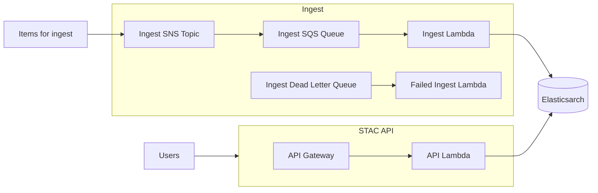

# stac-server 


- [stac-server](#stac-server)
  - [Overview](#overview)
  - [Architecture](#architecture)
  - [Migration](#migration)
    - [0.3 -> 0.4](#03---04)
  - [Usage](#usage)
  - [Deployment](#deployment)
  - [Ingesting Data](#ingesting-data)
    - [Subscribing to SNS Topics](#subscribing-to-sns-topics)
    - [Ingest Errors](#ingest-errors)
  - [Development](#development)
    - [Running Locally using AWS Resources](#running-locally-using-aws-resources)
    - [Running Locally using Local Resources](#running-locally-using-local-resources)
  - [About](#about)

## Overview

Stac-server is an implementation of the [STAC API specification](https://github.com/radiantearth/stac-api-spec) for searching and serving metadata for geospatial data, including but not limited to satellite imagery). The STAC and STAC API versions supported by a given version of stac-server are shown in the table below. Additional information can be found in the [CHANGELOG](CHANGELOG.md)

| stac-server Version | STAC Version | STAC API Version |
| ------------------- | ------------ | ---------------- |
| 0.1.x               | 0.9.x        | 0.9.x            |
| 0.2.x               | <1.0.0-rc.1  | 0.9.x            |
| 0.3.x               | 1.0.0        | 1.0.0-beta.2     |
| 0.4.x               | 1.0.0        | 1.0.0-beta.5     |

The following APIs are deployed instances of stac-server:

| Name                                                       | STAC Version | STAC API Version | Description                         |
| ---------------------------------------------------------- | ------------ | ---------------- |
| [Earth Search](https://earth-search.aws.element84.com/v0/) | 1.0.0-beta.2 | 0.9.0            | Catalog of some AWS Public Datasets |
| [Landsat Look](https://landsatlook.usgs.gov/stac-server)   | 1.0.0        | 0.9.0            |                                     |
| [USGS Planetary Catalog](https://asc-stacbrowser.s3.us-west-2.amazonaws.com/catalog.json) | 1.0.0 |  | USGS Astrogeology hosted Analysis Ready Data (ARD) |

## Architecture



## Migration

### 0.3 -> 0.4

The Serverless Framework supports provisioning AWS resources, but it does not support updating existing resources. In 0.4, the default Elasticsearch version has been updated from 7.9 to 7.10. Continuing to use 7.9 should not cause any problems, but it recommended that you manually upgrade to 7.10 by going to [AWS Console - Amazon OpenSearch Service](https://console.aws.amazon.com/esv3/home), choosing the Elasticsearch domain used by your stac-server deployment (e.g., stac-server-{stage}-es), choose Upgrade from the Actions menu, and then upgrade to Elasticsearch 7.10.

## Usage

Stac-server is a web API that returns JSON, see the [documentation](http://stac-utils.github.io/stac-server), or the /api endpoint which is a self-documenting OpenAPI document. Here are some additional tools that might prove useful:

- [pystac-client](https://github.com/stac-utils/pystac-client): A Python client library and CLI for searching a STAC compliant API

## Deployment

This repository contains Node libraries for running the API, along with a [serverless](https://serverless.com/) configuration file for deployment to AWS.

To create your own deployment of stac-server, first clone the repository:

```sh
git clone https://github.com/stac-utils/stac-server.git
cd stac-server
```

Copy the [example serverless config file](serverless.yml.example) to a file named `serverless.yml`:

```sh
cp serverless.yml.example serverless.yml
```

There are some settings that should be reviewed and updated as needeed in the serverless config file, under provider->environment:

| Name                          | Description                                                                                                                                             | Default Value                                                                        |
| ----------------------------- | ------------------------------------------------------------------------------------------------------------------------------------------------------- | ------------------------------------------------------------------------------------ |
| STAC_VERSION                  | STAC Version of this STAC API                                                                                                                           | 1.0.0                                                                                |
| STAC_ID                       | ID of this catalog                                                                                                                                      | stac-server                                                                          |
| STAC_TITLE                    | Title of this catalog                                                                                                                                   | STAC API                                                                             |
| STAC_DESCRIPTION              | Description of this catalog                                                                                                                             | A STAC API                                                                           |
| STAC_DOCS_URL                 | URL to documentation                                                                                                                                    | [https://stac-utils.github.io/stac-server](https://stac-utils.github.io/stac-server) |
| ES_BATCH_SIZE                 | Number of records to ingest in single batch                                                                                                             | 500                                                                                  |
| LOG_LEVEL                     | Level for logging (CRITICAL, ERROR, WARNING, INFO, DEBUG)                                                                                               | INFO                                                                                 |
| STAC_API_URL                  | The root endpoint of this API                                                                                                                           | Inferred from request                                                                |
| ENABLE_TRANSACTIONS_EXTENSION | Boolean specifying if the [Transaction Extension](https://github.com/radiantearth/stac-api-spec/tree/master/extensions/transaction) should be activated | false                                                                                |

After reviewing the settings, build and deploy:

```sh
npm install
npm run build
npm run deploy
```

This will create a CloudFormation stack in the `us-west-2` region called `stac-server-dev`. To change the region or the stage name (from `dev`) provide arguments to the deploy command (note the additional `--` in the command, required by `npm` to provide arguments):

```sh
npm run deploy -- --stage mystage --region eu-central-1
```

Once deployed there is one final step - creating the indices and mappings in Elasticsearch. Invoke the `stac-server-<stage>-ingest` Lambda function with a payload of:

```json
{ 
  "create_indices": true
} 
```

This can be done with the AWS CLI with (the final `-` parameter pipes the output to stdout):

```sh
aws lambda invoke \
  --function-name stac-server-dev-ingest \
  --cli-binary-format raw-in-base64-out \
  --payload '{ "create_indices": true }' \
  -
```

Stac-server is now ready to ingest data!

## Ingesting Data

STAC Collections and Items are ingested by the `ingest` Lambda function, however this Lambda is not invoked directly by a user, it consumes records from the `stac-server-<stage>-queue` SQS. To add STAC Items or Collections to the queue, publish them to the SNS Topic `stac-server-<stage>-ingest`.

STAC Collections should be ingested before Items that belong to that Collection. Items should have the `collection` field populated with the ID of an existing Collection.

### Subscribing to SNS Topics

Stac-server can also be subscribed to SNS Topics that publish complete STAC Items as their message. This provides a way to keep stac-server up to date with new data. Use the AWS Lambda console for the function `stac-server-<stage>-subscibe-to-sns` to subscribe to an SNS Topic for which you have the full ARN and permission to subscribe to. This could be an SNS Topic you created yourself to publish STAC records to, or a publicly available one, such as for [Sentinel](https://github.com/sat-utils/sat-stac-sentinel).

*Note*, that adding the subscription via the topic page does not seem to work. Instead, add a trigger on Lambda edit page.

### Ingest Errors

Errors that occur during ingest will end up in the dead letter processing queue, where they are processed by the `stac-server-<stage>-failed-ingest` Lambda function. Currently all the failed-ingest Lambda does is log the error, see the CloudWatch log `/aws/lambda/stac-server-<stage>-failed-ingest` for errors.

## Development

Install [NVM](https://github.com/nvm-sh/nvm) to manage your Node.js environment.

```
# uses version in .nvmrc
nvm install
nvm use 
```

The package-lock.json was built with npm 8.5.0, so use at least this version.

There are several useful npm commands available to use locally:

```
# Install dependencies in package.json
npm install

# Run the build command in each of the packages (runs webpack)
npm run build

# Run ESLint
npm run lint

# To run tests for all packages
npm run test

# To build API docs from the api spec
npm run build-api-docs # TODO: this fails
```

### Running Locally using AWS Resources

The easiest way to run the API server locally is to deploy an instance to AWS, and then run a local instance pointing at the Elasticsearch resource created by that deployment. 

To do this, first change the value of `ES_HOST` in the serverless.yml file from the default (which dynamically populates it from the resource created upon deploy):

```
ES_HOST:
  Fn::GetAtt: [ElasticSearchInstance, DomainEndpoint]
```

to instead use a hard-coded string of the Elasticsearch instance URL, e.g.,

```
ES_HOST: https://search-stac-server-dev-es-7bwzvxndbxp4dl6h344xlpvly.us-west-2.es.amazonaws.com/
```

also set the STAC_API_URL explicitly:

```
STAC_API_URL: http://localhost:3000
```

Then, use npm `serve` command to run serverless offline:

```
npm run serve
```

Connect to the sever on http://localhost:3000/dev/

To quickly ingest a collection and item into your deployment, run the following (where `TOPIC_ARN` is the ARN for the SNS topic created by your deployment):

```sh
curl -s https://planetarycomputer.microsoft.com/api/stac/v1/collections/aster-l1t | \
    aws sns publish --topic-arn ${TOPIC_ARN} --message file:///dev/stdin
curl -s https://planetarycomputer.microsoft.com/api/stac/v1/collections/aster-l1t/items/AST_L1T_00312272006020322_20150518201805 | \
    aws sns publish --topic-arn ${TOPIC_ARN} --message file:///dev/stdin
```

### Running Locally using Local Resources

TBD, possibly using:

- https://github.com/localstack/localstack
- https://github.com/localstack/serverless-localstack

## Running Tests

stac-server uses [ava](https://github.com/avajs/ava) to execute tests.

```sh
# alias to run unit tests
npm run test

# run unit tests in tests directory
npm run test:unit

# run unit tests with coverage
npm run test:coverage

# run integration tests
npm run test:integration

# run tests from a single test file whose titles match 'foobar*'
npx ava tests/test_es.js --match='foobar*'
```

## About

[stac-server](https://github.com/stac-utils/stac-server) was forked from [sat-api](https://github.com/sat-utils/sat-api). Stac-server is for STAC versions 0.9.0+, while sat-api exists for versions of STAC prior to 0.9.0.
