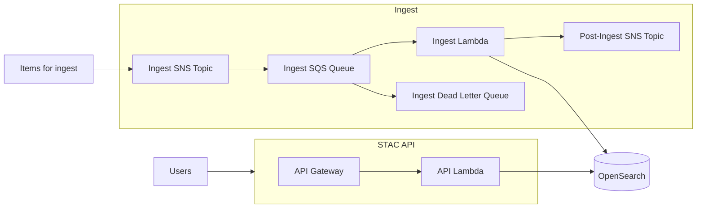

<!-- omit from toc -->

# stac-server

**A scalable, serverless implementation of the STAC API spec for searching geospatial metadata**

[](https://github.com/stac-utils/stac-server/actions)
[](https://www.npmjs.com/package/@stac-utils/stac-server)
[](https://opensource.org/licenses/MIT)
[](https://stacspec.org)

**Documentation:** [README](README.md) | [Deployment](DEPLOYMENT.md) | [Contributing](CONTRIBUTING.md) | [Security](SECURITY.md) | [Changelog](CHANGELOG.md)

## Table of Contents

## Table of Contents

- [Overview](#overview)
- [Architecture](#architecture)
- [Quick Start](#-quick-start)
- [Usage](#️-usage)
  - [Basic Search](#basic-search)
  - [Filtering with CQL2](#filtering-with-cql2)
  - [Sorting Results](#sorting-results)
  - [Field Selection](#field-selection)
  - [Aggregations](#aggregations)
  - [Asset Proxy](#asset-proxy)
- [API Extensions](#-api-extensions)
- [Ingesting Data](#-ingesting-data)
- [Production Deployments](#-production-deployments)
- [Contributing](#-contributing)
- [About](#about)
- [License](#license)

## Overview

Stac-server is a production-ready implementation of the [STAC API specification](https://github.com/radiantearth/stac-api-spec) for searching and serving metadata for geospatial data, including satellite imagery. Built on AWS serverless infrastructure (Lambda, API Gateway, OpenSearch), it provides a highly scalable and cost-effective solution for cataloging and discovering Earth observation data.

### 🌟 Key Features

- **📡 Full STAC API Support** - Core, Features, Collections, Item Search with extensions
- **🔍 Advanced Querying** - CQL2 filtering, full-text search, spatial and temporal queries
- **📊 Aggregations** - Statistical summaries and frequency distributions  
- **🛸 Serverless Architecture** - Auto-scaling, pay-per-use AWS Lambda and API Gateway
- **🔐 Fine-Grained Access Control** - OpenSearch security with optional pre/post hooks
- **📨 Event-Driven Ingest** - SNS/SQS-based ingestion pipeline with dead-letter handling
- **🗂️ Asset Proxying** - Generate pre-signed S3 URLs for secure asset access

### Supported Versions

| stac-server Version(s) | STAC Version | STAC API Foundation Version |
| ---------------------- | ------------ | --------------------------- |
| 0.1.x                  | 0.9.x        | 0.9.x                       |
| 0.2.x                  | <1.0.0-rc.1  | 0.9.x                       |
| 0.3.x                  | 1.0.0        | 1.0.0-beta.2                |
| 0.4.x                  | 1.0.0        | 1.0.0-beta.5                |
| 0.5.x-0.8.x            | 1.0.0        | 1.0.0-rc.2                  |
| >=1.0.0                | 1.0.0        | 1.0.0                       |
| >=3.10.0               | 1.1.0        | 1.0.0                       |

### Tech Stack

- **Runtime:** Node.js 22 (AWS Lambda)
- **API Framework:** AWS API Gateway with Lambda proxy integration
- **Database:** AWS OpenSearch Service
- **Queue/Events:** AWS SNS and SQS for ingest pipeline
- **Infrastructure:** Serverless Framework for deployment
- **Language:** TypeScript

### Supported STAC Extensions

- STAC API - Core
- STAC API - Features
- STAC API - Collections
- STAC API - Item Search
- Context Extension (deprecated, disabled by default)
- Sort Extension
- Fields Extension
- Query Extension
- Filter Extension (conformance classes "Basic CQL2", "CQL2 JSON", "Basic Spatial Functions", and
  "Basic Spatial Functions with additional Spatial Literals", and
  the "in" and "between" predicates from "Advanced Comparison Operators")
- Transaction Extension (disabled by default)
- Aggregation Extension (experimental)

## 🗄️ Architecture



## 🚀 Quick Start

For detailed deployment instructions to AWS, see [DEPLOYMENT.md](DEPLOYMENT.md).

### Prerequisites

- Node.js 22 or later
- AWS account with appropriate permissions
- Serverless Framework

For local development and testing, see [CONTRIBUTING.md](CONTRIBUTING.md).

## 🕹️ Usage

Stac-server is a web API that returns JSON. See the [API documentation](http://stac-utils.github.io/stac-server) or the `/api` endpoint which provides a self-documenting OpenAPI specification. [STAC Index](https://stacindex.org) lists various [client tools](https://stacindex.org/ecosystem?category=Client) for working with STAC APIs.

### Basic Search

Stac-server supports both GET and POST for Item Search requests.

**GET request:**

```shell
curl "${HOST}/search?collections=sentinel-2-l2a&bbox=10,10,15,15&limit=10"
```

**POST request:**

```shell
curl -X POST "${HOST}/search" \
  -H 'Content-Type: application/json' \
  -d '{
  "collections": ["sentinel-2-l2a"],
  "bbox": [10, 10, 15, 15],
  "limit": 10
}'
```

### Filtering with CQL2

The [Filter Extension](https://github.com/stac-api-extensions/filter) allows complex queries using CQL2 (Common Query Language).

**Using Query Extension (simple property filters):**

```shell
curl "${HOST}/search?collections=sentinel-2-l2a&query=%7B%22eo%3Acloud_cover%22%3A%7B%22gte%22%3A0%2C%22lte%22%3A5%7D%7D"
```

Or with POST:

```json
{
  "collections": ["sentinel-2-l2a"],
  "query": {
    "eo:cloud_cover": {
      "gte": 0,
      "lte": 5
    }
  }
}
```

**Using Filter Extension (CQL2 expressions):**

```json
{
  "collections": ["sentinel-2-l2a"],
  "filter": {
    "op": "and",
    "args": [
      {
        "op": "<=",
        "args": [{"property": "eo:cloud_cover"}, 10]
      },
      {
        "op": ">",
        "args": [{"property": "view:sun_elevation"}, 30]
      }
    ]
  }
}
```

**Important notes on filtering:**
- Item `properties` fields must **not** be prefixed (use `eo:cloud_cover`, not `properties.eo:cloud_cover`)
- Top-level fields like `id`, `collection` are also not prefixed
- Field names must exactly match those in Item properties
- Discover available fields using the `/collections/{collectionId}/queryables` endpoint

### Sorting Results

Use the [Sort Extension](https://github.com/stac-api-extensions/sort) to control result ordering:

```json
{
  "collections": ["sentinel-2-l2a"],
  "sortby": [
    {
      "field": "properties.datetime",
      "direction": "desc"
    }
  ]
}
```

### Field Selection

Use the [Fields Extension](https://github.com/stac-api-extensions/fields) to include only specific fields:

```json
{
  "collections": ["sentinel-2-l2a"],
  "fields": {
    "include": ["id", "geometry", "properties.datetime"],
    "exclude": ["links"]
  }
}
```

### Aggregations

The [Aggregation Extension](https://github.com/stac-api-extensions/aggregation) provides statistical summaries. Query available aggregations for a collection:

```shell
curl "${HOST}/collections/sentinel-2-l2a/aggregations"
```

Request aggregations:

```json
{
  "collections": ["sentinel-2-l2a"],
  "aggregations": [
    {"name": "total_count"},
    {"name": "datetime_min"},
    {"name": "datetime_max"},
    {"name": "cloud_cover_frequency", "interval": 10}
  ]
}
```

**Available aggregation types:**
- `total_count` - Total number of items
- `datetime_min` / `datetime_max` - Temporal bounds
- `*_frequency` - Distribution histograms for various properties
- Grid aggregations (geohash, geohex, geotile) for spatial distributions

See [DEPLOYMENT.md](DEPLOYMENT.md) for how to configure which aggregations are available for each collection.

### Asset Proxy

When asset proxying is enabled, stac-server provides endpoints to access S3 assets via pre-signed URLs:

```shell
# Get an item asset
curl "${HOST}/collections/{collectionId}/items/{itemId}/assets/{assetKey}"

# Get a collection asset  
curl "${HOST}/collections/{collectionId}/assets/{assetKey}"
```

These endpoints return HTTP 302 redirects to pre-signed S3 URLs. When enabled, S3 hrefs in Items and Collections are automatically replaced with proxy URLs, with original URLs preserved in `alternate.s3.href`.

See [DEPLOYMENT.md](DEPLOYMENT.md) for asset proxy configuration.

## 📨 Ingesting Data

STAC Collections and Items are ingested by publishing them to the SNS Topic `stac-server-<stage>-ingest`. The ingest Lambda consumes messages from an SQS queue subscribed to this topic.

**Important:** Collections must be ingested before Items that belong to them.

### Publishing to SNS

Publish a STAC Item or Collection directly:

```json
{
  "type": "Feature",
  "stac_version": "1.0.0",
  "id": "my-item",
  "collection": "my-collection",
  ...
}
```

### Large Items

For items exceeding the 256 KB SQS message limit, publish a reference:

```json
{
  "href": "s3://source-bucket/path/to/item.json"
}
```

Supported protocols: `s3://`, `http://`, `https://`

### Ingest Actions

The ingest pipeline supports actions for data management:

**Truncate collection** (removes all items, keeps collection):

```json
{
  "type": "action",
  "command": "truncate",
  "collection": "my-collection"
}
```

Note: Requires `ENABLE_INGEST_ACTION_TRUNCATE=true` in deployment config.

### Post-Ingest Notifications

After ingest, success/failure events are published to a post-ingest SNS topic with attributes for filtering:

- `recordType`: `Collection` or `Item`
- `ingestStatus`: `successful` or `failed`  
- `collection`: Collection ID

For deployment configuration including SNS subscriptions and error handling, see [DEPLOYMENT.md](DEPLOYMENT.md).

## 🌍 Production Deployments

The following production instances are powered by stac-server:

- **[Earth Search v1](https://earth-search.aws.element84.com/v1)** - Catalog of AWS Public Datasets (STAC 1.0.0)
- **[USGS Astrogeology STAC API](https://stac.astrogeology.usgs.gov/api)** - Planetary data catalog (STAC 1.0.0)
- **[Landsat Look](https://landsatlook.usgs.gov/stac-server)** - USGS Landsat imagery catalog

## 👽 Contributing

For development setup, testing, and contribution guidelines, see [CONTRIBUTING.md](CONTRIBUTING.md).

## About

[stac-server](https://github.com/stac-utils/stac-server) was forked from [sat-api](https://github.com/sat-utils/sat-api). Stac-server is for STAC versions 0.9.0+, while sat-api exists for versions of STAC prior to 0.9.0.

## License

stac-server is licensed under [The MIT License](https://opensource.org/license/mit/).
Copyright for portions of stac-server is held by Development Seed (2016) as
part of project [sat-api](https://github.com/sat-utils/sat-api)
[original license](https://github.com/sat-utils/sat-api/blob/master/LICENSE). Copyright for all changes to stac-server since the fork date is held by Element 84, Inc (2020).
