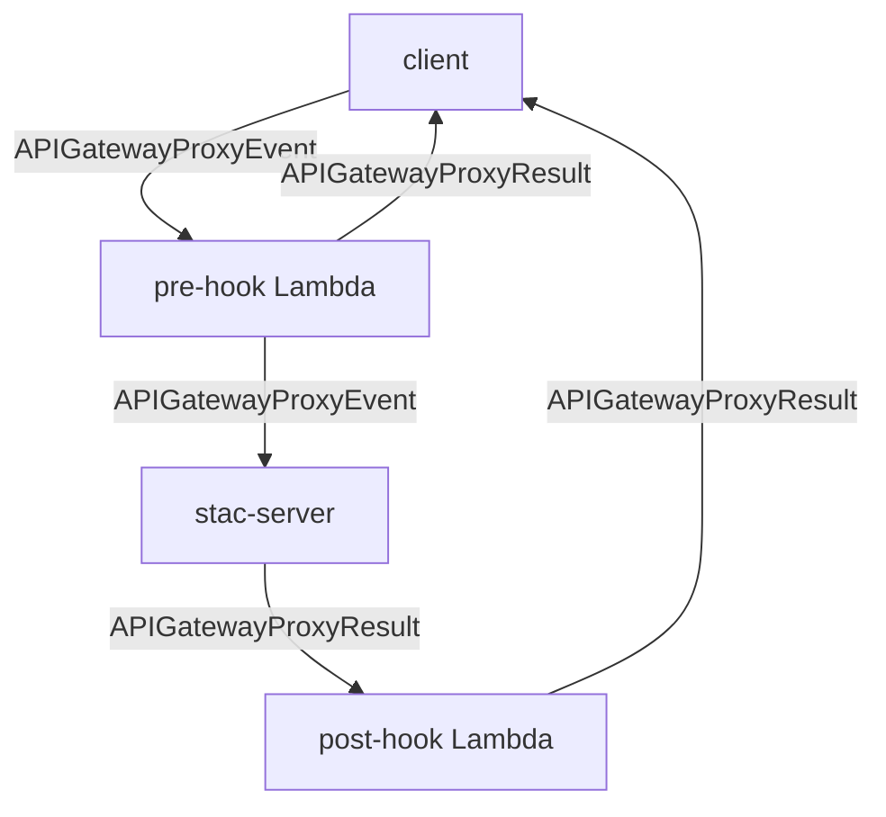

# Deployment Guide

Complete guide to deploying stac-server to AWS using the [Serverless Framework](https://serverless.com/).

For runtime configuration (environment variables, collection-level parameters), see the [Configuration Guide](../configuration/index.md).

## Prerequisites

- [Node.js](https://nodejs.org/) (version specified in package.json)
- [Serverless Framework](https://serverless.com/) installed globally or as a dev dependency
- AWS account with appropriate permissions
- AWS CLI configured with credentials

## Getting Started

Clone the repository and navigate to the project directory:

```shell
git clone https://github.com/stac-utils/stac-server.git
cd stac-server
```

Copy the [example serverless config file](https://github.com/stac-utils/stac-server/blob/main/serverless.example.yml) to a file named serverless.yml:

```shell
cp serverless.example.yml serverless.yml
```

## Step 1: Review Serverless Configuration

Prior to deployment, review and update your serverless.yml file. In particular, update
the `stage` and `region` with the desired values in the `provider` section, and review the
environment variables in the `provider > environment` section.

For a complete reference of all environment variables, see the [Configuration Guide](../configuration/index.md).

Key environment variables for deployment:

| Name                             | Description                                                                                                                                                                                                                                                                     | Default Value                                                                        |
| -------------------------------- | ------------------------------------------------------------------------------------------------------------------------------------------------------------------------------------------------------------------------------------------------------------------------------- | ------------------------------------------------------------------------------------ |
| OPENSEARCH_HOST                  | The URL of the OpenSearch cluster (required)                                                                                                                                                                                                                                    |                                                                                      |
| OPENSEARCH_CREDENTIALS_SECRET_ID | AWS Secrets Manager secret for OpenSearch username/password                                                                                                                                                                                                                     |                                                                                      |
| STAC_ID                          | ID of this catalog                                                                                                                                                                                                                                                              | stac-server                                                                          |
| STAC_TITLE                       | Title of this catalog                                                                                                                                                                                                                                                           | STAC API                                                                             |
| STAC_DESCRIPTION                 | Description of this catalog                                                                                                                                                                                                                                                     | A STAC API                                                                           |
| ENABLE_TRANSACTIONS_EXTENSION    | Enable Transaction Extension for write operations via API                                                                                                                                                                                                                      | false                                                                                |
| CORS_ORIGIN                      | Configure CORS allowed origins                                                                                                                                                                                                                                                  | `*`                                                                                  |

See the [Configuration Guide](../configuration/index.md) for all configuration options including: API settings, CORS, extensions, asset proxy, authorization, ingest, pre/post hooks, request handling, and logging.

## Step 2: Choose an Authentication Method

There are two types of clients that need to authenticate connections to OpenSearch:

- Stac-server's Lambda functions authenticate to read and write STAC data to OpenSearch
- Users authenticate when accessing OpenSearch via a terminal for debugging and
  administration

The choice of an authentication method is permanent. Changing the authentication method
after deployment requires creating a new cluster and migrating data. 

Stac-server supports two authentication methods. **Option A (Fine-grained Access Control) is the default** and recommended for most deployments.

**Option A: Fine-grained Access Control (default)**

- Uses OpenSearch's internal user management system
- Provides granular role-based permissions within OpenSearch
- Lambda functions use a dedicated service account
- Users access OpenSearch with master credentials for administration
- This is the default configuration in `serverless.example.yml`

**Option B: AWS IAM Authentication**

- Uses AWS IAM roles and policies via AWS Signature Version 4 (SigV4) signing
- Lambda functions use their IAM execution role
- Users access OpenSearch with AWS credentials (access keys, profiles, or temporary tokens)
- Requires tools that support SigV4 signing (`curl --aws-sigv4`, `opensearch-cli`, Postman)
- Simpler setup but less granular control within OpenSearch

## Step 3: Configure OpenSearch Authentication

**Option A: Fine-grained Access Control (default)**

Ensure your serverless.yml file contains these configurations:

**1. OpenSearch domain configuration (master admin account):**

```yaml
OpenSearchInstance:
  Type: AWS::OpenSearchService::Domain
  Properties:
    # ... other properties
    AdvancedSecurityOptions:
      Enabled: true
      InternalUserDatabaseEnabled: true
      MasterUserOptions:
        MasterUserName: admin
        MasterUserPassword: ${env:OPENSEARCH_MASTER_USER_PASSWORD}
```

This creates the master admin account used for OpenSearch administration via the terminal
or Dashboard.

**2. Environment variable for Lambda service account credentials (via Secrets Manager - recommended):**

```yaml
environment:
  OPENSEARCH_CREDENTIALS_SECRET_ID: ${self:service}-${self:provider.stage}-opensearch-user-creds
```

This configures where the Lambda functions will look for the service account credentials
(e.g., `stac_server` user). You'll create this service account and the secret in Step 5
after deployment. Alternatively, you can set credentials directly via `OPENSEARCH_USERNAME`
and `OPENSEARCH_PASSWORD` environment variables instead of using Secrets Manager.

**3. IAM permission to access secrets:**

```yaml
iam:
  role:
    statements:
      - Effect: Allow
        Resource: arn:aws:secretsmanager:${aws:region}:${aws:accountId}:secret:${self:provider.environment.OPENSEARCH_CREDENTIALS_SECRET_ID}-*
        Action: secretsmanager:GetSecretValue
```

**Option B: AWS IAM Authentication**

Modify your serverless.yml file as follows:

**1. Remove or comment out OpenSearch credential environment variables:**

```yaml
environment:
  # OPENSEARCH_CREDENTIALS_SECRET_ID: ${self:service}-${self:provider.stage}-opensearch-user-creds
```

**2. Remove or comment out Secrets Manager IAM permission:**

```yaml
iam:
  role:
    statements:
      # ... other statements
      # Not needed for IAM authentication - only for fine-grained access control
      # - Effect: Allow
      #   Resource: arn:aws:secretsmanager:${aws:region}:${aws:accountId}:secret:${self:provider.environment.OPENSEARCH_CREDENTIALS_SECRET_ID}-*
      #   Action: secretsmanager:GetSecretValue
```

**3. Disable fine-grained access control in OpenSearch domain:**

```yaml
OpenSearchInstance:
  Type: AWS::OpenSearchService::Domain
  Properties:
    # ... other properties
    AdvancedSecurityOptions:
      Enabled: false
      InternalUserDatabaseEnabled: false
      # MasterUserOptions not needed for IAM authentication
      #   MasterUserName: admin
      #   MasterUserPassword: ${env:OPENSEARCH_MASTER_USER_PASSWORD}
```

**4. Ensure Lambda has OpenSearch permissions (already in default config):**

```yaml
iam:
  role:
    statements:
      - Effect: Allow
        Resource: "arn:aws:es:${aws:region}:${aws:accountId}:domain/*"
        Action: "es:*"
```

**5. Configure access policy for OpenSearch domain:**

When using IAM authentication without fine-grained access control, AWS requires that you
restrict access to specific AWS accounts (you cannot use the wildcard `"AWS": "*"`, which
allows any AWS account). Use the account root principal to restrict access to your AWS
account only:

```yaml
OpenSearchInstance:
  Type: AWS::OpenSearchService::Domain
  Properties:
    # ... other properties
    AccessPolicies:
      Version: "2012-10-17"
      Statement:
        - Effect: "Allow"
          Principal: { "AWS": "arn:aws:iam::${aws:accountId}:root" }
          Action: "es:ESHttp*"
          Resource: "arn:aws:es:${aws:region}:${aws:accountId}:domain/${self:service}-${self:provider.stage}/*"
```

This restricts access to IAM principals in your AWS account only. Within your account,
access is further controlled by the IAM permissions configured above (only principals with
`es:*` can access).

## Step 4: Build & Deploy

First, build the application:

```shell
npm install
npm run build
```

Then deploy based on your authentication method:

**Option A: Fine-grained Access Control**

```shell
OPENSEARCH_MASTER_USER_PASSWORD='your-secure-password' npm run deploy
```

**Option B: AWS IAM Authentication**

```shell
npm run deploy
```

**Deployment options:**

You can customize the deployment with these options:

```shell
# Use a different stage and region:
npm run deploy -- --stage mystage --region eu-central-1

# Use a custom serverless config file:
npm run deploy -- --config serverless.custom.yml

# Combine options:
OPENSEARCH_MASTER_USER_PASSWORD='your-secure-password' npm run deploy -- --config serverless.custom.yml --stage prod
```

## Step 5: Set Up Authentication Credentials

**Option A: Fine-grained Access Control**

If you used fine-grained access control, complete these steps:

**1. Comment out MasterUserOptions in serverless.yml**

After the initial deployment, comment out the `MasterUserOptions` section in serverless.yml
to prevent accidental password changes on subsequent deployments:

```yaml
AdvancedSecurityOptions:
  Enabled: true
  InternalUserDatabaseEnabled: true
  # MasterUserOptions:
  #   MasterUserName: admin
  #   MasterUserPassword: ${env:OPENSEARCH_MASTER_USER_PASSWORD}
```

**2. Create a Lambda service account in OpenSearch**

The Lambda functions require a separate role-based user account (not the master user).
Create this user in OpenSearch and assign it appropriate roles. You can do this via
the OpenSearch API or Dashboard.

**Via OpenSearch API:**

Set environment variables in your current shell session for `HOST` (your OpenSearch endpoint)
and `OPENSEARCH_MASTER_USER_PASSWORD`, then run the following commands:

```shell
export HOST="your-opensearch-endpoint.us-east-1.es.amazonaws.com"
export OPENSEARCH_MASTER_USER_PASSWORD="your-secure-password"
```

Create the role:

```shell
curl -X "PUT" "${HOST}/_plugins/_security/api/roles/stac_server_role" \
     -H 'Content-Type: application/json; charset=utf-8' \
     -u "admin:${OPENSEARCH_MASTER_USER_PASSWORD}" \
     -d $'{
  "cluster_permissions": [
    "cluster_composite_ops",
    "cluster:monitor/health"
  ],
  "index_permissions": [
    {
      "index_patterns": ["*"],
      "allowed_actions": ["indices_all"]
    }
  ],
  "tenant_permissions": [
    {
      "tenant_patterns": ["global_tenant"],
      "allowed_actions": ["kibana_all_read"]
    }
  ]
}'
```

Create the user:

```shell
curl -X "PUT" "${HOST}/_plugins/_security/api/internalusers/stac_server" \
     -H 'Content-Type: application/json; charset=utf-8' \
     -u "admin:${OPENSEARCH_MASTER_USER_PASSWORD}" \
     -d $'{ "password": "your-service-account-password" }'
```

Map the role to the user:

```shell
curl -X "PUT" "${HOST}/_plugins/_security/api/rolesmapping/stac_server_role" \
     -H 'Content-Type: application/json; charset=utf-8' \
     -u "admin:${OPENSEARCH_MASTER_USER_PASSWORD}"  \
     -d $'{
  "users": ["stac_server"]
}'
```

**Via OpenSearch Dashboard:**

Login to the OpenSearch Dashboard with master username (`admin`) and password. From the
left sidebar menu, select "Security". Create a new role named `stac_server_role` with:

- Cluster permissions: `cluster:monitor/health`, `cluster_composite_ops`
- Index permissions: `indices_all` on `*`
- Tenant permissions: `global_tenant` Read only

Then create an internal user named `stac_server` and map it to the `stac_server_role`.

**3. Store service account credentials**

If you configured `OPENSEARCH_CREDENTIALS_SECRET_ID` in Step 3, now create the AWS Secrets
Manager secret to store the service account credentials:

- Secret type: "Other type of secret"
- Secret name: Must match the value of `OPENSEARCH_CREDENTIALS_SECRET_ID` (e.g.,
  `stac-server-dev-opensearch-user-creds`)
- Keys: `username` and `password`
- Values: `username`: `stac_server`, `password`: the password you set above when creating
  the service account user

If you configured `OPENSEARCH_USERNAME` and `OPENSEARCH_PASSWORD` directly in
your serverless.yml file in Step 3, you can skip this step - your credentials are already
configured.

**4. Redeploy**

After storing the service account credentials (via Secrets Manager or environment variables),
redeploy to ensure the Lambda functions pick up the credentials:

```shell
npm run deploy
```

**Option B: AWS IAM Authentication**

No authentication credential configuration is required. The Lambda functions will
automatically authenticate using their IAM execution role.

## Step 6: Disable Automatic Index Creation

It is recommended to disable automatic index creation. This prevents the situation where
a group of Items are bulk indexed before the Collection in which they are contained has
been created, and an OpenSearch index is created without the appropriate mappings.

**For fine-grained access control:**

```shell
curl -X "PUT" "${HOST}/_cluster/settings" \
     -H 'Content-Type: application/json; charset=utf-8' \
     -u "admin:${OPENSEARCH_MASTER_USER_PASSWORD}" \
     -d '{"persistent": {"action.auto_create_index": "false"}}'
```

Alternatively, set this configuration via the OpenSearch Dashboard.

**For AWS IAM authentication:**

```shell
# For temporary credentials (IAM Identity Center/SSO or assumed roles):
curl -X PUT "${HOST}/_cluster/settings" \
  --aws-sigv4 "aws:amz:us-east-1:es" \
  --user "$AWS_ACCESS_KEY_ID:$AWS_SECRET_ACCESS_KEY" \
  -H "x-amz-security-token:$AWS_SESSION_TOKEN" \
  -H 'Content-Type: application/json' \
  -d '{"persistent": {"action.auto_create_index": "false"}}'

# For permanent IAM user credentials:
curl -X PUT "${HOST}/_cluster/settings" \
  --aws-sigv4 "aws:amz:us-east-1:es" \
  --user "$AWS_ACCESS_KEY_ID:$AWS_SECRET_ACCESS_KEY" \
  -H 'Content-Type: application/json' \
  -d '{"persistent": {"action.auto_create_index": "false"}}'
```

## Step 7: Create Collection Index

The `collection` index must be created, which stores the metadata about each Collection.
Invoke the `stac-server-<stage>-ingest` Lambda function with a payload of:

```json
{
  "create_indices": true
}
```

This can be done with the [AWS CLI Version 2](https://docs.aws.amazon.com/cli/latest/userguide/getting-started-install.html):

```shell
aws lambda invoke \
  --function-name stac-server-dev-ingest \
  --cli-binary-format raw-in-base64-out \
  --payload '{ "create_indices": true }' \
  /dev/stdout
```

Stac-server is now ready to ingest STAC Collections and Items and serve API requests.

For runtime configuration (environment variables, collection parameters), see the [Configuration Guide](../configuration/index.md).

## Additional Configuration

### Proxying stac-server through CloudFront

The API Gateway URL associated with the deployed stac-server instance may not be the URL that you ultimately wish to expose to your API users. AWS CloudFront can be used to proxy to a more human readable URL.

**Important:** When using STAC Server with a proxy in front of it, the base URL for the server, which will be used in all link URLs in response bodies, can be set with the `STAC-Endpoint` header.

In order to set up CloudFront proxying, follow these steps:

1. Create a new CloudFront distribution (or use an existing distribution).
2. Set the origin to the Gateway API URL (obtain in the stage view of the deployed stac-server). The URL is in the form `<##abcde>.execute-api.region.amazonaws.com`.
3. Set the origin path to the deployed stage name prepended with a `/`, (e.g., /dev or /prod).
4. Under behaviors, add a new behavior for the desired URL endpoint or subdomain (e.g., /api or /v0.4.0).
5. Set the 'Origin and origin groups to the URL defined above ('`<##abcde>.execute-api.region.amazonaws.com`').
6. Set Viewer to HTTPS only and Allowed HTTP Methods to 'GET, HEAD, OPTIONS, PUT, POST, PATCH, DELETE'.
7. Set the Cache Policy to a custom policy that forwards query strings. If one simply disables caching, CloudFront strips the query strings.
8. Optionally, define a LambdaEdge to perform a URL rewrite. This is necessary if your API URL is appended to the root URL (e.g., mydomain.com/api). The Lambda must rewrite the URL to remove the /api. For example:

```python
from re import sub

def lambda_handler(event, context):
    request = event['Records'][0]['cf']['request']
    uri = request["uri"]

    if uri in ["/", "/index.html"]:
        response = {
            "status": 302,
            "statusDescription": "Found",
            "headers": {
                "location": [{
                    "key": "Location",
                    "value": "/api/"
                }]
            }
        }
        return response

    request["uri"] = sub("^/api", "/", uri)
    print(request)
    return request
```

### Locking down transaction endpoints

If you wanted to deploy STAC Server in a way which ensures certain endpoints have restricted access but others don't, you can deploy it into a VPC and add conditions that allow only certain IP addresses to access certain endpoints. Once you deploy STAC Server into a VPC, you can modify the Resource Policy of the API Gateway endpoint that gets deployed to restrict access to certain endpoints. Here is a hypothetical example. Assume that the account into which STAC Server is deployed is numbered 1234-5678-9123, the API ID is ab1c23def, and the region in which it is deployed is us-west-2. You might want to give the general public access to use any GET or POST endpoints with the API such as the "/search" endpoint, but lock down access to the transaction endpoints (see <https://github.com/radiantearth/stac-api-spec/tree/master/ogcapi-features/extensions/transaction>) to only allow certain IP addresses to access them. These IP addresses can be, for example: 94.61.192.106, 204.176.50.129, and 11.27.65.78. In order to do this, you can impose a condition on the API Gateway that only allows API transactions such as adding, updating, and deleting STAC items from the whitelisted endpoints. For example, here is a Resource Policy containing two statements that allow this to happen:

```json
{
  "Version": "2012-10-17",
  "Statement": [
    {
      "Effect": "Allow",
      "Principal": "*",
      "Action": "execute-api:Invoke",
      "Resource": [
        "arn:aws:execute-api:us-west-2:123456789123:ab1c23def/v1/POST/search",
        "arn:aws:execute-api:us-west-2:123456789123:ab1c23def/v1/POST/search/*",
        "arn:aws:execute-api:us-west-2:123456789123:ab1c23def/v1/GET/search/*",
        "arn:aws:execute-api:us-west-2:123456789123:ab1c23def/v1/GET/*"
      ]
    },
    {
      "Effect": "Allow",
      "Principal": "*",
      "Action": "execute-api:Invoke",
      "Resource": [
        "arn:aws:execute-api:us-west-2:123456789123:ab1c23def/v1/POST/collections/*/items",
        "arn:aws:execute-api:us-west-2:123456789123:ab1c23def/v1/PUT/collections/*/items/*",
        "arn:aws:execute-api:us-west-2:123456789123:ab1c23def/v1/PATCH/collections/*/items/*",
        "arn:aws:execute-api:us-west-2:123456789123:ab1c23def/v1/DELETE/collections/*/items/*"
      ],
      "Condition": {
        "IpAddress": {
          "aws:sourceIp": ["94.61.192.106", "204.176.50.129", "11.27.65.78"]
        }
      }
    }
  ]
}
```

The first statement in the Resource Policy above grants access to STAC API endpoints for use in general operations like searching, and the second statement restricts access to the Transaction endpoints to a set of source IP addresses. According to this policy, POST, PUT, PATCH, and DELETE operations on items within collections are only allowed if the request originates from the IP addresses 94.61.192.106, 204.176.50.129, or 11.27.65.78. The second statement can also be written in another manner, denying access to the Transaction endpoints for all addresses that don't match a set of source IP addresses. This is shown below.

```json
{
  "Effect": "Deny",
  "Principal": "*",
  "Action": "execute-api:Invoke",
  "Resource": [
    "arn:aws:execute-api:us-west-2:123456789123:ab1c23def/v1/POST/collections/*/items",
    "arn:aws:execute-api:us-west-2:123456789123:ab1c23def/v1/PUT/collections/*/items/*",
    "arn:aws:execute-api:us-west-2:123456789123:ab1c23def/v1/PATCH/collections/*/items/*",
    "arn:aws:execute-api:us-west-2:123456789123:ab1c23def/v1/DELETE/collections/*/items/*"
  ],
  "Condition": {
    "NotIpAddress": {
      "aws:sourceIp": ["94.61.192.106", "204.176.50.129", "11.27.65.78"]
    }
  }
}
```

### AWS WAF Rule Conflicts

Frequently, stac-server is deployed with AWS WAF protection. When making a POST request
that only has the `limit` parameter in the body, a WAF SQL injection protection rule
incurs a false positive and returns a Forbidden status code. This request is an example:

```shell
curl -X POST ${HOST}/search -d '{"limit": 1}'
```

This is also triggered when using pystac_client with no filtering parameters.

The fix is to disable the WAF SQL injection rule, which is unnecessary because
stac-server does not use SQL.

### API Gateway Logging

The example serverless.yml config contains disabled configuration for setting up
API Gateway logging of API requests. More information about these configuration can be
found in the [Serverless Framework API Gateway Documentation](https://www.serverless.com/framework/docs/providers/aws/events/apigateway#logs).

The `executionLogging` setting causes logging of the actual execution of the API Gateway
endpoints and backing Lambda, with `fullExecutionData` causing the entire request and
response to be logged to CloudWatch, which can be expensive.

The `accessLogging` setting logs the values specified in `format` to CloudWatch, which
can be useful for computing metrics on usage for the API.

### Supporting Cross-cluster Search and Replication

OpenSearch support cross-cluster connections that can be configured to either allow search
across the clusters, treating a remote cluster as if it were another group of nodes in the
cluster, or configure indicies to be replicated (continuously copied) from from one
cluster to another.

Configuring either cross-cluster behavior requires fine-grained access control.

#### Cross-cluster Search

The AWS documentation for cross-cluster search can be found
[here](https://docs.aws.amazon.com/opensearch-service/latest/developerguide/cross-cluster-search.html).

1. Ensure fine-grained access control is enabled.
2. Create a connection between the source and destination OpenSearch domains.
3. Ensure there is a `es:ESCrossClusterGet` action in the destination's access policy.
4. In the source stac-server, create a Collection for each collection to be mapped. This
   must have the same id as the destination collection.
5. For the source stac-server, configure a `COLLECTION_TO_INDEX_MAPPINGS`
   environment variable with a stringified JSON object mapping the collection name to the
   name of the index. For example, `{"collection1": "cluster2:collection1", "collection2": "cluster2:collection2"}` is a value mapping two collections through a
   connection named `cluster2`. Deploy this change.

#### Cross-cluster Replication

The AWS documentation for cross-cluster replication can be found
[here](https://docs.aws.amazon.com/opensearch-service/latest/developerguide/replication.html).

1. Ensure fine-grained access control is enabled (default as of v2.0.0)
2. Create the replication connection in the source to the destination
3. Create the collection in the source's stac-server instance

### Pre- and Post-Hooks

Stac-server supports two hooks into the request process: a pre-hook and a post-hook. These are each Lambda functions which, if configured, will be invoked by stac-server. It is assumed that the stac-server Lambda has been granted permission to invoke these Lambda functions, if configured.

#### Pre-Hook

If the stac-server is deployed with the `PRE_HOOK` environment variable set to the name of a Lambda function, then that function will be called as the pre-hook.

The event passed into the pre-hook Lambda will be an instance of an [API Gateway Proxy Event](https://docs.aws.amazon.com/apigateway/latest/developerguide/set-up-lambda-proxy-integrations.html#api-gateway-simple-proxy-for-lambda-input-format).

If the return value from the pre-hook Lambda is an instance of an [API Gateway Proxy Result](https://docs.aws.amazon.com/apigateway/latest/developerguide/set-up-lambda-proxy-integrations.html#api-gateway-simple-proxy-for-lambda-output-format), then that response will immediately be returned to the client.

If the return value of the pre-hook Lambda is an instance of an [API Gateway Proxy Event](https://docs.aws.amazon.com/apigateway/latest/developerguide/set-up-lambda-proxy-integrations.html#api-gateway-simple-proxy-for-lambda-input-format), then that event will be passed along to stac-server.

If the pre-hook Lambda throws an exception, an internal server error will be returned to the client.

The pre-hook Lambda configuration may reference any Lambda, not only one deployed as part
of this stack. There is an example pre-hook Lambda that can be included with this stack,
which provides an example rudimentary authorization mechanism via a hard-coded token.

To enable this example pre-hook:

- Either (1) in package.json, pass the env var `BUILD_PRE_HOOK=true` in the `build`
  command, or (2) modify bin/build.sh to always build the "pre-hook" package.
- In the serverless.yml file, uncomment the `preHook` function, the `preHook` IAM
  permissions, and the environment variables `PRE_HOOK` and `API_KEYS_SECRET_ID`
- Create a Secrets Manager secret with the name used in `API_KEYS_SECRET_ID` with
  the keys as the strings allowed for API Keys and the values as an array `["write"]`.
- Build and deploy.

#### Post-Hook

If the stac-server is deployed with the `POST_HOOK` environment variable set to the name of a Lambda function, then that function will be called as the post-hook.

The event passed into the post-hook labmda will be the response from the stac-server, and will be an instance of an [API Gateway Proxy Result](https://docs.aws.amazon.com/apigateway/latest/developerguide/set-up-lambda-proxy-integrations.html#api-gateway-simple-proxy-for-lambda-output-format).

The return value of the post-hook Lambda must be an instance of an [API Gateway Proxy Result](https://docs.aws.amazon.com/apigateway/latest/developerguide/set-up-lambda-proxy-integrations.html#api-gateway-simple-proxy-for-lambda-output-format).

If the post-hook Lambda throws an exception, an internal server error will be returned to the client.

The post-hook Lambda configuration may reference any Lambda, not only one deployed as part
of this stack. There is an example post-hook Lambda that can be included with this stack,
which does nothing, but shows how the API Lambda response can be modified.

The post-hook Lambda configuration may reference any Lambda, not only one deployed as part
of this stack. There is an example post-hook Lambda that can be included with this stack,
which provides an example of how to interact with the response, but does not modify it.

If compression is enabled with `ENABLE_RESPONSE_COMPRESSION`, you should ensure that the
post-hook deployed handles compressed responses, or for the example post-hook lambda,
disable compression.

To enable this example post-hook:

- Modify bin/build.sh to not exclude the "post-hook" package from being built.
- In the serverless.yml file, uncomment the `postHook` function and the `postHook`
  IAM permissions.
- Build and deploy.

#### Request Flow



#### Notes

Lambda payloads and responses [must be less than 6 MB](https://docs.aws.amazon.com/lambda/latest/dg/gettingstarted-limits.html#function-configuration-deployment-and-execution). A larger payload will result in an internal server error being returned to the client.

The outputs of the pre- and post-hooks are validated and, if they don't comply with the defined schemas, an internal server error will be returned to the client. Information about the invalid event, as well as details about the parsing errors, will be logged to CloudWatch.

## Migration Notes

### Warnings

- When upgrading to at least OpenSearch 2.7, there seems to be some low-level problem
  in the Lucene data storage that is a problem with indicies created in some but not all
  versions older
  than 2.7. Indicies created on the latest version in Fall of 2023 were not affected, but
  indices created is some previous version or versions are.
  After upgrading to 2.7, items may fail with the message reason "cannot
  change field \"geometry\" from doc values type=NONE to inconsistent doc values
  type=BINARY". There is no publicly-available information about this being a problem.
  The solution is to create a new index by creating a new collection with a different
  name, reindex the existing index into the newly-created index, delete and re-created
  the existing index by creating a collection, and reindex back into the index.

### 4.1.0

#### Thumbnails feature disabled by default

The thumbnails behavior is now disabled by default, and can be enabled with
`ENABLE_THUMBNAILS` = `true`.

### 4.0.0

#### Context Extension disabled by default

Context Extension is now disabled by default, and can be enabled with ENABLE_CONTEXT_EXTENSION
env var. Usage of the "context" object "limit", "matched", and "returned" fields can be replaced
with the root-level fields "numberMatched" and "numberReturned".

#### Node 22 update

The default Lambda deployment environment is now Node 22.

To update the deployment to use Node 22, modify the serverless config file value
`provider.runtime` to be `nodejs22.x` and the application re-deployed.

#### Hidden collections filter

To all endpoints that depend on collections, there is now support for a query parameter
(GET) or body field (POST) `_collections` that will filter to only those collections, but
will not reveal that in link contents. This is useful for the application of permissions
to only certain collections.

### 3.10.0

#### Node 20 update

The default Lambda deployment environment is now Node 20. The major difference between
the Node 18 and Node 20 Lambda environment is the update of the underlying Linux version
from Amazon Linux 2 to Amazon Linux 2023.

To update the deployment to use Node 20, modify the serverless config file value
`provider.runtime` to be `nodejs20.x` and the application re-deployed.

### 3.1.0

#### OpenSearch Version 2.11

- Update the `EngineVersion` setting in the serverless config file to `OpenSearch_2.11`
  and re-deploy

### 3.0.0

#### Node 18 update

The default Lambda deployment environment is now Node 18. The major difference between
the Node 16 and Node 18 Lambda environment is that the Node 16 env includes AWS SDK
for JS v2, and Node 18 includes v3. This code has been updated to use v3, so the
Node 18 environment must be used, or the build must be modified to install the v3 libraries.

To update the deployment to use Node 18, modify the serverless config file value
`provider.runtime` to be `nodejs18.x` and the application re-deployed.

### 2.4.0

#### OpenSearch Version 2.9

- Update the `EngineVersion` setting in the serverless config file to `OpenSearch_2.9`
  and re-deploy

### 2.3.0

#### OpenSearch Version 2.7

- Update the `EngineVersion` setting in the serverless config file to `OpenSearch_2.7`
  and re-deploy

### 0.x or 1.x -> 2.x

#### Fine-grained Access Control

As of 2.0.0, only OpenSearch is supported and only using fine-grained access control.
It is recommended to follow the migration path to upgrade to fine-grained access control
first and then upgrade to stac-server 2.x.

#### Enabling Post-ingest SNS publishing

stac-server now has the ability to publish all ingested entities (Items and Collections)
to an SNS topic. Follow these steps to add this to an existing deployment. These
configurations are also in the serverless.example.yml file, so reference that if it is
unclear exactly where to add this in your config.

The following changes should be added to the serverless.yml file.

Explicitly set the provider/environment setting for STAC_API_URL so the ingested entities
published to the topic will have their link hrefs set correctly. If this is not set,
the entities will still be published, with with incorrect link hrefs.

```text
STAC_API_URL: "https://some-stac-server.com"
```

Add the SNS topic resource:

```text
postIngestTopic:
  Type: AWS::SNS::Topic
  Properties:
    TopicName: ${self:service}-${self:provider.stage}-post-ingest
```

For the `ingest` Lambda resource definition, configure the ARN to publish to by adding:

```text
environment:
  POST_INGEST_TOPIC_ARN: !Ref postIngestTopic
```

Add IAM permissions with the statement:

```text
- Effect: Allow
  Action:
    - sns:Publish
  Resource:
    Fn::GetAtt: [postIngestTopic, TopicArn]
```

### 0.4.x -> 0.5.x

#### Elasticsearch to OpenSearch Migration

By default, a new deployment of 0.5.x will use OpenSearch instead of Elasticsearch. There
are three options if you have an existing deployment that uses Elasticsearch:

1. Use stac-server in compatibility mode
   1. Add to serverless.yml environment variables `ES_COMPAT_MODE: "true"` and retain the
      existing Elasticsearch 7.10 resource description.
2. Manage the Elasticsearch/OpenSearch domain outside the stac-server serverless deployment.
   1. With the 0.4.x stac-server code, add `DeletionPolicy: Retain` to the `AWS::Elasticsearch::Domain` resource
   2. Deploy the stack to update this property in the deployed CloudFormation Stack.
   3. Remove the `AWS::Elasticsearch::Domain` resource from serverless.yml, modify all of the variables that were previously dynamically populated by the Elasticsearch resource values to be hard-coded, and re-deploy.
   4. The Elasticsearch domain is now independent of the CF Stack.
   5. With the 0.5.x stac-server code, update the serverless.yml environment variable `ES_COMPAT_MODE: "true"`
   6. Deploy the 0.5.x stac-server code with the updated serverless.yml file
   7. Through the AWS Console, upgrade the OpenSearch Service domain from Elasticsearch 7.10
      to OpenSearch 1.3, retaining the compatibilty mode enabled configuration.
   8. Upgrade the OpenSearch 1.3 domain to OpenSearch 2.5.
   9. Re-deploy the stack without the ES_COMPAT_MODE environment variable set.
3. (Preferred) Disconnect the Elasticsearch domain from the stac-server CF Stack, deploy a new stac-server CF Stack,
   upgrade the Elasticsearch domain to OpenSearch, and connect the domain to the new CF Stack.
   This is described below.

Additionally, the `ES_HOST` variable used in the serverless.yml file has been
renamed `OPENSEARCH_HOST`.

#### Preferred Elasticsearch to OpenSearch Migration Process

**Note! The migration must be done carefully to avoid losing the database!**

The major part of this migration is the use of OpenSearch 2.5 instead of Elasticsearch
7.10. Confusingly, both of these are options in the AWS OpenSearch Service, but the Elasticsearch option
is no longer being updated by AWS in favor of OpenSearch.

The migration generally follows the outline in [here](https://docs.aws.amazon.com/AWSCloudFormation/latest/UserGuide/aws-resource-opensearchservice-domain.html#aws-resource-opensearchservice-domain--remarks). The underlying problem being solved
here is that the CloudFormation resource AWS::Elasticsearch::Domain is used for Elasticsearch,
but AWS::OpenSearchService::Domain is used for OpenSearch, and a CloudFormation update
can't "migrate" between these resource types. So, the approach is to upgrade the domain
to OpenSearch in compatibility mode, then clone the CloudFormation Stack, and import
the OpenSearch domain into it.

1. With the 0.4.x codebase, change the serverless.yml file to add `DeletionPolicy: Retain` and `UpdateReplacePolicy: Retain` to the `AWS::Elasticsearch::Domain` definition at the same level as the `Type` and deploy. See instructions for deploying [here](https://github.com/stac-utils/stac-server/blob/main/README.md#deployment).

```yaml
Type: AWS::Elasticsearch::Domain
DeletionPolicy: Retain
UpdateReplacePolicy: Retain
Properties: . . .
```

2. The existing Elasticsearch domain must be manually migrated to OpenSearch. Prior to
   re-deploying the stack, use the AWS Console to manually upgrade the
   Elasticsearch domain (`Actions->Upgrade`) to OpenSearch 1.3. Select "Enable
   compatibility mode" to support the existing stac-server 0.4.x code using the Elasticsearch
   JavaScript client library (@elastic/elasticsearch version 7.9.0). After this upgrade to
   OpenSearch 1.3, then upgrade the domain to OpenSearch 2.5.

3. Create a clone of the stac-server 0.5.x code. Copy and update the serverless.yml file used for the 0.4.0 deployment with these changes:

- `ElasticSearchInstance` should be renamed to `OpenSearchInstance`
  - The `Type` of this resource should be changed from `AWS::Elasticsearch::Domain` to
    `AWS::OpenSearchService::Domain`
  - `ElasticsearchClusterConfig` is now `ClusterConfig`
  - `InstanceType` values have changed, e.g., t3.small.elasticsearch is now t3.small.search
  - `ElasticsearchVersion` is replaced with `EngineVersion` and set to `OpenSearch_2.5`
- `EsEndpoint` should be renamed to `OpenSearchEndpoint` and the exported name suffixed
  with `-os-endpoint` instead of `-es-endpoint`
- Environment variable `STAC_API_VERSION` should be removed to instead defer to the current default version

- The `DomainName` value
  **must** remain the same as it is for the current deployment so
  the CloudFormation deployment will import the existing resource. Instead of a parameterized
  value of `${self:service}-${self:provider.stage}` as in the example serverless.yml file,
  it would have a hard-coded service name and `-es` suffix, e.g., `my-stac-server-${self:provider.stage}-es`.

- Note: these changes can be checked against the [serverless.example.yml](https://github.com/stac-utils/stac-server/blob/main/serverless.example.yml) file.

4. Run `npm run package` to generate the CloudFormation templates in the `.serverless` directory.
   Extract from the file `.serverless/cloudformation-template-update-stack.json` a template
   that only has the OpenSearchInstance resource in it. For example:

```json
{
  "AWSTemplateFormatVersion": "2010-09-09",
  "Description": "A STAC API running on stac-server",
  "Resources": {
    "OpenSearchInstance": {
      "Type": "AWS::OpenSearchService::Domain",
      "DeletionPolicy": "Retain",
      "UpdateReplacePolicy": "Retain",
      "UpdatePolicy": {
        "EnableVersionUpgrade": true
      },
      "Properties": {
        "DomainName": "my-stac-server-dev-es",
        "EBSOptions": {
          "EBSEnabled": true,
          "VolumeType": "gp2",
          "VolumeSize": 35
        },
        "ClusterConfig": {
          "InstanceType": "t3.small.search",
          "InstanceCount": 2,
          "DedicatedMasterEnabled": false,
          "ZoneAwarenessEnabled": true
        },
        "EngineVersion": "OpenSearch_2.3",
        "DomainEndpointOptions": {
          "EnforceHTTPS": true
        }
      }
    }
  }
}
```

5. Within CloudFormation, choose `Create stack` and `With existing resources (import resources)`.
   Upload the template that contains only the OpenSearch resource. Choose a new stack name for this similar to the old one, e.g., `my-stac-server-2-{deploy-stage}` and update `service` name in the serverless.yml file with this name without the deploy stage e.g., `my-stac-server-2`. When prompted for the name of the OpenSearch Domain, put in the name of the existing one, e.g., `my-stac-server-dev-es`.

6. Deploy the new stack with `npm run deploy -- --stage {deploy-stage}`. This should appear as an update to the CloudFormation stack that was just created manually, and should use the existing OpenSearch domain.

7. Switch the DNS entry for the domain name to the API Gateway endpoint for the new Stack. See instructions [here](https://github.com/stac-utils/stac-server/blob/main/README.md#proxying-stac-server-through-cloudfront).

8. Double-check that the `DeletionPolicy: Retain` is set on the old Stack for the Elasticsearch/OpenSearch resource, and then delete the old Stack.

#### Granting Access for Thumbnails

The new experimental endpoint `/collections/{c_id}/items/{item_id}/thumbnail` will
redirect to a URL providing a thumbnail as determined by the assets in an item. This is
enabled only if `ENABLE_THUMBNAILS` is set to `true`. If the
href for this is an AWS S3 ARN, IAM permissions must be granted for the API Lambda to
generate a pre-signed HTTP URL instead. For example:

```yaml
- Effect: Allow
  Action: s3:GetObject
  Resource: 'arn:aws:s3:::usgs-landsat/*'
```

### 0.3.x -> 0.4.x

Create a new deployment, copy the elasticsearch database, and rename indexes.

#### Elasticsearch upgrade from 7.9 to 7.10

The Serverless Framework supports provisioning AWS resources, but it does not support updating existing resources. In 0.4, the default Elasticsearch version has been updated from 7.9 to 7.10. Continuing to use 7.9 should not cause any problems, but it recommended that you manually upgrade to 7.10 by going to [AWS Console - Amazon OpenSearch Service](https://console.aws.amazon.com/esv3/home), choosing the Elasticsearch domain used by your stac-server deployment (e.g., stac-server-{stage}-es), choose Upgrade from the Actions menu, and then upgrade to Elasticsearch 7.10.

#### Disable automatic index creation

It is now recommended to [disable automatic index creation](#step-6-disable-automatic-index-creation).

#### Validate index mappings

Elasticsearch indices each have a mapping applied that determines how the data is indexed and searched over.
These mappings do not change the document data, but can change search behavior. One relevant mapping
behavior is that by default, string fields are analyzed for full-text search. In most cases with STAC Items,
values such as those in the `id` and `collection` fields should not be analyzed and should instead be searchable only
by exact matches. In Elasticsearch, this is known as a `keyword` field type. Importantly, sorting may only be done over `keyword` typed fields. As of 0.4.0, the default sort is now by `properties.datetime`, then `id`, then `collection`, and results will not be returnd if any indicies have the `id` or `collection` fields mapped as `text` instead of `keyword`.

For each index (other than `collections`), use GET to retrieve the endpoint `GET /{collectionId}/_mapping`, and
validate that `properties.datetime` type is `date`, and `id` and `collection` mappings are `keyword` (not `text` with a `keyword` subfield). For an AWS Opensearch Service instance, this can be done with a script similar to the one [here](#step-6-disable-automatic-index-creation).

The results should look simliar to this:

```json
{
  "my_collection_name": {
    "mappings": {
      "dynamic_templates": [
        ...
        {
          "strings": {
            "match_mapping_type": "string",
            "mapping": {
              "type": "keyword"
            }
          }
        },
        ...
      ],
      "properties": {
        ....
        "id": {
          "type": "keyword"
        },
        "collection": {
          "type": "keyword"
        },
        ....
        "properties": {
          "properties": {
            ...
            "datetime": {
              "type": "date"
            },
            ...
          }
        },
        ...
      }
    }
  }
}
```

If this is not the case, the easiest solution to fix it is to:

1. Deploy a 0.4.0 instance.
2. Backup and restore the 0.3.0 instance's Elasticsearch indicies to the 0.4.0 instances's
   Elasticsearch database.
3. Create a collection via ingest with a new collection name similar to the existing one (e.g., if index foo exists, create foo_new).
4. Reindex from the the existing index (foo) to the the new one (foo_new).
5. Delete the exiting index and rename the new one to the name of the formerly-existing one (e.g. foo_new -> foo).

## Next Steps

- **Guides > [Usage](../usage/index.md)** - Learn how to ingest data and use the API
- **Guides > [Configuration](../configuration/index.md)** - Configure collections, extensions, and environment variables
- **Reference > [Architecture](../reference/architecture.md)** - Understand the system architecture
