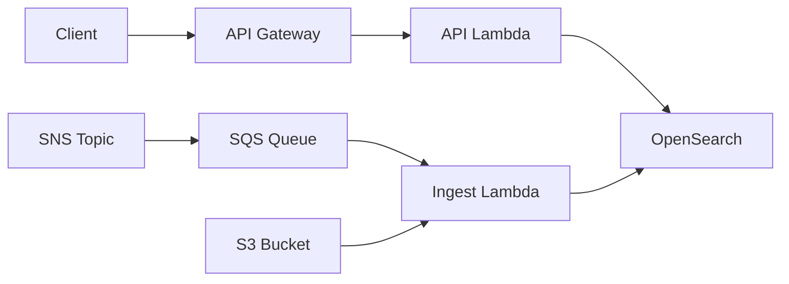

# 🌍 STAC Server Documentation

-   :material-play-circle:{ .lg .middle } __Getting Started__

    ---

    New to STAC Server? Start here for installation and quick setup.

    [:octicons-arrow-right-24: Overview](getting-started/overview.md) · 
    [:octicons-arrow-right-24: Installation](getting-started/installation.md) · 
    [:octicons-arrow-right-24: Quickstart](getting-started/quickstart.md)

-   :material-book-open-page-variant:{ .lg .middle } __Guides__

    ---

    Learn how to use, configure, and deploy STAC Server.

    [:octicons-arrow-right-24: Usage](usage/index.md) · 
    [:octicons-arrow-right-24: Configuration](configuration/index.md) · 
    [:octicons-arrow-right-24: Deployment](deployment/index.md)

-   :material-file-document:{ .lg .middle } __Reference__

    ---

    API documentation, OpenAPI spec, and architecture details.

    [:octicons-arrow-right-24: API Overview](reference/api.md) · 
    [:octicons-arrow-right-24: Interactive Spec](api-spec.html) · 
    [:octicons-arrow-right-24: OpenAPI Spec](reference/openapi.md) · 
    [:octicons-arrow-right-24: Architecture](reference/architecture.md)

-   :material-information-outline:{ .lg .middle } __About__

    ---

    Contributing, security policy, changelog, and license.

    [:octicons-arrow-right-24: Contributing](development/contributing.md) · 
    [:octicons-arrow-right-24: Security](about/security.md) · 
    [:octicons-arrow-right-24: Changelog](about/changelog.md) · 
    [:octicons-arrow-right-24: License](about/license.md)

## What is STAC Server?

**STAC Server** is a production-ready implementation of the [STAC API specification](https://github.com/radiantearth/stac-api-spec) with an OpenSearch backend. It provides a scalable, standards-compliant API for searching and accessing spatiotemporal data.

### Key Features

:material-magnify: **Powerful Search**
:   Search across millions of spatiotemporal items with complex queries, filters, and geospatial operations.

:material-puzzle: **[STAC Extensions](https://stac-api-extensions.github.io/)**
:   Built-in support for [Transaction](https://github.com/stac-api-extensions/transaction), [Query](https://github.com/stac-api-extensions/query), [Filter](https://github.com/stac-api-extensions/filter), [Sort](https://github.com/stac-api-extensions/sort), [Fields](https://github.com/stac-api-extensions/fields), [Aggregation](https://github.com/stac-api-extensions/aggregation), and [Context](https://github.com/stac-api-extensions/context) extensions.

:material-chart-box: **Aggregations**
:   Analyze data distributions with frequency histograms, temporal aggregations, and spatial grids.

:material-cloud: **Cloud Native**
:   Serverless deployment on AWS with Lambda, API Gateway, OpenSearch, and SNS/SQS for ingestion.

:material-shield-check: **Production Ready**
:   Battle-tested with [Element 84's Earth Search](https://www.element84.com/earth-search/).

### Architecture

STAC Server uses a serverless architecture on AWS:

See [Architecture](reference/architecture.md#system-components) for a more detailed diagram.

### Standards Compliance

STAC Server implements:

- **[STAC Spec](https://stacspec.org/)** v1.1.0 ([Items](https://github.com/radiantearth/stac-spec/blob/master/item-spec/item-spec.md), [Collections](https://github.com/radiantearth/stac-spec/blob/master/collection-spec/collection-spec.md), [Catalogs](https://github.com/radiantearth/stac-spec/blob/master/catalog-spec/catalog-spec.md))
- **[STAC API](https://github.com/radiantearth/stac-api-spec)** v1.0.0 ([Core](https://github.com/radiantearth/stac-api-spec/tree/main/core), [Features](https://github.com/radiantearth/stac-api-spec/tree/main/ogcapi-features), [Item Search](https://github.com/radiantearth/stac-api-spec/tree/main/item-search))
- **[Extensions](https://stac-api-extensions.github.io/)**: [Transaction](https://github.com/stac-api-extensions/transaction), [Query](https://github.com/stac-api-extensions/query), [Filter (CQL2)](https://github.com/stac-api-extensions/filter), [Sort](https://github.com/stac-api-extensions/sort), [Fields](https://github.com/stac-api-extensions/fields), [Context](https://github.com/stac-api-extensions/context), [Aggregation](https://github.com/stac-api-extensions/aggregation)

### Quick Links

:material-github:{ .lg } [GitHub Repository](https://github.com/stac-utils/stac-server)

:material-bug:{ .lg } [Report Issues](https://github.com/stac-utils/stac-server/issues)

## Getting Help

- **Documentation Issues**: Found something unclear? [Edit this page](https://github.com/stac-utils/stac-server/edit/main/docs/index.md) or [open an issue](https://github.com/stac-utils/stac-server/issues/new)
- **Security Issues**: See our [Security Policy](about/security.md)

## License

STAC Server is licensed under the [MIT License](about/license.md).
